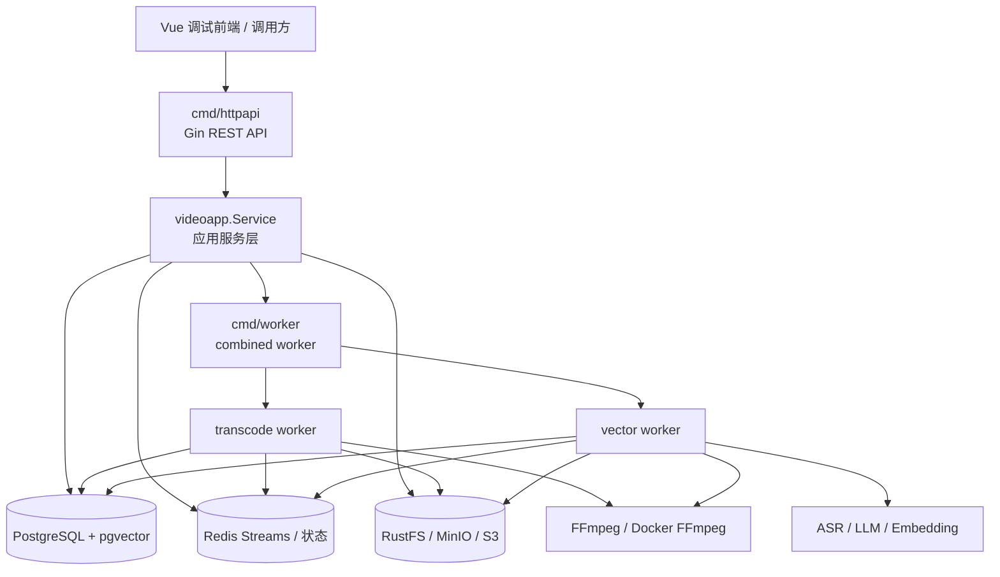

# 视频向量化与推荐服务

## 项目定位

这个仓库用于承接和复用原项目中的视频主链路代码，核心目标是把“视频上传、转码、内容向量化、题目推荐、HLS 播放调试”这一套能力沉淀成一个相对独立的工程基线。

当前推荐关注的主工程是：

```text
embedding-video/video-service
```

它是一个 Go HTTP 后端服务，包含对外 REST API、异步 worker、数据库模型、Redis 队列、对象存储、FFmpeg 转码、ASR/LLM/Embedding 调用和向量检索相关逻辑。

仓库中还保留了两个辅助部分：

- `embedding-video/hls-web`：Vue 3 + Vite 前端调试界面，用于上传、播放 HLS、查看转码/向量化状态和测试交互。
- `embedding-video/legacy-video`：历史工程代码，用作迁移参考，不是当前优先部署目标。

## 当前能力

### HTTP 服务

`video-service/cmd/httpapi` 提供统一 HTTP API，主要覆盖：

- 健康检查与系统运行指标
- 普通视频上传
- 分片上传与合并
- 视频压缩包上传
- 视频列表、播放地址、删除、发布状态、推荐状态维护
- 视频封面上传
- 视频资源代理访问
- 视频点赞/点踩与片段反馈
- 随机视频片段播放
- 基于题目的视频片段推荐
- 推荐记录查询与观看记录上报
- 题库查询
- Swagger 文档访问

默认监听地址来自配置文件中的 `HTTP.Addr`，本地配置默认为 `:8081`，也可以通过 `HTTP_ADDR` 环境变量覆盖。

### 异步 worker

`video-service/cmd/worker` 是统一 worker 入口，会在一个进程内注册两条异步链路：

- 转码 worker：消费视频转码任务，生成 HLS 切片和封面，并更新任务状态。
- 向量化 worker：消费视频向量化任务，执行 ASR、LLM 分段、Embedding 生成和 pgvector 写入。

向量化链路当前支持 hierarchical 模式，核心阶段包括：

1. `prepare`：准备视频元数据、探测时长、生成阶段任务。
2. `coarse`：粗切分视频片段，上传中间片段，执行 coarse ASR。
3. `refine`：调用 LLM 生成语义片段，执行边界修正、必要的 refine ASR 和 embedding。
4. `finalize`：写入最终状态，完成视频向量化流程。

队列与运行状态主要基于 Redis Streams 和 Redis key 前缀实现；阶段状态会写入 PostgreSQL 表，便于恢复和排查。

### 前端调试界面

`embedding-video/hls-web` 是一个本地调试前端，使用 Vue 3、Vite、hls.js 和 Vitest。它不是完整产品前端，主要用于验证：

- 上传链路
- HLS 播放
- 视频列表与播放地址
- 随机片段播放
- 观看进度上报
- 视频和片段反馈
- 系统运行指标展示

Vite dev server 默认把 `/api`、`/videos`、`/swagger` 代理到 `http://localhost:8081`，也可以通过 `VITE_PROXY_TARGET` 覆盖。

## 仓库结构

```text
.
├── README.md
├── .gitignore
└── embedding-video/
    ├── README.md
    ├── PROJECT_PARAMETERS.md
    ├── PROJECT_PARAMETERS_EN.md
    ├── docker-compose.yml
    ├── video-vectorization-cost-report.md
    ├── video-embedding.docx
    ├── docs/
    │   ├── presentations/
    │   └── superpowers/
    ├── hls-web/
    │   ├── package.json
    │   ├── vite.config.js
    │   └── src/
    ├── legacy-video/
    │   ├── cmd/
    │   ├── configs/
    │   ├── internal/
    │   └── video/
    └── video-service/
        ├── cmd/
        │   ├── httpapi/
        │   └── worker/
        ├── configs/
        │   ├── video.yml
        │   └── video_prod.yml
        ├── docs/
        │   └── swagger/
        ├── internal/
        │   ├── application/videoapp/
        │   ├── config/
        │   ├── domain/
        │   ├── http/
        │   ├── infrastructure/
        │   ├── lifecycle/
        │   ├── model/
        │   └── worker/
        ├── middleware/
        └── tools/
```

## 核心架构



## 运行依赖

后端服务依赖以下组件：

- Go：版本需与 `embedding-video/video-service/go.mod` 匹配。
- PostgreSQL：需要启用 `pgvector` 扩展。
- Redis：用于转码、向量化、反馈和运行状态队列。
- S3 兼容对象存储：代码中对象存储实现命名为 `RustFS`，也可对接 MinIO 等兼容服务。
- FFmpeg：可直接使用宿主机 FFmpeg，也可通过 Docker 镜像执行。
- AI 服务：ASR、LLM、Embedding 使用 DashScope/OpenAI 兼容风格接口。

前端调试界面依赖：

- Node.js
- npm

## 配置文件

后端配置文件位于：

```text
embedding-video/video-service/configs/video.yml
embedding-video/video-service/configs/video_prod.yml
```

默认加载规则在 `internal/config/loader.go`：

- macOS / Windows 默认使用 `configs/video.yml`
- 其他系统默认使用 `configs/video_prod.yml`
- `CONFIG_FILE` 或 `VIDEO_CONFIG_FILE` 可以显式覆盖配置路径

常用环境变量：

| 变量 | 作用 |
| --- | --- |
| `CONFIG_FILE` | 指定后端配置文件路径 |
| `VIDEO_CONFIG_FILE` | 指定后端配置文件路径，优先级低于 `CONFIG_FILE` |
| `HTTP_ADDR` | 覆盖 HTTP 监听地址 |
| `DASHSCOPE_API_KEY` | ASR、LLM、Embedding 的统一 API Key |
| `OPENAI_API_KEY` | OpenAI 兼容 API Key 备选 |
| `ASR_API_KEY` | ASR API Key 备选 |
| `EMBEDDING_API_KEY` | Embedding API Key 备选 |
| `DASHSCOPE_BASE_URL` | OpenAI 兼容接口 Base URL |
| `OPENAI_BASE_URL` | OpenAI 兼容接口 Base URL 备选 |
| `ASR_BASE_URL` | ASR HTTP Base URL |
| `ASR_WS_URL` | ASR WebSocket URL |
| `ASR_WS_MODEL` | ASR WebSocket 模型名 |
| `EMBED_MODEL` | Embedding 模型名 |
| `RUSTFS_ACCESS_KEY` | 对象存储 Access Key，覆盖配置文件 |
| `RUSTFS_SECRET_KEY` | 对象存储 Secret Key，覆盖配置文件 |
| `VITE_PROXY_TARGET` | 前端 dev server 代理目标 |

> 提交到公开或共享仓库前，应确认配置文件中没有真实密钥、内网地址或生产凭据。

## 本地启动

### 启动 HTTP API

```bash
cd embedding-video/video-service
go run ./cmd/httpapi
```

指定配置文件和监听地址：

```bash
CONFIG_FILE=configs/video.yml HTTP_ADDR=:8081 go run ./cmd/httpapi
```

启动后可访问：

```text
GET http://localhost:8081/healthz
GET http://localhost:8081/swagger/index.html
```

### 启动 worker

```bash
cd embedding-video/video-service
go run ./cmd/worker
```

HTTP 服务负责接收请求和写入任务，worker 负责消费 Redis Streams 中的异步任务。完整验证上传、转码和向量化时，通常需要同时启动 HTTP API 和 worker。

### 启动前端调试界面

```bash
cd embedding-video/hls-web
npm install
npm run dev
```

如果后端不在 `http://localhost:8081`：

```bash
VITE_PROXY_TARGET=http://localhost:8083 npm run dev
```

### 使用 Docker Compose

仓库提供了 `embedding-video/docker-compose.yml`，用于同时启动后端和前端调试服务：

```bash
cd embedding-video
docker compose up
```

该 compose 文件会：

- 使用 Go 容器编译并启动 `cmd/httpapi` 和 `cmd/worker`
- 使用 Node 容器启动 `hls-web`
- 将前端服务暴露到 `1325`
- 将后端 HTTP 服务暴露到 `8083`

注意：compose 文件假设 PostgreSQL、Redis、RustFS/MinIO 等依赖已经可访问，并且依赖配置中的地址正确。

## 主要 API

当前路由集中在 `embedding-video/video-service/internal/http/router/router.go`。常用接口包括：

| 方法 | 路径 | 说明 |
| --- | --- | --- |
| `GET` | `/healthz` | 健康检查 |
| `GET` | `/api/healthz` | API 健康检查 |
| `GET` | `/api/system/metrics` | 系统运行指标 |
| `GET` | `/swagger/index.html` | Swagger 文档 |
| `POST` | `/api/videos` | 上传视频 |
| `POST` | `/api/videos/archive` | 上传视频压缩包 |
| `POST` | `/api/videos/uploads` | 初始化分片上传 |
| `GET` | `/api/videos/uploads/:uploadId` | 查询分片上传状态 |
| `PUT` | `/api/videos/uploads/:uploadId/chunks/:chunkIndex` | 上传视频分片 |
| `POST` | `/api/videos/uploads/:uploadId/complete` | 完成分片上传 |
| `GET` | `/api/videos` | 视频列表 |
| `PATCH` | `/api/videos/:id` | 更新视频元数据 |
| `DELETE` | `/api/videos/:id` | 删除视频 |
| `POST` | `/api/videos/:id/cover` | 上传视频封面 |
| `GET` | `/api/videos/:id/play` | 获取播放地址 |
| `GET` | `/api/videos/:id/similar` | 获取相似视频 |
| `GET` | `/api/videos/:id/view-count` | 获取播放量 |
| `POST` | `/api/videos/:id/reactions` | 提交视频反馈 |
| `GET` | `/api/videos/:id/reaction-counts` | 获取视频反馈统计 |
| `GET` | `/api/video-segments/random-play` | 随机播放视频片段 |
| `POST` | `/api/video-segments/:id/reactions` | 提交片段反馈 |
| `GET` | `/api/video-segments/:id/reaction-counts` | 获取片段反馈统计 |
| `POST` | `/api/recommendations/by-question` | 根据题目推荐视频片段 |
| `GET` | `/api/recommendations` | 推荐记录列表 |
| `POST` | `/api/watch-records` | 上报观看记录 |
| `GET` | `/api/questions` | 题目列表 |
| `GET` | `/api/questions/:id` | 题目详情 |
| `GET` | `/api/transcode-tasks/:taskId` | 查询转码任务状态 |

代码同时保留了一批旧路径别名，例如 `/api/video/upload`、`/api/video/list`、`/api/video/play/:id`，用于兼容历史调用方。

## 数据与队列

后端启动时会自动执行数据库初始化：

- 创建 `vector` 扩展
- AutoMigrate 视频、片段、向量阶段、用户反馈和推荐记录相关表
- 创建视频片段、向量索引和推荐记录索引
- 执行持久化层完整性检查

关键 Redis key 可在配置文件 `RedisKeys` 中调整，默认包括：

- `video:transcode:queue`
- `video:vectorize:queue`
- `video:vector:prepare`
- `video:vector:coarse`
- `video:vector:refine`
- `video:vector:finalize`
- `video:reaction:queue`
- `segment:reaction:queue`
- `video:transcode:status:`
- `video:runtime:active:`

## 测试

### 后端测试

```bash
cd embedding-video/video-service
go test ./...
```

### 前端测试

```bash
cd embedding-video/hls-web
npm test
```

### 前端构建

```bash
cd embedding-video/hls-web
npm run build
```

## 工具

`embedding-video/video-service/tools` 下包含辅助命令：

- `upload_bench`：上传链路压测工具。
- `db_migrate_except_video_tables`：数据库迁移辅助工具，可通过 `SOURCE_DSN` 和 `TARGET_DSN` 或命令参数指定源/目标库。

示例：

```bash
cd embedding-video/video-service
go run ./tools/upload_bench
```

## 文档

仓库保留了一批设计文档、实施计划和评估材料，主要用于理解历史演进和后续重构方向：

- `embedding-video/PROJECT_PARAMETERS.md`
- `embedding-video/PROJECT_PARAMETERS_EN.md`
- `embedding-video/video-vectorization-cost-report.md`
- `embedding-video/video-service/docs/`
- `embedding-video/docs/superpowers/`
- `embedding-video/legacy-video/docs/`

这些文档中有些描述的是规划或历史方案，不一定全部代表当前代码已经完整落地。判断当前真实行为时，以 `embedding-video/video-service` 下的运行代码和测试为准。

## 首次提交建议

这个仓库当前是从其他工程迁移出来的初始代码基线。第一次提交建议包含：

- 根目录 README 和 `.gitignore`
- `embedding-video/video-service` 主服务代码、配置、Swagger、测试和工具
- `embedding-video/hls-web` 调试前端代码、锁文件和测试
- `embedding-video/legacy-video` 历史参考代码
- 项目文档和演示材料

运行日志、IDE 配置、agent 本地配置、构建产物、`node_modules`、`dist`、本地存储目录和临时文件不应进入提交。
