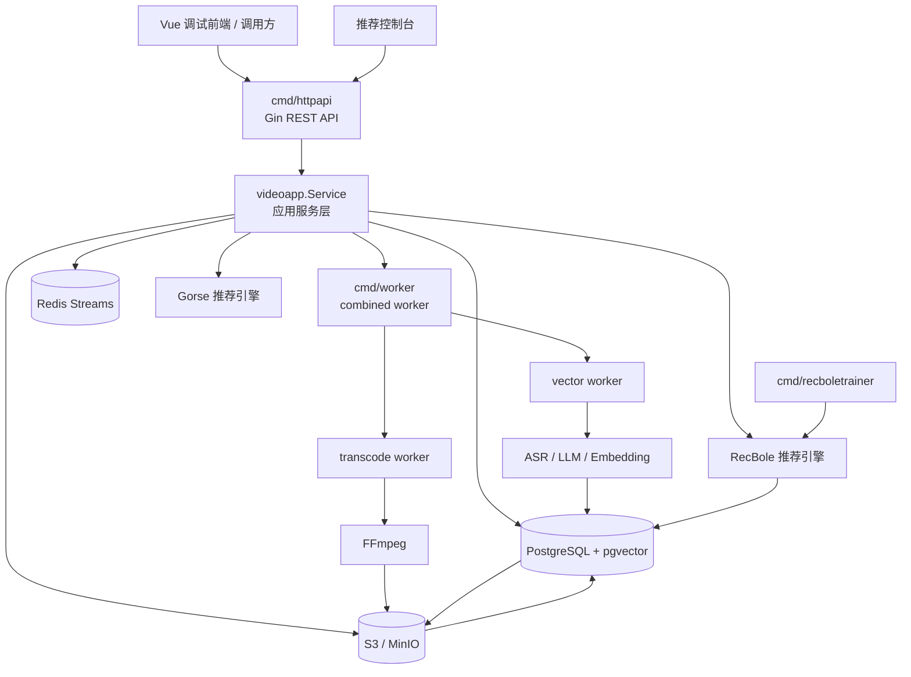

# 视频向量化与推荐服务

## 项目总览

这个仓库是一个多项目容器，不是单一可运行应用。核心服务是 `video-service/`，提供视频上传、转码、内容向量化、推荐、HLS 播放等能力。

当前主要项目：

- `video-service/`：推荐部署的 Go HTTP 视频服务，提供上传、转码、播放、推荐、观看记录、题库查询和异步 worker。
- `recbole-training/`：RecBole 推荐离线训练代码、样本导出流水线和模型产物目录。
- `hls-web/`：Vue 3 + Vite 统一前端，包含视频联调工作区和推荐控制台工作区。
- `legacy-video/`：历史 Go 后端工程，当前不作为后续对接入口。
- `gorse/`：Gorse 推荐引擎配置与初始化脚本。
- `docs/`：仓库级设计文档等材料。

> Go 命令需要在 `video-service/` 目录下执行；仓库根目录没有 `go.mod`。

## 推荐部署目标

- 对外服务工程：`video-service/`
- 对接方式：HTTP REST API
- 标准对接入口：`video-service/cmd/httpapi`
- 异步处理入口：`video-service/cmd/worker`
- RecBole 训练入口：`video-service/cmd/recboletrainer`
- 本地默认监听地址：`:8081`
- docker-compose 部署端口：`8083`
- 健康检查接口：`GET /healthz`
- Swagger 文档入口：`GET /swagger/index.html`

## 仓库结构

```text
.
├── README.md
├── .gitignore
└── embedding-video/
    ├── README.md                       # 本文件
    ├── PROJECT_PARAMETERS.md           # 中文参数总览
    ├── PROJECT_PARAMETERS_EN.md        # 英文参数总览
    ├── AGENTS.md                       # AI agent 行为准则
    ├── docker-compose.yml              # 本地开发编排
    ├── docker-compose.gorse.yml        # Gorse 推荐引擎独立编排
    ├── docker-compose.recbole.yml      # RecBole 训练编排（含 trainer profile）
    ├── video-vectorization-cost-report.md
    ├── video-service/                  # 推荐部署的 HTTP 后端
    ├── recbole-training/               # RecBole 推荐训练代码与模型产物
    ├── two-tower-training/             # 旧双塔训练代码（历史保留）
    ├── legacy-video/                   # 历史 Go 后端工程
    ├── hls-web/                        # Vue 3 + Vite 统一前端（视频 + 推荐控制台）
    ├── gorse/                          # Gorse 推荐引擎配置
    └── docs/                           # 仓库级设计文档
```

## 文档导航

- HTTP 后端服务说明：[`video-service/README.md`](video-service/README.md)
- RecBole 训练说明：[`recbole-training/README.md`](recbole-training/README.md)
- 推荐控制台说明：已合并至 [`hls-web`](hls-web)，切换工作区即可使用
- 前端调试工程说明：[`hls-web/README.md`](hls-web/README.md)
- 历史后端工程说明：[`legacy-video/README.md`](legacy-video/README.md)
- 接口契约：[`video-service/docs/swagger/swagger.yaml`](video-service/docs/swagger/swagger.yaml)
- RecBole 算法交接：[`recbole-training/ALGORITHM_HANDOFF.md`](recbole-training/ALGORITHM_HANDOFF.md)

## 快速开始

### 本地开发

```bash
# 1. 启动基础设施
cd embedding-video
docker compose up -d postgres redis minio

# 2. 启动后端 API
cd video-service
go run ./cmd/httpapi

# 3. 另开终端，启动 worker
go run ./cmd/worker

# 4. 另开终端，启动前端调试界面
cd ../hls-web
npm install && npm run dev
```

### Docker Compose 部署

```bash
cd embedding-video
cp .env.deploy.example .env.deploy
# 编辑 .env.deploy，填入服务器路径、数据库 DSN、对象存储和 AI API key
docker compose up -d
```

启动 RecBole 训练容器：

```bash
docker compose -f docker-compose.recbole.yml --profile recbole up -d
```

启动 Gorse 推荐引擎：

```bash
docker compose -f docker-compose.gorse.yml up -d
```

常用环境变量：

| 环境变量 | 作用 |
|------|------|
| `VIDEO_PROJECT_ROOT` | 仓库绝对路径，默认 `/repo` |
| `VIDEO_HTTP_PORT` | 后端 HTTP 端口，默认 `8083` |
| `VIDEO_WEB_PORT` | 前端端口，默认 `1325` |
| `CONFIG_FILE` | 后端配置文件路径 |
| `HTTP_ADDR` | 覆盖 HTTP 监听地址 |

## 核心架构



## 推荐链路

当前推荐引擎支持三种策略，通过配置文件 `Recommendation.Engine` 切换：

| 引擎 | 说明 |
|------|------|
| `recbole` | 当前默认，基于 RecBole 训练的 embedding 做个性化召回 |
| `gorse` | 基于 Gorse 推荐引擎的协同过滤 + external 召回 |
| `knowledge_match` | 基于文本向量的内容匹配（历史保留） |

RecBole 推荐链路：`cmd/recboletrainer` 定时导出训练数据 → Python 训练 → publish gate 门禁 → 导入 embedding 到 PostgreSQL → 推荐接口使用 embedding 做相似检索。

## 优先查看

- `video-service/cmd/httpapi/main.go`
- `video-service/cmd/worker/main.go`
- `video-service/cmd/recboletrainer/main.go`
- `video-service/internal/http/router/router.go`
- `video-service/docs/swagger/swagger.yaml`
- `recbole-training/scripts/run_recbole_pipeline.sh`
- `hls-web/vite.config.js`

## 补充说明

- `video-service/` 是当前对外对接入口；新集成应优先使用标准 REST 路径。
- 根目录 compose 更偏便捷部署和联调形态，不等同于完整生产编排。
- `legacy-video/` 和 `two-tower-training/` 是历史工程，除非明确需要维护历史链路，否则不建议作为新功能入口。
- 推荐控制台已合入 `hls-web`，在工作区切换器中选择"推荐控制台"即可使用。
- `legacy-video/` 和 `two-tower-training/` 是历史工程，除非明确需要维护历史链路，否则不建议作为新功能入口。
