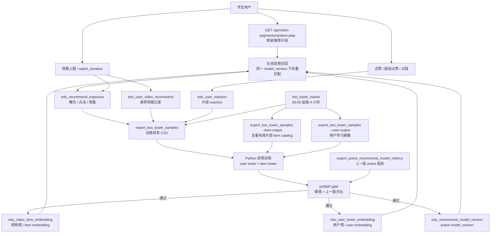

# Two Tower Training

这个目录独立存放双塔推荐训练相关内容，避免训练代码、数据集和模型产物散落到 HTTP 服务项目里。

## 目录结构

```text
two-tower-training/
  data/                         # 训练样本快照
  artifacts/                    # 本地训练产物
  src/two_tower_training/       # 训练代码
  tests/                        # 训练代码单测
```

## 当前版本

当前训练版本仍保持线上协议不变：

```text
user_id -> user embedding
video_segment_id -> item embedding
score = dot(user_embedding, item_embedding)
loss = PyTorch pairwise softplus ranking loss
```

训练前会先处理样本：

1. 保留 `source`、`reason`、`event_time`。
2. 对同一 `user_id + video_segment_id` 的多条行为做聚合。
3. 按 `event_time` 对样本权重做时间衰减。
4. 按时间切分训练集和评估集。
5. 对 `double_like`、长观看、点踩、极短观看、曝光未点击等行为做差异化权重处理。

默认后端是 PyTorch，item tower 使用 `segment_id embedding + item feature MLP`。item feature 来自全量有效片段目录，包括片段/视频时长、点赞/超级点赞/点踩计数、内容摘要、知识标签和视频标题；训练目标是让同一用户的正样本分数高于负样本分数，采样负例时会过滤该用户已知正样本，降低小数据下的假负例污染。
user tower 使用 `user_id embedding + user feature MLP`。user feature 来自 `sys_user`、知识点掌握、答题记录、题目反馈、搜题记录和生成题反馈；缺少用户画像时会使用零向量兜底。

训练后会输出训练集、评估集和 Recall@20/50、HitRate@K、NDCG@K、覆盖率、负样本命中率、点踩命中率。线上发布前会执行 publish gate，并和上一版 active model metrics 对比；指标不达标时只保留 artifact，不发布 active model version。

## 线上推荐与训练发布链路



关键说明：

- `edu_video_item_embedding` 是离线训练得到的视频塔向量表，不会在用户每次点赞、观看或刷新推荐时实时更新；它只在定时训练或手动训练导入成功后批量更新。
- `edu_user_tower_embedding` 同样由双塔训练产物导入；线上推荐读取 active `model_version` 下的用户向量和视频片段向量。
- 用户行为会先进入 reaction、watch、exposure 等行为表，再由 `export_two_tower_samples` 导出为训练样本，下一轮训练后影响新的 embedding。
- `two_tower_trainer` 容器使用 `video_prod.yml` 连接生产数据库，定时执行完整流水线：导出样本、全量 item catalog 和用户学习画像、Python 训练与离线评估、导出上一版 active 指标、执行 publish gate；只有 gate 通过后才导入 item/user embedding 并发布 active model version。
- 训练相关代码和算法对接协议集中在本目录，其中 `ALGORITHM_HANDOFF.md` 用于算法同事优化模型时对接输入输出协议。

双塔相关核心表：

| 表 | 作用 | 更新时机 |
| --- | --- | --- |
| `edu_recommend_exposure` | 记录推荐结果实际展示给谁、排序位置、是否点击/观看 | 推荐接口展示和后续行为回写 |
| `edu_user_video_recommend` | 记录推荐观看行为、`is_watched`、`watch_duration` | 推荐/观看上报链路 |
| `edu_user_reaction` | 记录用户对视频片段的点赞、超级点赞、点踩 | 用户 reaction 操作 |
| `edu_user_video_profile` | 用户行为画像向量，服务于画像重排和用户兴趣表达 | 用户行为后重算或回刷 |
| `edu_video_item_embedding` | 双塔 item tower 输出，保存每个 `video_segment_id` 的推荐向量 | 双塔训练导入后更新 |
| `edu_user_tower_embedding` | 双塔 user tower 输出，保存每个用户的兴趣向量 | 双塔训练导入后更新 |
| `edu_recommend_model_version` | 记录当前线上 active 双塔模型版本和发布指标 | 训练产物通过 publish gate 并 `--publish` 后更新 |

## 更新训练数据

先在 HTTP 服务目录导出训练样本：

```bash
cd ../video-service
go run ./tools/export_two_tower_samples \
  --seed-count 500 \
  --limit 2000 \
  --output ../two-tower-training/data/two_tower_samples.csv \
  --item-output ../two-tower-training/data/two_tower_items.csv \
  --user-output ../two-tower-training/data/two_tower_user_features.csv
```

## 运行测试

```bash
cd two-tower-training
PYTHONPATH=src python3 -m unittest discover -s tests
```

## 训练模型

```bash
cd two-tower-training
PYTHONPATH=src python3 -m two_tower_training.train \
  --samples data/two_tower_samples.csv \
  --item-catalog data/two_tower_items.csv \
  --user-features data/two_tower_user_features.csv \
  --output artifacts/two_tower_v1 \
  --model-version two_tower_v1 \
  --dim 64 \
  --epochs 60 \
  --learning-rate 0.01 \
  --eval-ratio 0.2 \
  --retrieval-ks 20,50 \
  --half-life-days 30 \
  --backend torch \
  --batch-size 128 \
  --random-negatives 3 \
  --hard-negatives 2 \
  --seed 20260623
```

`metrics.json` 当前包含 `train_loss`、`eval_loss`、`eval_auc`、`recall_at_20`、`recall_at_50`、`hit_rate_at_20`、`hit_rate_at_50`、`ndcg_at_20`、`ndcg_at_50`、`coverage_at_20`、`coverage_at_50`、`negative_hit_rate_at_20`、`dislike_hit_rate_at_20`、`train_sample_count` 和 `eval_sample_count`。

输出产物：

```text
artifacts/two_tower_v1/
  item_embeddings.csv
  metrics.json
  segment_id_map.json
  user_embeddings.csv
  user_id_map.json
```

## 历史第一波训练结果

基于 `data/two_tower_samples.csv`：

```text
samples=1277
users=7
items=152
dim=64
epochs=60
auc=0.946089
loss=0.476181
positive_avg_score=0.821018
negative_avg_score=0.141951
```

这些历史指标只证明当时的最小链路能跑通。当前发布判断应看 `eval_auc`、`recall_at_20`、`ndcg_at_20`、`coverage_at_20` 和 `negative_hit_rate_at_20`。

## 后续接入

后端已新增独立双塔 embedding 表，不复用 `edu_user_video_profile.profile_vector`，因为现有画像向量是 `vector(1536)`，而当前双塔模型输出是 64 维。

当前表：

```text
edu_video_item_embedding
edu_user_tower_embedding
```

导入数据库前，先检查 `artifacts/two_tower_v1/metrics.json` 和 embedding CSV 行数。

本地导入命令：

```bash
cd ../video-service
go run ./tools/import_two_tower_embeddings
```

导入并发布为当前线上 active 版本：

```bash
cd ../video-service
go run ./tools/import_two_tower_embeddings --artifact-dir ../two-tower-training/artifacts/two_tower_v1 --publish
```

完整离线流水线脚本：

```bash
cd two-tower-training
./scripts/run_two_tower_pipeline.sh
```

可通过环境变量控制训练参数：

```bash
CONFIG_FILE=configs/video.yml \
MODEL_VERSION=two_tower_v2 \
SAMPLE_LIMIT=20000 \
EPOCHS=80 \
./scripts/run_two_tower_pipeline.sh
```

发布门禁相关变量：

```bash
PUBLISH_GATE_ENABLED=true
MIN_EVAL_AUC=0.55
MIN_RECALL_AT_20=0.05
MIN_COVERAGE_AT_20=0.02
MAX_NEGATIVE_HIT_RATE_AT_20=0.50
MIN_EVAL_SAMPLE_COUNT=20
MAX_AUC_DROP=0.02
MAX_RECALL_DROP=0.05
MAX_COVERAGE_DROP=0.05
MAX_NEGATIVE_HIT_RATE_INCREASE=0.05
MAX_DISLIKE_HIT_RATE_INCREASE=0.05
EVAL_RATIO=0.2
RETRIEVAL_K=20
RETRIEVAL_KS=20,50
HALF_LIFE_DAYS=30
```

如果 gate 不通过，流水线会在执行 `go run ./tools/import_two_tower_embeddings --publish` 前退出。模型产物会保留在 `two-tower-training/artifacts/${MODEL_VERSION}` 下，便于排查。

阈值变量名保留 `AT_20` 是为了兼容现有脚本；实际 gate 会读取 `RETRIEVAL_K` 选中的指标 key。上一版对比指标来自 `edu_recommend_model_version.metrics_json` 中当前 active 的 `two_tower` 模型。

脚本会执行：

```text
导出样本、全量 item catalog 和用户学习画像 -> 训练 -> 导出上一版 active metrics -> publish gate -> 导入 item/user embedding -> 发布 active model_version
```

## 生产部署

线上 HTTP/worker 主服务不要求安装 Python。默认部署时，`backend_http` 设置 `TWO_TOWER_TRAINER_ENABLED=false`，只负责接口、转码 worker、向量 worker 和在线推荐。

双塔离线训练放到独立容器 `two_tower_trainer` 中运行。该容器使用 `two-tower-training/Dockerfile` 构建，镜像内包含 Go、Python 和 CPU PyTorch，启动命令是：

```bash
go run ./cmd/twotowertrainer
```

如果不使用训练容器，而是在宿主机直接运行 `scripts/run_two_tower_pipeline.sh`，需要先安装训练依赖：

```bash
cd two-tower-training
python3 -m pip install -r requirements.txt
```

默认训练后端是 `BACKEND=torch`。脚本启动时会预检 `import torch`，如果宿主机缺少 PyTorch，会输出 `training_dependency_missing=torch` 并在导出样本前退出。临时绕过 PyTorch 可设置 `BACKEND=sgd`，但线上推荐使用容器内的 PyTorch 训练后端。

训练容器会加载 `video_prod.yml`，按北京时间 `00:00`、`04:00`、`08:00`、`12:00`、`16:00`、`20:00` 触发完整训练发布流水线。训练完成后把 embedding 和 active `model_version` 写回数据库，线上推荐接口下次请求即可读取新版本。

脚本成功发布后会自动清理训练样本：

```text
video-service/storage/two_tower_samples.csv
two-tower-training/data/*.csv
```

训练产物会保留一段时间用于回溯和排查，默认清理 `two-tower-training/artifacts/` 下 7 天前的模型目录。可通过环境变量调整：

```bash
ARTIFACT_RETENTION_DAYS=14 ./scripts/run_two_tower_pipeline.sh
```
