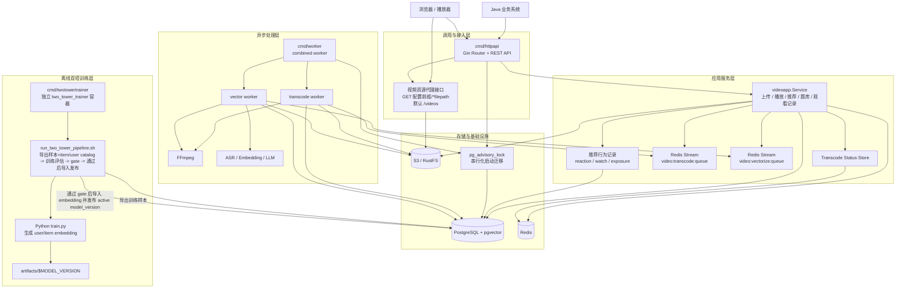
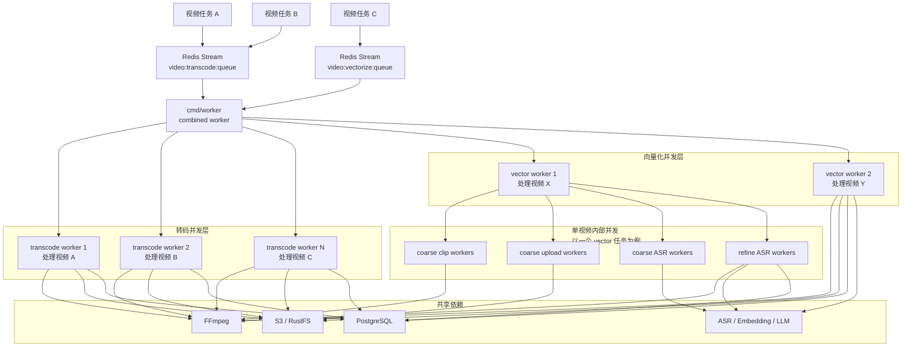

# 视频向量化 HTTP 视频服务

## 项目简介

`video-service/` 是当前推荐部署的 Go HTTP 视频服务，适合由 Java 服务通过 HTTP/JSON 调用。

当前已实现的核心能力：

- 视频上传
- HLS 转码与封面处理
- 视频列表、播放、删除、发布、推荐状态维护
- 基于题目的视频片段推荐
- 基于双塔 embedding 的个性化视频片段推荐
- 推荐曝光、观看、reaction 行为记录与离线训练样本导出
- 观看记录上报
- 题库查询
- 对象存储中的视频资源代理访问
- AI 能力异常时的推荐降级与向量化异步补偿

> 本目录是 Go module 根目录。HTTP API、worker、工具命令和测试都应在本目录下执行。

## 目录结构

```text
video-service/
├── cmd/
│   ├── dlqctl/                  # Redis Stream 死信队列查看与重放工具
│   ├── httpapi/                 # HTTP 服务入口
│   ├── twotowertrainer/         # 双塔训练调度入口
│   └── worker/                  # 统一 worker 入口
├── configs/                     # HTTP 服务配置
├── docs/                        # 设计文档与 Swagger
│   └── swagger/                 # Swagger 产物
├── internal/
│   ├── application/videoapp/    # 应用服务层
│   ├── config/                  # 配置加载与类型定义
│   ├── domain/                  # 领域模型
│   ├── http/                    # HTTP 路由、handler、DTO、错误处理
│   ├── infrastructure/          # 基础设施（AI、对象存储、DB、Redis、FFmpeg）
│   ├── lifecycle/               # 启动初始化编排
│   ├── model/                   # 数据模型
│   └── worker/                  # worker 实现（transcode、vector、combined、antspool）
├── logs/                        # 日志目录
├── middleware/
├── storage/                     # 本地存储目录（gitignored）
└── tools/                       # 压测、迁移、双塔样本导出/导入等辅助工具
```

## 系统组成



说明：

- `cmd/httpapi` 提供统一 HTTP 接口，Java 直接调用这一层。
- `cmd/worker` 是当前默认的 worker 启动入口，用于消费转码和向量化任务队列。
- 视频文件与 HLS 产物存放在对象存储中，通过 `Storage.MediaRoutePrefix` 配置的路由代理访问，默认兼容 `/videos/*filepath`。
- `/api/video-segments/random-play` 是当前双塔推荐的主要展现入口；带 `user_id` 时优先使用 active 双塔 embedding 做个性化召回，缺少模型或用户向量时回退到可用片段。
- `/api/recommendations/by-question` 面向题目文本匹配，主要基于题目文本向量与视频片段向量做召回，不依赖双塔用户向量。
- `two_tower_trainer` 是独立训练调度进程，线上主服务容器默认不执行 Python 训练。
- 推荐链路在外部 AI provider 不可用时会自动进入降级模式，优先返回可用结果而不是直接报错。
- `vector_worker` 在 AI provider 短时不可用时优先走重试与退避，不把所有上游失败立即视为终态失败。
- 转码队列和向量化队列基于 Redis Streams 消费者组实现，任务处理成功后才 ACK；终态失败会进入对应 `:dlq` 死信流。
- `hierarchical` 向量化链路已拆为 prepare、coarse、refine、finalize 四个 Redis Stream 阶段，并通过 `edu_video_vector_stage` 记录阶段状态。
- `cmd/httpapi` 与 `cmd/worker` 启动时都会尝试补齐数据库 schema；当前通过 PostgreSQL advisory lock 串行化迁移，避免 HTTP 与 worker 并发启动时发生 DDL 冲突。

## 多视频并发处理



真实负载是“视频级并发 + 单视频内部并发”叠加，最终共同竞争 FFmpeg、对象存储、数据库和 AI 服务资源。

## HTTP 服务入口

### 启动 HTTP API

```bash
go run ./cmd/httpapi
```

直接用 `go run` 启动时，会自动向上查找根目录 `.env`，再按其中的 `VIDEO_ENV_FILE` 加载 `.env.local` 或 `.env.deploy`。当前本地默认 `.env` 指向 `.env.local`，因此无需手动 export `POSTGRES_DSN`。

该入口会完成以下初始化：

- 加载配置文件
- 连接 PostgreSQL
- 连接 Redis
- 初始化对象存储客户端并确保 Bucket 存在
- 自动执行表迁移，并尝试创建 `pgvector` 扩展与相关索引
- 注册 Gin 路由、Swagger、健康检查和视频代理接口

默认监听地址：

```text
:8081
```

可以通过环境变量覆盖：

```bash
HTTP_ADDR=:8081 go run ./cmd/httpapi
```

### 启动 Worker

```bash
go run ./cmd/worker
```

该 worker 会统一启动转码 worker 和向量化 worker。

如果要启用向量化 worker，需要同时准备 AI 服务的 API Key，例如：

```bash
VIDEO_ENV_FILE=.env.local go run ./cmd/worker
```

### 启动双塔训练调度

本地如需验证双塔定时训练入口，可以单独启动：

```bash
CONFIG_FILE=configs/video.yml go run ./cmd/twotowertrainer
```

该入口只负责训练调度，不启动 HTTP 服务、转码 worker 或向量化 worker。训练调度会按北京时间 `00:00`、`04:00`、`08:00`、`12:00`、`16:00`、`20:00` 触发 `../two-tower-training/scripts/run_two_tower_pipeline.sh`。

## Java 调用方式

后续部署建议让 Java 服务直接调用本服务暴露的 REST 接口，不再依赖 gRPC。

推荐方式：

- Java 通过 `RestTemplate`、`WebClient`、OpenFeign 或其他 HTTP Client 调用。
- 请求和响应统一使用 JSON。
- 小文件或历史兼容上传可以继续使用 `multipart/form-data`。
- 大文件视频和 ZIP 批量导入建议使用分片断点续传接口。
- 视频播放地址、封面地址、HLS 地址均由 HTTP 服务返回。
- 新增调用应统一使用标准 REST 路径，不要继续依赖历史兼容路径。

典型调用链路：

1. Java 调用上传接口提交视频文件；大文件先创建上传会话，再按分片上传并完成会话。
2. HTTP 服务合并上传内容，写入视频记录并投递转码任务。
3. Java 通过任务状态接口轮询转码进度。
4. 转码完成后，Java 调用播放接口获取播放地址。
5. 推荐场景下，Java 调用题目推荐接口获取片段列表。

## 主要接口

`internal/http/router/router.go` 当前同时保留两套路由：

- 标准 REST 风格接口：推荐给 Java 服务使用。
- 旧兼容接口：用于兼容历史调用方。

后续新增调用建议统一使用标准 REST 风格接口。

### 推荐给 Java 的 REST 接口

| 方法 | 路径 | 说明 |
|------|------|------|
| `GET` | `/healthz` | 健康检查 |
| `GET` | `/api/healthz` | API 健康检查 |
| `GET` | `/api/system/metrics` | 查询系统运行指标 |
| `POST` | `/api/videos` | 上传视频 |
| `POST` | `/api/videos/archive` | 上传归档视频 |
| `POST` | `/api/videos/uploads` | 创建普通视频分片上传会话 |
| `GET` | `/api/videos/uploads/:uploadId` | 查询分片上传状态 |
| `PUT` | `/api/videos/uploads/:uploadId/chunks/:chunkIndex` | 上传一个分片 |
| `POST` | `/api/videos/uploads/:uploadId/complete` | 完成普通视频分片上传 |
| `POST` | `/api/videos/archive/uploads` | 创建 ZIP 批量分片上传会话 |
| `POST` | `/api/videos/archive/uploads/:uploadId/complete` | 完成 ZIP 批量分片上传 |
| `GET` | `/api/videos` | 获取视频列表 |
| `PATCH` | `/api/videos/:id` | 更新视频标题和描述 |
| `DELETE` | `/api/videos/:id` | 删除视频 |
| `POST` | `/api/videos/:id/cover` | 上传封面 |
| `GET` | `/api/videos/:id/play` | 获取播放地址 |
| `GET` | `/api/videos/:id/similar` | 获取相似视频 |
| `GET` | `/api/videos/:id/view-count` | 获取观看次数 |
| `POST` | `/api/videos/:id/reactions` | 提交视频反馈 |
| `GET` | `/api/videos/:id/reaction-counts` | 获取视频反馈计数 |
| `GET` | `/api/video-segments/random-play` | 刷新播放片段；带 `user_id` 时优先双塔个性化召回，否则随机兜底 |
| `POST` | `/api/video-segments/:id/reactions` | 提交视频片段反馈 |
| `GET` | `/api/video-segments/:id/reaction-counts` | 获取视频片段反馈计数 |
| `POST` | `/api/videos/:id/publish` | 设置发布状态 |
| `POST` | `/api/videos/:id/recommend` | 设置推荐状态 |
| `GET` | `/api/transcode-tasks/:taskId` | 查询转码任务状态 |
| `POST` | `/api/recommendations/by-question` | 根据题目推荐视频片段 |
| `GET` | `/api/recommendations` | 查询推荐记录 |
| `POST` | `/api/watch-records` | 上报观看记录 |
| `GET` | `/api/questions` | 分页查询题库 |
| `GET` | `/api/questions/:id` | 查询题目详情 |
| `GET` | `/videos/*filepath` | 代理访问对象存储中的视频资源，默认路径 |

对象存储代理路由由 `Storage.MediaRoutePrefix` 控制，默认是 `/videos`。如果配置成其他前缀，服务仍保留 `/videos/*filepath` 兼容路由。

### 兼容保留的旧接口

项目中仍保留旧路径，例如：

- `/api/video/upload`
- `/api/video/upload_archive`
- `/api/video/list`
- `/api/video/:id`
- `/api/video/play/:id`
- `/api/video/reaction/:id`
- `/api/video/reaction_counts/:id`
- `/api/video/recommend_by_question`
- `/api/video/report_watch`
- `/api/question/list`
- `/api/question/:id`

这些兼容路径当前仍可正常调用，Swagger 文档只暴露标准 REST 路径，避免新接入方继续依赖旧路径。

### 旧路径到标准路径对照

| 旧路径 | 方法 | 标准路径 | 方法 |
|------|------|------|------|
| `/api/question/list` | `GET` | `/api/questions` | `GET` |
| `/api/question/:id` | `GET` | `/api/questions/:id` | `GET` |
| `/api/video/upload` | `POST` | `/api/videos` | `POST` |
| `/api/video/upload_archive` | `POST` | `/api/videos/archive` | `POST` |
| `/api/video/recommend_by_question` | `POST` | `/api/recommendations/by-question` | `POST` |
| `/api/video/report_watch` | `POST` | `/api/watch-records` | `POST` |
| `/api/video/list` | `GET` | `/api/videos` | `GET` |
| `/api/video/:id` | `PUT` | `/api/videos/:id` | `PATCH` |
| `/api/video/:id` | `DELETE` | `/api/videos/:id` | `DELETE` |
| `/api/video/cover/:id` | `POST` | `/api/videos/:id/cover` | `POST` |
| `/api/video/play/:id` | `GET` | `/api/videos/:id/play` | `GET` |
| `/api/video/similar/:id` | `GET` | `/api/videos/:id/similar` | `GET` |
| `/api/video/view_count/:id` | `GET` | `/api/videos/:id/view-count` | `GET` |
| `/api/video/reaction/:id` | `POST` | `/api/videos/:id/reactions` | `POST` |
| `/api/video/reaction_counts/:id` | `GET` | `/api/videos/:id/reaction-counts` | `GET` |
| `/api/video/publish/:id` | `POST` | `/api/videos/:id/publish` | `POST` |
| `/api/video/recommend/:id` | `POST` | `/api/videos/:id/recommend` | `POST` |
| `/api/video/status/:taskId` | `GET` | `/api/transcode-tasks/:taskId` | `GET` |

注意：`更新视频元数据` 这一项不只是路径变化，HTTP 方法也从 `PUT` 收敛为 `PATCH`。

## 当前可靠性机制

### 上传链路一致性补偿

上传接口会先把原始视频上传到对象存储，再创建视频记录、写入转码状态并投递转码任务。当前代码已经补齐了启动阶段的补偿逻辑：

- 原视频上云后，如果视频记录创建失败，会尽力删除刚上传的原始对象。
- 视频记录创建成功后，如果转码状态写入失败，会把视频状态标记为 `FAILED`，并尽力删除原始对象。
- 视频记录创建成功后，如果转码任务入队失败，也会把视频状态标记为 `FAILED`，并尽力删除原始对象。
- 向量化任务入队仍是尽力而为，不阻断主上传链路。

这套补偿不是完整 outbox/saga，但可以避免上传启动阶段出现“对象已上传、任务未启动、状态不一致”的常见脏状态。

### 大文件上传与断点续传

普通视频和 ZIP 批量导入都支持分片断点续传：

- 普通视频先调用 `POST /api/videos/uploads` 创建上传会话。
- ZIP 批量导入先调用 `POST /api/videos/archive/uploads` 创建上传会话。
- 两类上传都通过 `PUT /api/videos/uploads/:uploadId/chunks/:chunkIndex` 上传分片。
- 可通过 `GET /api/videos/uploads/:uploadId` 查询已上传分片，客户端重试或刷新后可以跳过已完成分片。
- 普通视频调用 `POST /api/videos/uploads/:uploadId/complete` 完成合并并进入转码。
- ZIP 调用 `POST /api/videos/archive/uploads/:uploadId/complete` 完成合并并批量导入视频。

分片序号从 `0` 开始。除最后一个分片外，每个分片大小必须等于创建会话时传入的 `chunk_size`；最后一个分片大小必须等于文件剩余字节数。服务端只把大小正确的分片计入上传状态。

旧的 `POST /api/videos/archive` ZIP multipart 接口仍保留，但后端会先把 ZIP 落盘再流式解包，不再把整个 ZIP 一次性读入内存。新接入方如果需要断点续传，应优先使用 ZIP 分片上传接口。

### Redis Stream 队列语义

当前转码和向量化任务都走 Redis Streams，下面是默认 key；实际值可通过 `RedisKeys` 配置覆盖：

- 转码队列：`video:transcode:queue`
- 向量化队列：`video:vectorize:queue`
- 向量化 prepare 阶段队列：`video:vector:prepare`
- 向量化 coarse 阶段队列：`video:vector:coarse`
- 向量化 refine 阶段队列：`video:vector:refine`
- 向量化 finalize 阶段队列：`video:vector:finalize`
- 运行状态：`video:transcode:status:{taskId}`
- 活跃计数：`video:runtime:active:*`
- 视频反馈队列：`video:reaction:queue`
- 视频片段反馈队列：`segment:reaction:queue`

队列消费采用消费者组：

- `Dequeue` 只取消息，不立即 ACK。
- worker 处理成功后调用 `Ack`。
- 可重试失败会重新入队并 ACK 原消息。
- 终态失败会写入 `:dlq` 死信流并 ACK 原消息。

### 向量化链路现状

向量化 worker 当前支持 `hierarchical` 模式。顶层 `video:vectorize:queue` 仍是上传链路的入口；当模式为 `hierarchical` 时，worker 会把任务转交给四个 Redis Stream 阶段队列：

1. `vector.prepare`：校验视频、探测时长、生成粗分段计划。
2. `vector.coarse`：按计划粗切分、上传片段并执行 coarse ASR。
3. `vector.refine`：基于 coarse 文本调用 LLM 生成细分段，并执行 refine ASR 与 embedding。
4. `vector.finalize`：标记向量化链路完成。

`full` 和 `sample` 模式仍走原有视频级单体处理路径。`coarse` 和 `refine` 阶段内部继续使用既有 ants pool 并发，避免把 clip、ASR、LLM、embedding 拆成过多 Redis 队列。

## 示例请求

### 上传视频

```bash
curl -X POST "http://localhost:8081/api/videos" \
  -F "file=@demo.mp4" \
  -F "title=示例视频" \
  -F "description=用于联调"
```

### 分片上传普通视频

```bash
curl -X POST "http://localhost:8081/api/videos/uploads" \
  -H "Content-Type: application/json" \
  -d '{
    "file_name": "demo.mp4",
    "content_type": "video/mp4",
    "title": "示例视频",
    "description": "用于联调",
    "file_size": 10485760,
    "chunk_size": 8388608,
    "total_chunks": 2
  }'

curl -X PUT "http://localhost:8081/api/videos/uploads/{uploadId}/chunks/0" \
  --data-binary "@demo.part0"

curl -X GET "http://localhost:8081/api/videos/uploads/{uploadId}"

curl -X POST "http://localhost:8081/api/videos/uploads/{uploadId}/complete"
```

### 分片上传 ZIP 批量导入

```bash
curl -X POST "http://localhost:8081/api/videos/archive/uploads" \
  -H "Content-Type: application/json" \
  -d '{
    "file_name": "lessons.zip",
    "content_type": "application/zip",
    "description": "批量导入说明",
    "file_size": 104857600,
    "chunk_size": 8388608,
    "total_chunks": 13
  }'

curl -X PUT "http://localhost:8081/api/videos/uploads/{uploadId}/chunks/0" \
  --data-binary "@lessons.part0"

curl -X POST "http://localhost:8081/api/videos/archive/uploads/{uploadId}/complete"
```

### 查询转码状态

```bash
curl "http://localhost:8081/api/transcode-tasks/{taskId}"
```

### 获取播放地址

```bash
curl "http://localhost:8081/api/videos/{id}/play"
```

### 根据题目推荐视频

```bash
curl -X POST "http://localhost:8081/api/recommendations/by-question" \
  -H "Content-Type: application/json" \
  -d '{
    "question_id": 1001,
    "user_id": 2001,
    "limit": 3
  }'
```

如果外部 AI provider 暂时不可用，服务会自动走本地 fallback embedding 和降级召回路径。降级时仍返回 `200`，但响应体中的 `data.degraded` 会为 `true`，并带有 `data.message` 提示当前结果来自降级路径。

### 上报观看记录

```bash
curl -X POST "http://localhost:8081/api/watch-records" \
  -H "Content-Type: application/json" \
  -d '{
    "question_id": 1001,
    "user_id": 2001,
    "video_segment_id": 3001,
    "is_watched": true,
    "watch_duration": 120
  }'
```

## 运行依赖

部署时至少需要以下依赖：

- Go `1.26.1`
- PostgreSQL `13+`，并启用 `pgvector`
- Redis `6+`
- S3 兼容对象存储
- FFmpeg / ffprobe，或 Docker 可用的 FFmpeg 镜像
- ASR / Embedding / LLM 对应的外部 AI 服务
- 双塔训练容器需要 Python 3；线上 HTTP/worker 主服务不要求宿主机安装 Python

推荐链路已经具备本地 fallback embedding 兜底，因此外部 embedding 服务短时异常时，推荐接口仍可能返回降级结果。向量化链路仍然依赖外部 ASR / Embedding / LLM，但 worker 已增加更细粒度的 AI 错误重试与退避逻辑。

## 配置说明

配置文件位置：

- `configs/video.yml`
- `configs/video_prod.yml`

默认加载规则：

- Windows、macOS 默认加载 `configs/video.yml`。
- 其他环境默认加载 `configs/video_prod.yml`。
- `cmd/httpapi` 和 `cmd/worker` 启动时会先定位到本目录，再按相对路径读取配置。
- 直接 `go run` 会先加载根目录 `.env`，再根据 `VIDEO_ENV_FILE` 加载私有 `.env.local` 或 `.env.deploy`；已有 shell 环境变量优先生效，不会被 `.env` 覆盖。
- 可通过 `CONFIG_FILE` 或 `VIDEO_CONFIG_FILE` 覆盖配置文件路径。
- 两者同时存在时，`CONFIG_FILE` 优先生效。

当前对象存储约定：

- `configs/video.yml` 保留本地测试配置，默认连接本机 MinIO：`localhost:9000`，Bucket 为 `video-embedding-storage`。
- `configs/video_prod.yml` 面向生产/服务器部署，当前连接腾讯云 COS：`https://video-embedding-storage.cos.ap-beijing.myqcloud.com`，地域为 `ap-beijing`，Bucket 为 `video-embedding-storage`。
- 对象存储底层仍走 S3 兼容协议和 MinIO SDK；生产配置使用 `Region: "ap-beijing"` 与 `BucketLookup: "dns"`，代码会兼容 COS bucket 域名并在内部归一化为服务 endpoint。
- 密钥、密码和 DSN 不写入 YAML。复制根目录 `.env.local.example` 或 `.env.deploy.example` 后，在私有 `.env.local` / `.env.deploy` 中填写。
- `POSTGRES_DSN`、`REDIS_PASSWORD`、`COS_SECRET_ID` / `COS_SECRET_KEY`、`RUSTFS_ACCESS_KEY` / `RUSTFS_SECRET_KEY`、`GORSE_API_KEY` 和 AI API key 会覆盖配置文件中的对应字段。

### 环境变量覆盖

| 环境变量 | 作用 |
|------|------|
| `CONFIG_FILE` | 指定配置文件路径，优先级高于 `VIDEO_CONFIG_FILE` |
| `VIDEO_CONFIG_FILE` | 指定配置文件路径 |
| `HTTP_ADDR` | 覆盖 HTTP 服务监听地址，例如 `0.0.0.0:8083` |
| `TWO_TOWER_TRAINER_ENABLED` | 是否在 `cmd/worker` 中注册双塔训练调度；主服务容器默认 `false`，独立训练容器为 `true` |
| `POSTGRES_DSN` | PostgreSQL DSN，覆盖 `Postgres.DSN` |
| `REDIS_PASSWORD` | Redis 密码，覆盖 `Redis.Password` |
| `COS_SECRET_ID` | 腾讯云 COS SecretId，覆盖 `RustFS.AccessKey` |
| `COS_SECRET_KEY` | 腾讯云 COS SecretKey，覆盖 `RustFS.SecretKey` |
| `RUSTFS_ACCESS_KEY` | 对象存储 AccessKey，COS 变量未设置时使用 |
| `RUSTFS_SECRET_KEY` | 对象存储 SecretKey，COS 变量未设置时使用 |
| `GORSE_API_KEY` | Go 服务调用 Gorse server 的 API Key |
| `DASHSCOPE_API_KEY` | DashScope / 百炼兼容接口 API Key，供推荐 embedding 和向量化 worker 使用 |
| `OPENAI_API_KEY` | OpenAI 兼容接口 API Key 兜底 |
| `EMBEDDING_API_KEY` | 推荐链路 embedding 客户端 API Key 兜底 |
| `DASHSCOPE_BASE_URL` | 向量化 worker 的 OpenAI 兼容接口地址 |
| `OPENAI_BASE_URL` | OpenAI 兼容接口地址兜底 |
| `ASR_API_KEY` | 向量化 worker 的 ASR API Key 兜底 |
| `ASR_BASE_URL` | ASR HTTP 基础地址 |
| `ASR_WS_URL` | ASR WebSocket 地址 |
| `ASR_WS_MODEL` | ASR WebSocket 首选模型 |
| `EMBED_MODEL` | Embedding 模型名 |
| `UPLOAD_BENCH_BASE_URL` | `tools/upload_bench` 压测工具的目标服务地址 |
| `SOURCE_DSN` | 数据迁移工具源库 DSN |
| `TARGET_DSN` | 数据迁移工具目标库 DSN |
| `MODEL_VERSION` | 双塔训练流水线本次模型版本，默认按时间生成 |
| `SAMPLE_LIMIT`、`SEED_COUNT` | 双塔样本导出数量和本地造数数量 |
| `BACKEND`、`EPOCHS`、`DIM`、`BATCH_SIZE` | 双塔训练后端、训练轮数、embedding 维度和 batch 大小 |
| `RANDOM_NEGATIVES`、`HARD_NEGATIVES` | 双塔训练随机负采样和 batch 内 hard negative 数量 |
| `PUBLISH_GATE_ENABLED` | 是否启用双塔发布门禁，默认 `true` |
| `MIN_EVAL_AUC`、`MIN_RECALL_AT_20`、`MIN_COVERAGE_AT_20` | 双塔发布门禁的最低离线指标 |
| `MAX_NEGATIVE_HIT_RATE_AT_20` | 双塔发布门禁的负样本命中率上限 |
| `MAX_AUC_DROP`、`MAX_RECALL_DROP`、`MAX_COVERAGE_DROP` | 新模型相对上一版 active 指标允许下降的最大幅度 |
| `MAX_NEGATIVE_HIT_RATE_INCREASE`、`MAX_DISLIKE_HIT_RATE_INCREASE` | 新模型相对上一版 active 负反馈指标允许上升的最大幅度 |
| `ARTIFACT_RETENTION_DAYS` | 双塔训练产物保留天数，默认 `7` |

生产环境建议把敏感值放到环境变量或密钥管理系统中，不要把真实 API Key、数据库密码、对象存储密钥提交到仓库。

### 重点配置项

部署前建议重点确认以下配置块：

- `HTTP`：`Addr`、`ShutdownTimeoutSec`、`LogDir`、`SlowRequestMs`、`CORS`。
- `Video`：`RawPath`、`HlsPath`。
- `Storage`：对象存储 key 前缀、资源 URL 前缀、`MediaRoutePrefix`、`VectorTempPath`。
- `Redis`：`Addr`、`Password`、`DB`。
- `RedisKeys`：转码队列、向量化队列、四阶段向量化队列、反馈队列、运行计数、DLQ 对应 key。
- `Postgres`：`DSN` 和连接池参数。
- `RustFS`：`Endpoint`、`Bucket`、`UseSSL`、`Region`、`BucketLookup`、`AccessKey`、`SecretKey`。
- `FFmpeg`：`UseDocker`、`DockerImage`、`HLS`、`Fast`、`Cover`、`Audio`。
- `Transcode`：`WorkerCount`、`QueueSize`、`Mode`、`TaskTimeoutMinutes`、`ShutdownTimeoutSec`。
- `VectorWorker`：`Mode`、粗分段/精修分段参数、LLM 模型、ASR 并发、Embedding 批大小、任务超时。
- `VectorStageWorkers`：`Prepare`、`Coarse`、`Refine`、`Finalize`。
- `WorkerPools`：`vector.coarse`、`vector.sample_asr`、`vector.refine_asr`。
- `asr`：`base-url`、`ws-url`、`options.ws-model`、`options.ws-model-fallbacks`。
- `embedding`：`base-url`、`options.model`。
- `AI`：`EmbeddingDim`，默认 `1536`。

### 对象存储环境约定与迁移

当前本地测试环境继续使用 `configs/video.yml` 中的 MinIO 配置；服务器部署使用 `configs/video_prod.yml` 中的腾讯云 COS 配置。迁移历史对象数据时使用独立工具，不需要改业务代码：

```bash
# 默认是 dry-run，只列出动作，不复制对象
go run ./tools/migrate_rustfs_bucket

# 确认 dry-run 结果后执行真实迁移
go run ./tools/migrate_rustfs_bucket --dry-run=false
```

常用参数：

| 参数 | 作用 |
| --- | --- |
| `--prefix` | 只迁移某个对象 key 前缀，适合分批迁移 |
| `--workers` | 并发复制 worker 数，默认 `4` |
| `--overwrite` | 目标对象已存在时是否覆盖，默认不覆盖 |
| `--dry-run` | 是否只预演，默认 `true` |
| `--source-endpoint` / `--target-endpoint` | 覆盖源端和目标端对象存储地址 |
| `--source-bucket` / `--target-bucket` | 覆盖源桶和目标桶 |

### 默认值兜底

即使部分新增配置项缺失，代码也会使用默认值兜底，主要默认值包括：

- HTTP 地址：`:8081`
- 日志目录：`logs`
- 媒体代理路由：`/videos`
- 原视频对象前缀：`raw`
- HLS 对象前缀：`hls`
- 转码队列：`video:transcode:queue`
- 向量化队列：`video:vectorize:queue`
- 转码状态前缀：`video:transcode:status:`
- 运行计数前缀：`video:runtime:active:`
- Embedding 维度：`1536`
- DashScope 兼容接口地址：`https://dashscope.aliyuncs.com/compatible-mode/v1`
- ASR WebSocket 地址：`wss://dashscope.aliyuncs.com/api-ws/v1/inference/`

这些默认值用于兼容历史行为。正式部署仍建议在配置文件中显式写出关键运行参数，方便排障和环境对比。

## 本地启动步骤

### 启动 HTTP 服务

```bash
go run ./cmd/httpapi
```

### 启动 Worker

```bash
go run ./cmd/worker
```

如果需要指定配置文件或监听地址，可以这样启动：

```bash
CONFIG_FILE=configs/video_prod.yml HTTP_ADDR=0.0.0.0:8083 go run ./cmd/httpapi
```

### 查看与重放死信队列

当转码、向量化阶段或反馈落库任务超过重试上限后，消息会进入对应 Redis Stream 的死信流。节点恢复后不会自动重放 DLQ，需要运维确认失败原因已解除后显式执行 `cmd/dlqctl`。

常用命令：

```bash
# 查看所有支持队列的死信消息
go run ./cmd/dlqctl list --queue all --limit 20

# 查看某个队列
go run ./cmd/dlqctl list --queue transcode --limit 20

# 预演重放，不写回主队列
go run ./cmd/dlqctl replay --queue vector-coarse --limit 10 --dry-run

# 按 message id 精确重放
go run ./cmd/dlqctl replay --queue transcode --id <dlq-message-id>

# 批量重放并保留原 DLQ 记录
go run ./cmd/dlqctl replay --queue vector-coarse --limit 10 --keep-dlq
```

支持的队列名：

```text
transcode
vectorize
vector-prepare
vector-coarse
vector-refine
vector-finalize
video-reaction
segment-reaction
```

默认情况下，`replay` 会把 DLQ 中的 `payload` 重新写回原主队列，并删除原 DLQ 消息，避免重复重放。若需要保留审计痕迹，可加 `--keep-dlq`。

注意：DLQ 里可能包含视频损坏、对象 key 不存在、参数非法等永久失败任务。不要在未确认原因前直接 `--queue all --limit` 批量重放。

Docker 部署时，当前运行容器里不一定有 `go` 命令，也不一定内置 `dlqctl` 二进制。若需要在线上容器内直接执行 DLQ 重放，应在部署脚本中额外编译：

```bash
go build -o /tmp/dlqctl ./cmd/dlqctl
```

然后执行：

```bash
docker exec -it embedding-video /tmp/dlqctl list --queue all --limit 20
docker exec -it embedding-video /tmp/dlqctl replay --queue vector-refine --id <dlq-message-id>
```

线上重放前要先确认失败原因已经解除，例如 DashScope 付费/额度问题已经处理，否则任务会再次进入 DLQ。

### 手动跑双塔训练流水线

```bash
cd ../two-tower-training
CONFIG_FILE=../video-service/configs/video.yml ./scripts/run_two_tower_pipeline.sh
```

流水线执行顺序：

```text
导出训练样本、全量 item catalog 和用户学习画像
-> Python 训练和时间切分离线评估
-> 导出上一版 active model metrics
-> publish gate 阈值检查和上一版对比
-> gate 通过后导入 item/user embedding 并发布 active model_version
```

如果 publish gate 不通过，脚本会停在导入发布前，保留 `../two-tower-training/artifacts/${MODEL_VERSION}` 便于排查，线上继续使用上一版 active 模型。

### 访问 Swagger

```text
http://localhost:8081/swagger/index.html
```

### 健康检查

```bash
curl http://localhost:8081/healthz
```

## 返回格式说明

该 HTTP 项目返回的是统一 JSON 结构，整体上分为成功和失败两类：

- 成功响应包含 `success` 和 `data`。
- 失败响应包含 `success` 和 `error`。

Java 侧建议封装统一响应体：

- `success`
- `data`
- `error.code`
- `error.message`

对于推荐接口，还建议额外关注：

- `data.degraded`
- `data.message`

具体字段定义可直接查看：

- `docs/swagger/swagger.yaml`
- `http://{host}:{port}/swagger/index.html`

## Java 对接建议

如果调用方是 Java 服务，建议在接入层统一封装一套视频服务客户端，不要把各业务系统直接散落调用具体 URL。

### 推荐的 Java 封装方式

- 内部服务调用量不大时，可使用 `RestTemplate`。
- 新项目或响应式链路可使用 `WebClient`。
- 如果团队已经统一使用声明式客户端，可使用 OpenFeign。

推荐封装内容：

- 服务基础地址，例如 `video.service.base-url`
- 统一超时配置
- 统一鉴权头或网关头透传
- 统一错误解析
- 上传接口与 JSON 接口分开封装

### 建议的统一响应体

```java
public class ApiResponse<T> {
    private boolean success;
    private T data;
    private ApiError error;
}

public class ApiError {
    private String code;
    private String message;
}
```

推荐接口的数据体建议兼容如下扩展字段：

```java
public class RecommendationListData {
    private List<RecommendationItem> items;
    private int total;
    private boolean degraded;
    private String message;
}
```

建议统一处理规则：

- `success=true` 时读取 `data`。
- `success=false` 时读取 `error.code` 与 `error.message`。
- 对 `4xx` 视为业务错误。
- 对 `5xx` 视为服务异常或依赖异常。
- 对推荐接口应额外判断 `data.degraded=true`，把它视为“成功但已降级”的状态，而不是失败。

### 建议的 Java DTO 划分

建议至少按下面几类 DTO 建模：

- `UploadVideoResponse`
- `TranscodeStatusResponse`
- `VideoListResponse`
- `PlayVideoResponse`
- `RecommendationListResponse`
- `QuestionListResponse`
- `QuestionDetailResponse`
- `WatchRecordRequest`

高频对象建议单独抽出来：

- `VideoItem`
- `RecommendationItem`
- `QuestionItem`
- `ApiResponse<T>`
- `ApiError`

### 推荐调用流程

1. 教学后台调用 `/api/videos` 上传视频；大文件可使用分片上传接口。
2. 保存返回的 `video_id` 和 `task_id`。
3. 定时任务或业务线程轮询 `/api/transcode-tasks/{taskId}`。
4. 转码完成后，调用 `/api/videos/{id}/play` 获取播放地址。
5. 学生端触发题目推荐时，调用 `/api/recommendations/by-question`。
6. 学生观看片段后，调用 `/api/watch-records` 上报学习行为。

轮询转码状态时，建议初次上传后延迟 2 到 3 秒开始查询，轮询间隔 3 到 5 秒，单次轮询超时时间 3 到 10 秒，总超时时间按业务场景设置为 5 分钟到 30 分钟。

### 文件上传注意事项

- `POST /api/videos`、`POST /api/videos/archive`、封面上传接口使用 `multipart/form-data`。
- multipart 视频和 ZIP 上传的文件字段名必须是 `file`。
- multipart 普通视频上传的 `title` 和 `description` 作为普通表单字段传递。
- 分片上传先用 JSON 创建上传会话，再用 `PUT` 请求体直接上传分片二进制内容。
- 分片上传建议客户端持久化 `upload_id`，重试时先查询状态并跳过 `uploaded_chunks` 中已有的分片。
- Java 网关层如果有限制，需要确认上传文件大小上限、单分片大小上限以及 `PUT` 方法是否放行。

### 路由使用建议

Java 新接入建议统一只用下面这套路径风格：

- `/api/videos`
- `/api/videos/uploads`
- `/api/videos/archive/uploads`
- `/api/videos/{id}/play`
- `/api/videos/{id}/similar`
- `/api/videos/{id}/view-count`
- `/api/transcode-tasks/{taskId}`
- `/api/recommendations/by-question`
- `/api/recommendations`
- `/api/watch-records`
- `/api/questions`

不要新旧路径混用，否则后续排障和接口治理会比较麻烦。

### 错误处理建议

推荐 Java 客户端按三层处理：

1. HTTP 层错误：如超时、连接失败、502、504。
2. 业务层错误：HTTP 返回成功到达，但 `success=false`。
3. 数据层错误：字段缺失、返回结构不匹配、空数据。

对推荐接口再补一层语义处理：

4. 降级成功：HTTP 200 且 `success=true`，但 `data.degraded=true`，表示服务已自动绕过主 AI provider，返回的是可用但降级后的结果。

建议日志至少记录请求路径、请求参数摘要、响应状态码、`error.code`、`error.message` 和调用耗时。

## 部署建议

正式环境建议至少拆成三类进程或容器：

1. `httpapi` 进程，对外提供 HTTP 接口给 Java 调用。
2. `worker` 进程，独立消费转码与向量化任务。
3. `twotowertrainer` 进程，独立执行双塔训练、发布门禁、embedding 导入和模型版本发布。

这样可以隔离 HTTP 请求与耗时任务，隔离在线推荐与离线训练，并便于独立扩缩容。

根目录 `docker-compose.yml` 当前提供一个便捷部署形态：`backend_http` 同一容器中后台启动 worker，再以前台进程启动 HTTP API；`two_tower_trainer` 使用独立 profile；`frontend_web` 是 `hls-web` 调试前端。

## 适合优先查看的文件

- `cmd/httpapi/main.go`
- `cmd/worker/main.go`
- `cmd/twotowertrainer/main.go`
- `internal/http/router/router.go`
- `internal/http/handler/`
- `internal/http/app/app.go`
- `internal/application/videoapp/`
- `docs/swagger/swagger.yaml`
- `tools/migrate_rustfs_bucket/main.go`
- `tools/export_two_tower_samples/main.go`
- `tools/export_active_recommend_model_metrics/main.go`
- `tools/import_two_tower_embeddings/main.go`

双塔训练代码与算法协议请看：

- `../two-tower-training/README.md`
- `../two-tower-training/ALGORITHM_HANDOFF.md`
- `../two-tower-training/scripts/run_two_tower_pipeline.sh`
