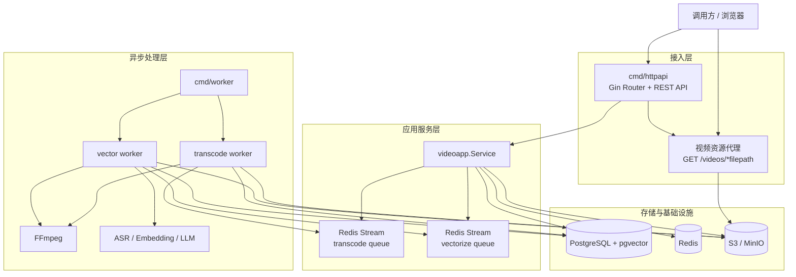

# Video Service — HTTP 视频服务

## 项目简介

`video-service/` 是当前推荐部署的 Go HTTP 视频服务。

当前已实现的核心能力：

- 视频上传（普通 multipart + 分片断点续传）
- ZIP 批量视频导入（multipart + 分片断点续传）
- HLS 转码与封面处理
- 视频列表、播放、删除、发布、推荐状态维护
- 视频与片段反馈（like / double_like / dislike）
- 随机视频片段播放
- 基于内容的视频片段推荐
- 推荐曝光、观看、reaction 行为记录
- 对象存储中的视频资源代理访问
- AI 能力异常时的推荐降级与向量化异步补偿

> 本目录是 Go module 根目录。所有 Go 命令都应在本目录下执行。

## 目录结构

```text
video-service/
├── cmd/
│   ├── dlqctl/                  # Redis Stream 死信队列查看与重放工具
│   ├── httpapi/                 # HTTP 服务入口
│   ├── twotowertrainer/         # 双塔训练调度入口
│   └── worker/                  # 统一 worker 入口
├── configs/                     # 配置文件
├── docs/                        # 设计文档与 Swagger
├── internal/
│   ├── application/videoapp/    # 应用服务层
│   ├── config/                  # 配置加载与类型定义
│   ├── domain/                  # 领域模型
│   ├── http/                    # HTTP 路由、handler、DTO
│   ├── infrastructure/          # AI、对象存储、DB、Redis、FFmpeg
│   ├── lifecycle/               # 启动初始化编排
│   ├── model/                   # 数据模型
│   └── worker/                  # worker 实现
├── middleware/                   # 中间件
├── tools/                       # 辅助工具
└── go.mod
```

## 系统组成



## 启动方式

### 启动 HTTP API

```bash
go run ./cmd/httpapi
```

默认监听 `:8081`。可通过 `HTTP_ADDR` 覆盖：

```bash
HTTP_ADDR=:8083 go run ./cmd/httpapi
```

### 启动 Worker

```bash
go run ./cmd/worker
```

worker 统一启动转码和向量化两条异步处理链路。

### 健康检查

```bash
curl http://localhost:8081/healthz
```

### Swagger 文档

```
http://localhost:8081/swagger/index.html
```

## 主要接口

标准 REST 接口：

| 方法 | 路径 | 说明 |
|------|------|------|
| `GET` | `/healthz` | 健康检查 |
| `GET` | `/api/healthz` | API 健康检查 |
| `GET` | `/api/system/metrics` | 系统运行指标 |
| `POST` | `/api/videos` | 上传视频 |
| `POST` | `/api/videos/archive` | 上传视频压缩包 |
| `POST` | `/api/videos/uploads` | 初始化分片上传 |
| `GET` | `/api/videos/uploads/:uploadId` | 查询分片上传状态 |
| `PUT` | `/api/videos/uploads/:uploadId/chunks/:chunkIndex` | 上传分片 |
| `POST` | `/api/videos/uploads/:uploadId/complete` | 完成分片上传 |
| `GET` | `/api/videos` | 视频列表 |
| `PATCH` | `/api/videos/:id` | 更新视频元数据 |
| `DELETE` | `/api/videos/:id` | 删除视频 |
| `POST` | `/api/videos/:id/cover` | 上传封面 |
| `GET` | `/api/videos/:id/play` | 获取播放地址 |
| `GET` | `/api/videos/:id/similar` | 获取相似视频 |
| `GET` | `/api/videos/:id/view-count` | 获取播放次数 |
| `POST` | `/api/videos/:id/reactions` | 提交视频反馈 |
| `GET` | `/api/videos/:id/reaction-counts` | 获取视频反馈计数 |
| `GET` | `/api/video-segments/random-play` | 随机播放视频片段 |
| `POST` | `/api/video-segments/:id/reactions` | 提交片段反馈 |
| `GET` | `/api/video-segments/:id/reaction-counts` | 获取片段反馈计数 |
| `POST` | `/api/videos/:id/publish` | 设置发布状态 |
| `POST` | `/api/videos/:id/recommend` | 设置推荐状态 |
| `GET` | `/api/transcode-tasks/:taskId` | 查询转码状态 |
| `POST` | `/api/recommendations/by-question` | 根据题目推荐片段 |
| `GET` | `/api/recommendations` | 查询推荐记录 |
| `POST` | `/api/watch-records` | 上报观看记录 |
| `GET` | `/api/questions` | 题目列表 |
| `GET` | `/api/questions/:id` | 题目详情 |
| `GET` | `/videos/*filepath` | 代理访问对象存储资源 |

代码同时保留了一批旧路径别名（如 `/api/video/upload`、`/api/video/list`），用于兼容历史调用方。

## 示例请求

### 上传视频

```bash
curl -X POST "http://localhost:8081/api/videos" \
  -F "file=@demo.mp4" \
  -F "title=示例视频"
```

### 分片上传

```bash
# 创建上传会话
curl -X POST "http://localhost:8081/api/videos/uploads" \
  -H "Content-Type: application/json" \
  -d '{"file_name":"demo.mp4","content_type":"video/mp4","file_size":10485760,"chunk_size":5242880,"total_chunks":2}'

# 上传分片
curl -X PUT "http://localhost:8081/api/videos/uploads/{uploadId}/chunks/0" \
  --data-binary "@demo.part0"

# 完成上传
curl -X POST "http://localhost:8081/api/videos/uploads/{uploadId}/complete"
```

### 查询播放地址

```bash
curl "http://localhost:8081/api/videos/{id}/play"
```

## 配置说明

配置文件位于 `configs/` 目录：

- `video.yml`：本地开发配置（macOS/Windows 默认）
- `video_prod.yml`：服务器部署配置（Linux 默认）

默认加载规则在 `internal/config/loader.go`：
- macOS / Windows 默认使用 `configs/video.yml`
- 其他系统默认使用 `configs/video_prod.yml`
- `CONFIG_FILE` 或 `VIDEO_CONFIG_FILE` 可显式覆盖

环境变量覆盖：

| 环境变量 | 作用 |
|------|------|
| `HTTP_ADDR` | 覆盖 HTTP 监听地址 |
| `CONFIG_FILE` | 指定配置文件路径 |
| `POSTGRES_DSN` | 数据库连接串 |
| `REDIS_PASSWORD` | Redis 密码 |
| `RUSTFS_ACCESS_KEY` | 对象存储 AccessKey |
| `RUSTFS_SECRET_KEY` | 对象存储 SecretKey |
| `DASHSCOPE_API_KEY` | AI 服务 API Key |
| `OPENAI_API_KEY` | OpenAI 兼容 API Key |
| `ASR_API_KEY` | ASR API Key |
| `EMBEDDING_API_KEY` | Embedding API Key |
| `GORSE_API_KEY` | Gorse 推荐引擎 API Key |

## 运行依赖

- Go（版本见 `go.mod`）
- PostgreSQL 13+（需启用 `pgvector` 扩展）
- Redis 6+
- S3 兼容对象存储（MinIO / COS 等）
- FFmpeg（可直接使用宿主机或通过 Docker 镜像）
- ASR / Embedding / LLM 外部 AI 服务

## 测试

```bash
go test ./...
```

## 工具

`tools/` 下包含辅助命令：

- `upload_bench`：上传链路压测
- `db_migrate_except_video_tables`：数据库迁移
- `dlqctl`（在 `cmd/` 下）：死信队列查看与重放
- `publish_recommend_model`：发布推荐模型版本
- 更多工具见各子目录的 `main.go`

## 优先查看的文件

- `cmd/httpapi/main.go`
- `cmd/worker/main.go`
- `internal/http/router/router.go`
- `internal/http/handler/`
- `internal/application/videoapp/`
- `docs/swagger/swagger.yaml`
