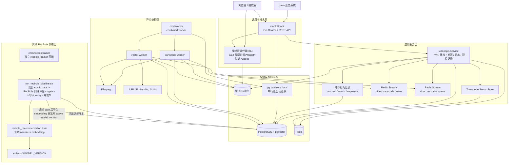
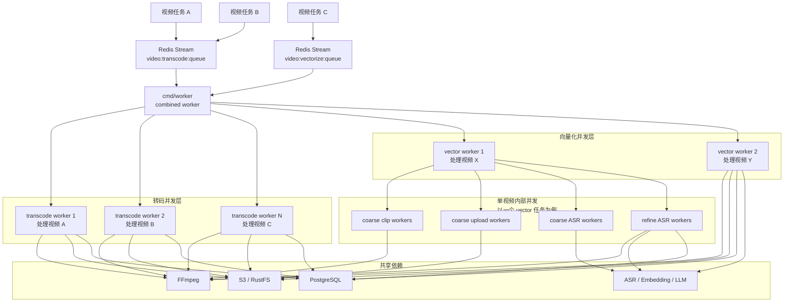

# 衡桃学堂 HTTP 视频服务

## 项目简介

`video-service/` 是当前推荐部署的 Go HTTP 视频服务，适合由 Java 服务通过 HTTP/JSON 调用。

当前已实现的核心能力：

- 视频上传
- HLS 转码与封面处理
- 视频列表、播放、删除、发布、推荐状态维护
- 基于题目的视频片段推荐
- 基于 RecBole embedding 的个性化视频片段推荐
- 推荐曝光、观看、reaction 行为记录与 RecBole 离线训练数据导出
- 观看记录上报
- 题库查询
- 对象存储中的视频资源代理访问
- 知识点视频 ZIP + XLSX 批量导入、异步转码、知识点树和播放记录
- 一个知识点关联多个视频并返回全部可播放资源
- AI 能力异常时的推荐降级与向量化异步补偿

> 本目录是 Go module 根目录。HTTP API、worker、工具命令和测试都应在本目录下执行。

## 目录结构

```text
video-service/
├── cmd/
│   ├── dlqctl/                  # Redis Stream 死信队列查看与重放工具
│   ├── httpapi/                 # HTTP 服务入口
│   ├── knowledgevideo-import/   # MinIO 知识点视频初始化导入工具
│   ├── recboletrainer/          # RecBole 训练调度入口
│   └── worker/                  # 统一 worker 入口
├── configs/                     # HTTP 服务配置
├── docs/                        # 设计文档与 Swagger
│   └── swagger/                 # Swagger 产物
├── internal/
│   ├── application/videoapp/    # 通用视频应用服务层
│   ├── application/knowledgevideo/ # 知识点视频导入与播放
│   ├── config/                  # 配置加载与类型定义
│   ├── domain/                  # 领域模型
│   ├── http/                    # HTTP 路由、handler、DTO、错误处理
│   ├── infrastructure/          # 基础设施（AI、对象存储、DB、Redis、FFmpeg）
│   ├── lifecycle/               # 启动初始化编排
│   ├── model/                   # 数据模型
│   └── worker/                  # worker 实现（transcode、vector、knowledge video、combined）
├── logs/                        # 日志目录
├── middleware/
├── storage/                     # 本地存储目录（gitignored）
└── tools/                       # 压测、迁移、RecBole 数据导出/导入等辅助工具
```

## 系统组成


```mermaid
flowchart TD
    Java[Java 业务系统]
    Browser[浏览器 / 播放器]

    subgraph Access[调用与接入层]
        HTTP[cmd/httpapi\nGin Router + REST API]
        Proxy[视频资源代理接口\nGET 配置前缀/*filepath\n默认 /videos]
    end

    subgraph App[应用服务层]
        Service[videoapp.Service\n上传 / 播放 / 推荐 / 题库 / 观看记录]
        Status[Transcode Status Store]
        TQ[Redis Stream\nvideo:transcode:queue]
        VQ[Redis Stream\nvideo:vectorize:queue]
        RecLog[推荐行为记录\nreaction / watch / exposure]
    end

    subgraph Infra[存储与基础设施]
        PG[(PostgreSQL + pgvector)]
        Redis[(Redis)]
        S3[(S3 / RustFS)]
        SchemaLock[pg_advisory_lock\n串行化启动迁移]
    end

    subgraph Async[异步处理层]
        Worker[cmd/worker\ncombined worker]
        TW[transcode worker]
        VW[vector worker]
        FFmpeg[FFmpeg]
        AI[ASR / Embedding / LLM]
    end

    subgraph Training[离线 RecBole 训练层]
        Trainer[cmd/recboletrainer\n独立 recbole_trainer 容器]
        Pipeline[run_recbole_pipeline.sh\n导出 atomic data -> RecBole 训练评估 -> gate -> 导入 recsys 并发布]
        PyTrain[recbole_recommendation.train\n生成 user/item embedding]
        Artifact["artifacts/$MODEL_VERSION"]
    end

    Java --> HTTP
    Browser --> HTTP
    Browser --> Proxy

    HTTP --> Service
    HTTP --> Proxy

    Service --> PG
    Service --> Redis
    Service --> S3
    Service --> Status
    Service --> TQ
    Service --> VQ
    Service --> RecLog

    Status --> Redis
    Proxy --> S3
    RecLog --> PG

    HTTP --> SchemaLock
    Worker --> SchemaLock
    SchemaLock --> PG

    Worker --> TW
    Worker --> VW

    TW --> TQ
    TW --> PG
    TW --> S3
    TW --> FFmpeg

    VW --> VQ
    VW --> PG
    VW --> S3
    VW --> FFmpeg
    VW --> AI

    Trainer --> Pipeline
    Pipeline -->|导出训练样本| PG
    Pipeline --> PyTrain
    PyTrain --> Artifact
    Pipeline -->|通过 gate 后导入 embedding 并发布 active model_version| PG
```

说明：

- `cmd/httpapi` 提供统一 HTTP 接口，Java 直接调用这一层。
- `cmd/worker` 是当前默认的 worker 启动入口，用于消费通用视频转码、向量化和知识点视频转码任务队列。
- 视频文件与 HLS 产物存放在对象存储中，通过 `Storage.MediaRoutePrefix` 配置的路由代理访问，默认兼容 `/videos/*filepath`。
- `/api/video-segments/random-play` 是当前个性化推荐的主要展现入口；当前两份示例配置均使用 `Recommendation.Engine=recbole`，从 `recsys` 的 active RecBole embedding 做召回。设为 `gorse` 时可改由 Gorse 提供候选，Go 服务仍负责 Redis random-play bucket、可播放过滤、曝光记录和最终兜底。
- `/api/recommendations/by-question` 面向题目文本匹配，主要基于题目文本向量与视频片段向量做召回，不依赖 RecBole 用户向量。
- `recbole_trainer` 是独立训练调度进程，线上主服务容器默认不执行 Python 训练。
- 推荐链路在外部 AI provider 不可用时会自动进入降级模式，优先返回可用结果而不是直接报错。
- `vector_worker` 在 AI provider 短时不可用时优先走重试与退避，不把所有上游失败立即视为终态失败。
- 转码队列和向量化队列基于 Redis Streams 消费者组实现，任务处理成功后才 ACK；终态失败会进入对应 `:dlq` 死信流。
- `hierarchical` 向量化链路已拆为 prepare、coarse、refine、finalize 四个 Redis Stream 阶段，并通过 `edu_video_vector_stage` 记录阶段状态。
- `cmd/httpapi` 与 `cmd/worker` 启动时都会尝试补齐数据库 schema；当前通过 PostgreSQL advisory lock 串行化迁移，避免 HTTP 与 worker 并发启动时发生 DDL 冲突。
- 知识点视频使用独立的 `KnowledgeVideoStorage` Bucket 和 `/knowledge-video-media` 代理前缀，不与通用视频 HLS 对象混用。

## 多视频并发处理


```mermaid
flowchart TD
    VT1[视频任务 A]
    VT2[视频任务 B]
    VT3[视频任务 C]

    TQ[Redis Stream\nvideo:transcode:queue]
    VQ[Redis Stream\nvideo:vectorize:queue]

    Worker[cmd/worker\ncombined worker]

    subgraph TP[转码并发层]
        TW1[transcode worker 1\n处理视频 A]
        TW2[transcode worker 2\n处理视频 B]
        TW3[transcode worker N\n处理视频 C]
    end

    subgraph VP[向量化并发层]
        VW1[vector worker 1\n处理视频 X]
        VW2[vector worker 2\n处理视频 Y]
    end

    subgraph VInner[单视频内部并发\n以一个 vector 任务为例]
        Clip[coarse clip workers]
        Upload[coarse upload workers]
        CoarseASR[coarse ASR workers]
        RefineASR[refine ASR workers]
    end

    subgraph Infra2[共享依赖]
        FFmpeg2[FFmpeg]
        S32[S3 / RustFS]
        PG2[PostgreSQL]
        AI2[ASR / Embedding / LLM]
    end

    VT1 --> TQ
    VT2 --> TQ
    VT3 --> VQ

    TQ --> Worker
    VQ --> Worker

    Worker --> TW1
    Worker --> TW2
    Worker --> TW3
    Worker --> VW1
    Worker --> VW2

    TW1 --> FFmpeg2
    TW1 --> S32
    TW1 --> PG2
    TW2 --> FFmpeg2
    TW2 --> S32
    TW2 --> PG2
    TW3 --> FFmpeg2
    TW3 --> S32
    TW3 --> PG2

    VW1 --> Clip
    VW1 --> Upload
    VW1 --> CoarseASR
    VW1 --> RefineASR

    Clip --> FFmpeg2
    Upload --> S32
    CoarseASR --> AI2
    RefineASR --> FFmpeg2
    RefineASR --> AI2
    RefineASR --> PG2

    VW2 --> FFmpeg2
    VW2 --> S32
    VW2 --> PG2
    VW2 --> AI2
```

真实负载是“视频级并发 + 单视频内部并发”叠加，最终共同竞争 FFmpeg、对象存储、数据库和 AI 服务资源。

## HTTP 服务入口

### 启动 HTTP API

```bash
go run ./cmd/httpapi
```

直接用 `go run` 启动时，会自动向上查找根目录 `.env`，再按其中的 `VIDEO_APP_ENV_FILE` 加载 `.env.local` 或 `.env.deploy`。当前本地默认 `.env` 指向 `.env.local`，因此无需手动 export `POSTGRES_DSN`。

该入口会完成以下初始化：

- 加载配置文件
- 连接 PostgreSQL
- 连接 Redis
- 初始化对象存储客户端并确保 Bucket 存在
- 自动执行表迁移，并尝试创建 `pgvector` 扩展与相关索引
- 注册 Gin 路由、Swagger、健康检查和视频代理接口

默认监听地址：

```text
:8081
```

可以通过环境变量覆盖：

```bash
HTTP_ADDR=:8081 go run ./cmd/httpapi
```

HTTP API 使用配置文件中的 `Auth.JWTSecret`，也可在 `.env.local` / `.env.deploy` 或当前环境中设置不少于 32 个字符的 `JWT_SECRET`；环境变量优先覆盖 YAML。`configs/video.yml` 提供仅限本地开发的回退密钥，生产环境必须通过 `.env.deploy` 或部署环境设置独立随机密钥。JWT 默认有效期由 `Auth.JWTExpireHour` 控制；本地配置显式为 8 小时，HTTP 服务的 `configs/video_prod.yml` 示例显式为 24 小时，而 `deployment/config/video_prod.yml` 未设置该字段时会回退到代码默认的 8 小时。

管理员通过 `POST /api/auth/login` 使用 `sys_user.username/password` 登录。服务只接受 `user_type = 3`、`status = 1`、`deleted = 0` 的管理员账号，并在每次受保护请求中重新校验账号状态。上传、修改、删除、封面、发布、人工推荐、转码/系统监控和 `/api/admin/**` 需要 Bearer JWT；Swagger 页面和文档可直接访问，但其中的管理 API 仍需要在 Swagger 的 `Authorize` 中填写 JWT；播放、推荐、观看记录和互动接口保持公开。本服务没有创建或重置管理员账号的 API，部署前必须通过现有身份/数据库运维流程预置 `sys_user` 管理员和密码哈希。

普通视频、压缩包、分片上传和知识点视频导入的上传者 ID 由 JWT 管理员 ID 决定，不再接收客户端上传者字段。观看、推荐、点赞等公开接口中的业务 `user_id` 保持现有含义和协议。

知识点视频的播放记录和观看会话接口当前不使用 JWT，`user_id` 由调用方提供；观看会话只确认该用户存在，不验证调用方是否拥有该身份。若请求来自不可信客户端，应在上游网关或业务服务补充身份绑定、限流和防刷，否则可能冒用用户并污染 RecBole 训练信号。

### 启动 Worker

```bash
go run ./cmd/worker
```

该 worker 会统一启动通用视频转码 worker、向量化 worker 和知识点视频转码 worker。

向量化 worker 需要 AI 服务的 API Key。下面的命令会按根 `.env` 指定的文件加载 `DASHSCOPE_API_KEY`、`OPENAI_API_KEY` 或相应的 ASR/Embedding 覆盖变量：

```bash
VIDEO_APP_ENV_FILE=.env.local go run ./cmd/worker
```

### 启动 RecBole 训练调度

本地如需验证 RecBole 定时训练入口，可以单独启动：

```bash
RECBOLE_TRAINER_ENABLED=true CONFIG_FILE=configs/video.yml go run ./cmd/recboletrainer
```

`RECBOLE_TRAINER_ENABLED` 默认是 `false`；没有显式设为 `true` 时进程会启动但不会注册调度器。该入口只负责训练调度，不启动 HTTP 服务、转码 worker 或向量化 worker。训练调度会触发 `../recbole-training/scripts/run_recbole_pipeline.sh`。

## Java 调用方式

后续部署建议让 Java 服务直接调用本服务暴露的 REST 接口，不再依赖 gRPC。

推荐方式：

- Java 通过 `RestTemplate`、`WebClient`、OpenFeign 或其他 HTTP Client 调用。
- 请求和响应统一使用 JSON。
- 小文件或历史兼容上传可以继续使用 `multipart/form-data`。
- 大文件视频和通用视频 ZIP 归档建议使用分片断点续传接口；知识点视频 ZIP + XLSX 批次使用独立导入接口。
- 视频播放地址、封面地址、HLS 地址均由 HTTP 服务返回。
- 新增调用应统一使用标准 REST 路径，不要继续依赖历史兼容路径。

典型调用链路：

1. Java 调用上传接口提交视频文件；大文件先创建上传会话，再按分片上传并完成会话。
2. HTTP 服务合并上传内容，写入视频记录并投递转码任务。
3. Java 通过任务状态接口轮询转码进度。
4. 转码完成后，Java 调用播放接口获取播放地址。
5. 推荐场景下，Java 调用题目推荐接口获取片段列表。

## 主要接口

`internal/http/router/router.go` 当前同时保留两套路由：

- 标准 REST 风格接口：推荐给 Java 服务使用。
- 旧兼容接口：用于兼容历史调用方。

后续新增调用建议统一使用标准 REST 风格接口。

### 推荐给 Java 的 REST 接口

接口边界如下：

- **公开接口**：健康检查、Swagger、播放/媒体代理、推荐查询、观看记录、reaction、题库查询和知识点视频播放/观看上报。
- **管理员 JWT**：上传、分片/归档处理、元数据与发布/推荐状态修改、转码状态、系统指标、知识点视频导入、`/api/admin/**` 以及下表标注的管理接口。先调用 `POST /api/auth/login`，再在请求中发送 `Authorization: Bearer <access_token>`。
- **内部用途但应用层无鉴权**：`/api/internal/recommendations/external/recbole` 只供 Gorse external script 或受控内部调用，但当前没有 JWT/API key 校验。部署时必须通过反向代理 ACL、网络策略或防火墙限制访问，不能把路径中的 `internal` 当作安全边界，也不是浏览器或普通 Java 客户端的公开契约。

表中未重复标注的路径按以上路由分组规则解释；Swagger 页面本身可公开访问，但其中的管理员 API 仍需要 JWT。

| 方法 | 路径 | 说明 |
|------|------|------|
| `POST` | `/api/auth/login` | 管理员登录，公开；返回短期 JWT |
| `GET` | `/api/auth/me` | 当前管理员资料，管理员 JWT |
| `GET` | `/healthz` | 健康检查 |
| `GET` | `/api/healthz` | API 健康检查 |
| `GET` | `/api/system/metrics` | 查询系统运行指标，管理员 JWT |
| `GET` | `/api/knowledge-videos/tree` | 查询知识点树及关联视频状态 |
| `POST` | `/api/admin/knowledge-videos/batches` | 上传 ZIP 与 XLSX，创建知识点视频导入批次，管理员 JWT |
| `GET` | `/api/admin/knowledge-videos/batches/:batchId` | 查询知识点视频导入与转码进度，管理员 JWT |
| `GET` | `/api/knowledge-points/:knowledgePointId/video` | 知识点单视频兼容查询，公开 |
| `GET` | `/api/knowledge-points/:knowledgePointId/videos` | 获取知识点下全部可播放视频 |
| `POST` | `/api/knowledge-videos/:knowledgeVideoId/playbacks` | 记录知识点视频播放 |
| `PUT` | `/api/knowledge-videos/:knowledgeVideoId/watch-sessions/:sessionId` | 幂等上报绝对观看秒数，公开；累计达到视频时长 60% 时形成有效观看信号 |
| `GET` | `/api/admin/recommendation/overview` | 推荐总览，管理员 JWT |
| `GET` | `/api/admin/recommendation/diagnostics` | 推荐诊断，管理员 JWT |
| `GET` | `/api/admin/recommendation/datasources` | 推荐数据源统计，管理员 JWT |
| `GET` | `/api/admin/recommendation/effects` | 推荐效果指标，管理员 JWT |
| `GET` | `/api/admin/recommendation/recbole/performance` | 查询 RecBole Recall@20、NDCG@20、Hit@20、Precision@20 与模型版本时间序列，管理员 JWT |
| `GET` | `/api/admin/recommendation/trace/random-play` | 追踪随机播放推荐，管理员 JWT |
| `POST` | `/api/admin/recommendation/trace/by-question` | 追踪题目推荐，管理员 JWT |
| `GET` | `/api/admin/recommendation/redis-state` | 查询推荐 Redis 状态，管理员 JWT |
| `GET` | `/api/admin/recommendation/preview/random-play` | 预览随机播放候选，管理员 JWT |
| `POST` | `/api/admin/recommendation/preview/by-question` | 预览题目推荐候选，管理员 JWT |
| `POST` | `/api/videos` | 上传视频，管理员 JWT |
| `POST` | `/api/videos/archive` | 上传归档视频，管理员 JWT |
| `GET` | `/api/videos/archive/batches/:batchId/progress` | 查询归档处理进度，管理员 JWT |
| `POST` | `/api/videos/uploads` | 创建普通视频分片上传会话，管理员 JWT |
| `GET` | `/api/videos/uploads/:uploadId` | 查询分片上传状态，管理员 JWT |
| `PUT` | `/api/videos/uploads/:uploadId/chunks/:chunkIndex` | 上传一个分片，管理员 JWT |
| `POST` | `/api/videos/uploads/:uploadId/complete` | 完成普通视频分片上传，管理员 JWT |
| `POST` | `/api/videos/archive/uploads` | 创建 ZIP 批量分片上传会话，管理员 JWT |
| `POST` | `/api/videos/archive/uploads/:uploadId/complete` | 完成 ZIP 批量分片上传，管理员 JWT |
| `GET` | `/api/videos` | 获取视频列表 |
| `PATCH` | `/api/videos/:id` | 更新视频标题和描述，管理员 JWT |
| `DELETE` | `/api/videos/:id` | 删除视频，管理员 JWT |
| `POST` | `/api/videos/:id/cover` | 上传封面，管理员 JWT |
| `GET` | `/api/videos/:id/play` | 获取播放地址 |
| `GET` | `/api/videos/:id/similar` | 获取相似视频 |
| `GET` | `/api/videos/:id/view-count` | 获取观看次数 |
| `POST` | `/api/videos/:id/reactions` | 提交视频反馈 |
| `GET` | `/api/videos/:id/reaction-counts` | 获取视频反馈计数 |
| `GET` | `/api/video-segments/random-play` | 刷新播放片段；带 `user_id` 时按 `Recommendation.Engine` 选择主引擎，当前示例配置默认使用 RecBole，候选不足时随机兜底；省略 `user_id` 时兼容回退到用户 `6` |
| `POST` | `/api/video-segments/:id/reactions` | 提交视频片段反馈 |
| `GET` | `/api/video-segments/:id/reaction-counts` | 获取视频片段反馈计数 |
| `POST` | `/api/videos/:id/publish` | 设置发布状态，管理员 JWT |
| `POST` | `/api/videos/:id/recommend` | 设置推荐状态，管理员 JWT |
| `GET` | `/api/transcode-tasks/:taskId` | 查询转码任务状态，管理员 JWT |
| `POST` | `/api/recommendations/by-question` | 根据题目推荐视频片段 |
| `GET` | `/api/recommendations` | 查询推荐记录 |
| `POST` | `/api/watch-records` | 上报观看记录 |
| `GET` | `/api/questions` | 分页查询题库 |
| `GET` | `/api/questions/:id` | 查询题目详情 |
| `GET` | `/videos/*filepath` | 代理访问对象存储中的视频资源，默认路径 |
| `GET` | `/knowledge-video-media/hls/:videoId/*filepath` | 代理知识点视频 HLS 资源，默认路径 |
| `GET` | `/api/internal/recommendations/external/recbole` | Gorse external 候选回调；应用层无鉴权，必须由网络边界限制为内部访问 |

对象存储代理路由由 `Storage.MediaRoutePrefix` 控制，默认是 `/videos`。如果配置成其他前缀，服务仍保留 `/videos/*filepath` 兼容路由。

### 兼容保留的旧接口

项目中仍保留旧路径，例如：

- `/api/video/upload`
- `/api/video/upload_archive`
- `/api/video/list`
- `/api/video/:id`
- `/api/video/play/:id`
- `/api/video/reaction/:id`
- `/api/video/reaction_counts/:id`
- `/api/video/recommend_by_question`
- `/api/video/report_watch`
- `/api/question/list`
- `/api/question/:id`

这些兼容路径当前仍可正常调用，Swagger 文档只暴露标准 REST 路径，避免新接入方继续依赖旧路径。

### 旧路径到标准路径对照

| 旧路径 | 方法 | 标准路径 | 方法 |
|------|------|------|------|
| `/api/question/list` | `GET` | `/api/questions` | `GET` |
| `/api/question/:id` | `GET` | `/api/questions/:id` | `GET` |
| `/api/video/upload` | `POST` | `/api/videos` | `POST` |
| `/api/video/upload_archive` | `POST` | `/api/videos/archive` | `POST` |
| `/api/video/recommend_by_question` | `POST` | `/api/recommendations/by-question` | `POST` |
| `/api/video/report_watch` | `POST` | `/api/watch-records` | `POST` |
| `/api/video/list` | `GET` | `/api/videos` | `GET` |
| `/api/video/:id` | `PUT` | `/api/videos/:id` | `PATCH` |
| `/api/video/:id` | `DELETE` | `/api/videos/:id` | `DELETE` |
| `/api/video/cover/:id` | `POST` | `/api/videos/:id/cover` | `POST` |
| `/api/video/play/:id` | `GET` | `/api/videos/:id/play` | `GET` |
| `/api/video/similar/:id` | `GET` | `/api/videos/:id/similar` | `GET` |
| `/api/video/view_count/:id` | `GET` | `/api/videos/:id/view-count` | `GET` |
| `/api/video/reaction/:id` | `POST` | `/api/videos/:id/reactions` | `POST` |
| `/api/video/reaction_counts/:id` | `GET` | `/api/videos/:id/reaction-counts` | `GET` |
| `/api/video/publish/:id` | `POST` | `/api/videos/:id/publish` | `POST` |
| `/api/video/recommend/:id` | `POST` | `/api/videos/:id/recommend` | `POST` |
| `/api/video/status/:taskId` | `GET` | `/api/transcode-tasks/:taskId` | `GET` |

注意：`更新视频元数据` 这一项不只是路径变化，HTTP 方法也从 `PUT` 收敛为 `PATCH`。

## 当前可靠性机制

### 上传链路一致性补偿

上传接口会先把原始视频上传到对象存储，再创建视频记录、写入转码状态并投递转码任务。当前代码已经补齐了启动阶段的补偿逻辑：

- 原视频上云后，如果视频记录创建失败，会尽力删除刚上传的原始对象。
- 视频记录创建成功后，如果转码状态写入失败，会把视频状态标记为 `FAILED`，并尽力删除原始对象。
- 视频记录创建成功后，如果转码任务入队失败，也会把视频状态标记为 `FAILED`，并尽力删除原始对象。
- 向量化任务入队仍是尽力而为，不阻断主上传链路。

这套补偿不是完整 outbox/saga，但可以避免上传启动阶段出现“对象已上传、任务未启动、状态不一致”的常见脏状态。

### 大文件上传与断点续传

普通视频和 ZIP 批量导入都支持分片断点续传：

- 普通视频先调用 `POST /api/videos/uploads` 创建上传会话。
- ZIP 批量导入先调用 `POST /api/videos/archive/uploads` 创建上传会话。
- 两类上传都通过 `PUT /api/videos/uploads/:uploadId/chunks/:chunkIndex` 上传分片。
- 可通过 `GET /api/videos/uploads/:uploadId` 查询已上传分片，客户端重试或刷新后可以跳过已完成分片。
- 普通视频调用 `POST /api/videos/uploads/:uploadId/complete` 完成合并并进入转码。
- ZIP 调用 `POST /api/videos/archive/uploads/:uploadId/complete` 完成合并并批量导入视频。

分片序号从 `0` 开始。除最后一个分片外，每个分片大小必须等于创建会话时传入的 `chunk_size`；最后一个分片大小必须等于文件剩余字节数。服务端只把大小正确的分片计入上传状态。

旧的 `POST /api/videos/archive` 通用视频 ZIP multipart 接口仍保留，但后端会先把 ZIP 落盘再流式解包，不再把整个 ZIP 一次性读入内存。新接入方如果需要断点续传，应优先使用通用视频 ZIP 分片上传接口。知识点视频的 ZIP + XLSX 导入当前通过 `POST /api/admin/knowledge-videos/batches` 完成，不复用这组分片接口。

### 知识点视频导入文件约定

`POST /api/admin/knowledge-videos/batches` 的 `archive` 必须是 ZIP，`mapping` 必须是 XLSX。映射表读取第一个 worksheet，第一行必须严格为三列 `id`、`name`、`video_name`，不能有第四列，且至少有一行数据。`id` 必须是已存在的正整数知识点 ID，`name` 必须与字典名称完全一致；同一知识点可以有多行视频。

`video_name` 在表内必须唯一，并按 basename 与 ZIP 中恰好一个视频文件匹配。ZIP 可包含目录，但重复 basename、映射缺失视频或未被映射引用的额外视频会拒绝整个批次。支持 `.mp4`、`.mov`、`.mkv`、`.avi`、`.webm`、`.m4v`；路径穿越、绝对路径、符号链接和其他扩展名会被拒绝，`__MACOSX`、`.DS_Store`、`._*` 元数据会被忽略。大小和条目限制见 `KnowledgeVideoStorage`。

### MinIO 知识点视频初始化导入

运维初始化可使用 `cmd/knowledgevideo-import`，直接扫描源 MinIO 前缀，不经过 HTTP、ZIP 或浏览器鉴权。XLSX 仍必须严格使用 `id`、`name`、`video_name` 三列表头；`video_name` 可以是前缀下唯一的 basename，也可以是相对对象路径。数据库知识点名称是最终依据，类似 `父级 / 叶子名称` 的输入会在叶子名称精确匹配时自动规范化。

该命令允许同一个源对象出现在多行并挂到多个知识点。每个唯一源对象只会流式复制一次到知识视频对象存储；每行仍创建独立的视频 ID、HLS 前缀和转码任务。现有 HTTP 导入接口的唯一文件名规则不变。

先执行 dry-run：

```bash
SOURCE_MINIO_ENDPOINT=http://minio.example:9000 \
SOURCE_MINIO_BUCKET=source-bucket \
SOURCE_MINIO_ACCESS_KEY=... \
SOURCE_MINIO_SECRET_KEY=... \
go run ./cmd/knowledgevideo-import \
  --mapping /path/to/mapping.xlsx \
  --source-prefix '_video/xlsx视频' \
  --upload-user-id 1 \
  --batch-key initial-import-001 \
  --dry-run
```

确认输出后去掉 `--dry-run` 正式执行。PostgreSQL、Redis 和知识视频目标对象存储继续使用项目配置及现有环境变量；源 MinIO 凭据只通过 `SOURCE_MINIO_*` 环境变量传入，不能写入仓库或命令输出。`--batch-key` 用于幂等：相同 key 已创建批次时不会重复入库。

批量场景（源桶按 `batch-*` 组织 XLSX + ZIP）可用 `--all-prefix` 一次扫描整段前缀并逐批处理：

```bash
SOURCE_MINIO_ENDPOINT=... SOURCE_MINIO_BUCKET=... \
SOURCE_MINIO_ACCESS_KEY=... SOURCE_MINIO_SECRET_KEY=... \
go run ./cmd/knowledgevideo-import \
  --all-prefix 'batch_imports/2026-08' \
  --upload-user-id 1 \
  --batch-key bulk-import-202608 \
  --report-dir /private/tmp/knowledge-video-import-report
```

- `--all-prefix` 会为前缀下每个同时存在 `batch-*.xlsx` 与 `batch-*.zip` 的批次执行导入；只有 XLSX 或只有 ZIP 的批次记为 `invalid` 并跳过。
- `--report-dir`（不传时默认为系统临时目录下的 `knowledge-video-import-<batch-key>`）会写出 `summary.json`、`valid-batches.csv` 和 `invalid-batches.csv`，后者含 `batch`、`status`、`rows`、`unique_objects`、`skipped_empty_rows`、`error` 列，用于核对失败原因。
- `--continue-on-error` 默认 `true`，单个批次失败不中断后续批次；改成 `false` 可在首个失败批次处停止。
- 单批次模式下 `--list-only` 只列源对象不碰数据库，`--inspect-object <key>` 可下载并打印单个 XLSX 的表头与校验问题，适合先排查映射文件格式。

该命令对映射文件的校验与 HTTP 批次接口一致：表头必须严格为 `id`、`name`、`video_name` 三列；`id` 必须存在、`name` 必须与知识点字典精确匹配（`父级 / 叶子名称` 形式会自动按叶子名称规范化）。批量报告中的常见失败原因是表头不精确（`header must be exactly ...`）和数据行缺少 `video_name`（`video name is required`）。

观看会话的 `sessionId` 由客户端生成，必须匹配 `^[A-Za-z0-9_-]{16,64}$`，幂等范围是 `(user_id, knowledge_video_id, session_id)`。同一 session 重试只保留较大观看秒数，不发送增量；不同 session 按用户和视频求和，服务端把单次值与汇总值封顶到视频时长。达到视频时长 60% 的 `effective_watch` 只进入 RecBole 训练期虚拟 item，不会成为在线候选。

### Redis Stream 队列语义

当前转码和向量化任务都走 Redis Streams，下面是默认 key；实际值可通过 `RedisKeys` 配置覆盖：

- 转码队列：`video:transcode:queue`
- 向量化队列：`video:vectorize:queue`
- 向量化 prepare 阶段队列：`video:vector:prepare`
- 向量化 coarse 阶段队列：`video:vector:coarse`
- 向量化 refine 阶段队列：`video:vector:refine`
- 向量化 finalize 阶段队列：`video:vector:finalize`
- 知识点视频转码队列：`knowledge_video:transcode:stream`
- 运行状态：`video:transcode:status:{taskId}`
- 活跃计数：`video:runtime:active:*`
- 视频反馈队列：`video:reaction:queue`
- 视频片段反馈队列：`segment:reaction:queue`

队列消费采用消费者组：

- `Dequeue` 只取消息，不立即 ACK。
- worker 处理成功后调用 `Ack`。
- 可重试失败会重新入队并 ACK 原消息。
- 终态失败会写入 `:dlq` 死信流并 ACK 原消息。

知识点视频终态失败会写入 `knowledge_video:transcode:stream:dlq`，但当前 `cmd/dlqctl` 不包含该队列，`--queue all` 也不会查看或重放它。批次接口会显示失败状态和错误；仓库当前没有受支持的知识点视频 DLQ 恢复工具或 runbook。生产恢复必须同时处理持久化失败状态、重试计数和 Redis payload；单纯重新插入原 payload 会再次被判定为终态失败。

### 向量化链路现状

向量化 worker 当前支持 `hierarchical` 模式。顶层 `video:vectorize:queue` 仍是上传链路的入口；当模式为 `hierarchical` 时，worker 会把任务转交给四个 Redis Stream 阶段队列：

1. `vector.prepare`：校验视频、探测时长、生成粗分段计划。
2. `vector.coarse`：按计划粗切分、上传片段并执行 coarse ASR。
3. `vector.refine`：基于 coarse 文本调用 LLM 生成细分段，并执行 refine ASR 与 embedding。
4. `vector.finalize`：标记向量化链路完成。

`full` 和 `sample` 模式仍走原有视频级单体处理路径。`coarse` 和 `refine` 阶段内部继续使用既有 ants pool 并发，避免把 clip、ASR、LLM、embedding 拆成过多 Redis 队列。

## 示例请求

受保护请求先登录并保存 access token：

```bash
ACCESS_TOKEN=$(curl -sS -X POST "http://localhost:8081/api/auth/login" \
  -H "Content-Type: application/json" \
  -d '{"username":"<admin-username>","password":"<admin-password>"}' \
  | jq -r '.data.access_token // .data.token')
test -n "${ACCESS_TOKEN}" && test "${ACCESS_TOKEN}" != "null"
```

示例中的 `<admin-username>` 和 `<admin-password>` 必须来自已配置且启用的 `sys_user` 管理员账号；仓库不提供默认密码。

### 上传视频

```bash
curl -X POST "http://localhost:8081/api/videos" \
  -H "Authorization: Bearer ${ACCESS_TOKEN}" \
  -F "file=@demo.mp4" \
  -F "title=示例视频" \
  -F "description=用于联调"
```

### 分片上传普通视频

```bash
curl -X POST "http://localhost:8081/api/videos/uploads" \
  -H "Authorization: Bearer ${ACCESS_TOKEN}" \
  -H "Content-Type: application/json" \
  -d '{
    "file_name": "demo.mp4",
    "content_type": "video/mp4",
    "title": "示例视频",
    "description": "用于联调",
    "file_size": 10485760,
    "chunk_size": 8388608,
    "total_chunks": 2
  }'

curl -X PUT "http://localhost:8081/api/videos/uploads/{uploadId}/chunks/0" \
  -H "Authorization: Bearer ${ACCESS_TOKEN}" \
  --data-binary "@demo.part0"

curl -X GET "http://localhost:8081/api/videos/uploads/{uploadId}" \
  -H "Authorization: Bearer ${ACCESS_TOKEN}"

curl -X POST "http://localhost:8081/api/videos/uploads/{uploadId}/complete" \
  -H "Authorization: Bearer ${ACCESS_TOKEN}"
```

### 分片上传 ZIP 批量导入

```bash
curl -X POST "http://localhost:8081/api/videos/archive/uploads" \
  -H "Authorization: Bearer ${ACCESS_TOKEN}" \
  -H "Content-Type: application/json" \
  -d '{
    "file_name": "lessons.zip",
    "content_type": "application/zip",
    "description": "批量导入说明",
    "file_size": 104857600,
    "chunk_size": 8388608,
    "total_chunks": 13
  }'

curl -X PUT "http://localhost:8081/api/videos/uploads/{uploadId}/chunks/0" \
  -H "Authorization: Bearer ${ACCESS_TOKEN}" \
  --data-binary "@lessons.part0"

curl -X POST "http://localhost:8081/api/videos/archive/uploads/{uploadId}/complete" \
  -H "Authorization: Bearer ${ACCESS_TOKEN}"
```

### 查询转码状态

```bash
curl "http://localhost:8081/api/transcode-tasks/{taskId}" \
  -H "Authorization: Bearer ${ACCESS_TOKEN}"
```

### 获取播放地址

```bash
curl "http://localhost:8081/api/videos/{id}/play"
```

### 根据题目推荐视频

```bash
curl -X POST "http://localhost:8081/api/recommendations/by-question" \
  -H "Content-Type: application/json" \
  -d '{
    "question_id": 1001,
    "user_id": 2001,
    "limit": 3
  }'
```

如果外部 AI provider 暂时不可用，服务会自动走本地 fallback embedding 和降级召回路径。降级时仍返回 `200`，但响应体中的 `data.degraded` 会为 `true`，并带有 `data.message` 提示当前结果来自降级路径。

### 上报观看记录

```bash
curl -X POST "http://localhost:8081/api/watch-records" \
  -H "Content-Type: application/json" \
  -d '{
    "question_id": 1001,
    "user_id": 2001,
    "video_segment_id": 3001,
    "is_watched": true,
    "watch_duration": 120
  }'
```

## 运行依赖

部署时至少需要以下依赖：

- Go `1.26.1`
- PostgreSQL `13+`，并启用 `pgvector`
- Redis `6+`
- S3 兼容对象存储
- FFmpeg / ffprobe，或 Docker 可用的 FFmpeg 镜像
- ASR / Embedding / LLM 对应的外部 AI 服务
- RecBole 训练容器需要 Python 3、RecBole 和 PyTorch；线上 HTTP/worker 主服务不要求宿主机安装 Python

推荐链路已经具备本地 fallback embedding 兜底，因此外部 embedding 服务短时异常时，推荐接口仍可能返回降级结果。向量化链路仍然依赖外部 ASR / Embedding / LLM，但 worker 已增加更细粒度的 AI 错误重试与退避逻辑。

## 配置说明

配置文件位置：

- `configs/video.yml`
- `configs/video_prod.yml`

默认加载规则：

- Windows、macOS 默认加载 `configs/video.yml`。
- 其他环境默认加载 `configs/video_prod.yml`。
- `cmd/httpapi` 和 `cmd/worker` 启动时会先定位到本目录，再按相对路径读取配置。
- 直接 `go run` 会先加载根目录 `.env`，再根据 `VIDEO_APP_ENV_FILE` 加载私有 `.env.local` 或 `.env.deploy`；已有 shell 环境变量优先生效，不会被 `.env` 覆盖。
- 可通过 `CONFIG_FILE` 或 `VIDEO_CONFIG_FILE` 覆盖配置文件路径。
- 两者同时存在时，`CONFIG_FILE` 优先生效。

当前对象存储约定：

- `configs/video.yml` 保留本地测试配置，默认连接本机 MinIO：`localhost:9000`，Bucket 为 `video-object-storage`。
- `configs/video_prod.yml` 面向生产/服务器部署，当前连接腾讯云 COS：`https://video-object-storage.cos.ap-beijing.myqcloud.com`，地域为 `ap-beijing`，Bucket 为 `video-object-storage`。
- 对象存储底层仍走 S3 兼容协议和 MinIO SDK；生产配置使用 `Region: "ap-beijing"` 与 `BucketLookup: "dns"`，代码会兼容 COS bucket 域名并在内部归一化为服务 endpoint。
- 密钥、密码和 DSN 不写入 YAML。复制根目录 `.env.local.example` 或 `.env.deploy.example` 后，在私有 `.env.local` / `.env.deploy` 中填写。
- `POSTGRES_DSN`、`REDIS_ADDR`、`REDIS_PASSWORD`、`COS_SECRET_ID` / `COS_SECRET_KEY`、`RUSTFS_ACCESS_KEY` / `RUSTFS_SECRET_KEY`、`GORSE_API_KEY` 和 AI API key 会覆盖配置文件中的对应字段。根 Compose 的 `GORSE_API_KEY` 必须与 `GORSE_SERVER_API_KEY` 完全一致。Gorse 镜像默认固定为 `0.5.11`；版本覆盖只能由 shell 或 Compose 根 `.env` 提供，服务级 `.env.local` / `.env.deploy` 不参与镜像标签插值。

Gorse endpoint 需按运行位置区分：本地服务配置和代码默认值使用 `http://localhost:8087`；根 Compose 的 Gorse master HTTP 是容器内 `8088`，叠加 `docker-compose.gorse.yml` 后才从宿主机暴露为 `http://localhost:8088`。交付配置中的 API/worker 与 Gorse 在同一网络时使用 `http://gorse:8088`。宿主机调用诊断 Compose 服务时设置 `GORSE_ENDPOINT=http://localhost:8088`，不要把 `8087` 和 `8088` 当作同一个默认端口。

### 环境变量覆盖

| 环境变量 | 作用 |
|------|------|
| `CONFIG_FILE` | 指定配置文件路径，优先级高于 `VIDEO_CONFIG_FILE` |
| `VIDEO_CONFIG_FILE` | 指定配置文件路径 |
| `HTTP_ADDR` | 覆盖 HTTP 服务监听地址，例如 `0.0.0.0:8083` |
| `JWT_SECRET` | 管理员 JWT 的 HMAC 签名密钥，HTTP API 必填且不少于 32 个字符 |
| `RECBOLE_TRAINER_ENABLED` | 是否在 `cmd/worker` 中注册 RecBole 训练调度；主服务容器默认 `false`，独立训练容器为 `true` |
| `POSTGRES_DSN` | PostgreSQL DSN，覆盖 `Postgres.DSN` |
| `REDIS_ADDR` | Redis 地址，覆盖 `Redis.Addr` |
| `REDIS_PASSWORD` | Redis 密码，覆盖 `Redis.Password` |
| `COS_SECRET_ID` | 腾讯云 COS SecretId，覆盖 `RustFS.AccessKey` |
| `COS_SECRET_KEY` | 腾讯云 COS SecretKey，覆盖 `RustFS.SecretKey` |
| `RUSTFS_ACCESS_KEY` | 对象存储 AccessKey，COS 变量未设置时使用 |
| `RUSTFS_SECRET_KEY` | 对象存储 SecretKey，COS 变量未设置时使用 |
| `GORSE_API_KEY` | Go 服务调用 Gorse server 的 API Key |
| `GORSE_SERVER_API_KEY` | 根 Compose 中 Gorse server 校验的 API Key，必须与 `GORSE_API_KEY` 相同 |
| `GORSE_VERSION` | 根 Compose 使用的 Gorse 镜像版本，默认 `0.5.11`；由 shell 或 Compose 根 `.env` 提供，不从服务 `env_file` 读取 |
| `GORSE_ENDPOINT` | 覆盖 Gorse server HTTP endpoint；本地诊断 Compose 通常为 `http://localhost:8088` |
| `DASHSCOPE_API_KEY` | DashScope / 百炼兼容接口 API Key，供推荐 embedding 和向量化 worker 使用 |
| `OPENAI_API_KEY` | OpenAI 兼容接口 API Key 兜底 |
| `EMBEDDING_API_KEY` | 推荐链路 embedding 客户端 API Key 兜底 |
| `DASHSCOPE_BASE_URL` | 向量化 worker 的 OpenAI 兼容接口地址 |
| `OPENAI_BASE_URL` | OpenAI 兼容接口地址兜底 |
| `ASR_API_KEY` | 向量化 worker 的 ASR API Key 兜底 |
| `ASR_BASE_URL` | ASR HTTP 基础地址 |
| `ASR_WS_URL` | ASR WebSocket 地址 |
| `ASR_WS_MODEL` | ASR WebSocket 首选模型 |
| `EMBED_MODEL` | Embedding 模型名 |
| `UPLOAD_BENCH_BASE_URL` | `tools/upload_bench` 压测工具的目标服务地址 |
| `SOURCE_DSN` | 数据迁移工具源库 DSN |
| `TARGET_DSN` | 数据迁移工具目标库 DSN |
| `SERVICE_DIR`、`CONFIG_FILE` | RecBole Go 工具目录和配置文件路径 |
| `MODEL_VERSION`、`MODEL_NAME` | RecBole 候选版本和线上模型名 |
| `RECBOLE_MODEL`、`DATASET` | RecBole 模型名和 atomic 文件前缀 |
| `DIM`、`EPOCHS` | RecBole embedding 维度和训练轮数 |
| `SAMPLE_LIMIT`、`DAYS_BACK` | RecBole atomic 交互数据导出数量和回看窗口 |
| `PYTHON_BIN` | RecBole 训练/门禁使用的 Python 可执行文件 |
| `DATA_ROOT`、`DATA_DIR`、`ARTIFACT_DIR` | RecBole 数据和候选产物目录 |
| `BASELINE_METRICS` | 训练前导出的 active 模型指标文件 |
| `PUBLISH_GATE_ENABLED` | 是否启用 RecBole 发布门禁，默认 `true` |
| `SOURCE_MINIO_ENDPOINT` | `cmd/knowledgevideo-import` 源 MinIO S3 API 地址，必填 |
| `SOURCE_MINIO_BUCKET` | `cmd/knowledgevideo-import` 源 MinIO bucket，必填 |
| `SOURCE_MINIO_ACCESS_KEY` | `cmd/knowledgevideo-import` 源 MinIO AccessKey，必填 |
| `SOURCE_MINIO_SECRET_KEY` | `cmd/knowledgevideo-import` 源 MinIO SecretKey，必填 |
| `SOURCE_MINIO_USE_SSL` | `cmd/knowledgevideo-import` 源 MinIO 是否走 HTTPS，默认 `false` |

RecBole 门禁阈值通过 Python CLI flags（例如 `--min-recall-at-20`、`--min-ndcg-at-20`、`--max-relative-ndcg-drop`）传入，不是以下环境变量：`MIN_RECALL_AT_20`、`MIN_NDCG_AT_20`、`MAX_RELATIVE_NDCG_DROP`、`ARTIFACT_RETENTION_DAYS`。

生产环境建议把敏感值放到环境变量或密钥管理系统中，不要把真实 API Key、数据库密码、对象存储密钥提交到仓库。

### 重点配置项

部署前建议重点确认以下配置块：

- `HTTP`：`Addr`、`ShutdownTimeoutSec`、`LogDir`、`SlowRequestMs`、`CORS`。
- `Video`：`RawPath`、`HlsPath`。
- `Storage`：对象存储 key 前缀、资源 URL 前缀、`MediaRoutePrefix`、`VectorTempPath`。
- `Redis`：`Addr`、`Password`、`DB`。
- `RedisKeys`：转码队列、向量化队列、四阶段向量化队列、反馈队列、运行计数、DLQ 对应 key。
- `KnowledgeVideoStorage`：独立对象存储 endpoint、Bucket、对象前缀、媒体代理前缀和临时目录。
- `KnowledgeVideoWorker`：`WorkerCount`、`TaskTimeoutMinutes`、`ShutdownTimeoutSec`；它没有独立的消费阻塞或临时目录保留字段。
- `Postgres`：`DSN` 和连接池参数。
- `RustFS`：`Endpoint`、`Bucket`、`UseSSL`、`Region`、`BucketLookup`、`AccessKey`、`SecretKey`。
- `FFmpeg`：`UseDocker`、`DockerImage`、`HLS`、`Fast`、`Cover`、`Audio`。
- `Transcode`：`WorkerCount`、`QueueSize`、`Mode`、`TaskTimeoutMinutes`、`ShutdownTimeoutSec`。
- `VectorWorker`：`Mode`、粗分段/精修分段参数、LLM 模型、ASR 并发、Embedding 批大小、任务超时。
- `VectorStageWorkers`：`Prepare`、`Coarse`、`Refine`、`Finalize`。
- `WorkerPools`：`vector.coarse`、`vector.sample_asr`、`vector.refine_asr`。
- `asr`：`base-url`、`ws-url`、`options.ws-model`、`options.ws-model-fallbacks`。
- `embedding`：`base-url`、`options.model`。
- `AI`：`EmbeddingDim`，默认 `1536`。

### 对象存储环境约定与迁移

当前本地测试环境继续使用 `configs/video.yml` 中的 MinIO 配置；服务器部署使用 `configs/video_prod.yml` 中的腾讯云 COS 配置。迁移历史对象数据时使用独立工具，不需要改业务代码：

```bash
# 默认是 dry-run，只列出动作，不复制对象
go run ./tools/migrate_rustfs_bucket

# 确认 dry-run 结果后执行真实迁移
go run ./tools/migrate_rustfs_bucket --dry-run=false
```

常用参数：

| 参数 | 作用 |
| --- | --- |
| `--prefix` | 只迁移某个对象 key 前缀，适合分批迁移 |
| `--workers` | 并发复制 worker 数，默认 `4` |
| `--overwrite` | 目标对象已存在时是否覆盖，默认不覆盖 |
| `--dry-run` | 是否只预演，默认 `true` |
| `--source-endpoint` / `--target-endpoint` | 覆盖源端和目标端对象存储地址 |
| `--source-bucket` / `--target-bucket` | 覆盖源桶和目标桶 |

### 默认值兜底

即使部分新增配置项缺失，代码也会使用默认值兜底，主要默认值包括：

- HTTP 地址：`:8081`
- 日志目录：`logs`
- 媒体代理路由：`/videos`
- 原视频对象前缀：`raw`
- HLS 对象前缀：`hls`
- 转码队列：`video:transcode:queue`
- 向量化队列：`video:vectorize:queue`
- 转码状态前缀：`video:transcode:status:`
- 运行计数前缀：`video:runtime:active:`
- Embedding 维度：`1536`
- DashScope 兼容接口地址：`https://dashscope.aliyuncs.com/compatible-mode/v1`
- ASR WebSocket 地址：`wss://dashscope.aliyuncs.com/api-ws/v1/inference/`

这些默认值用于兼容历史行为。正式部署仍建议在配置文件中显式写出关键运行参数，方便排障和环境对比。

## 本地启动步骤

### 启动 HTTP 服务

```bash
go run ./cmd/httpapi
```

### 启动 Worker

```bash
go run ./cmd/worker
```

如果需要指定配置文件或监听地址，可以这样启动：

```bash
CONFIG_FILE=configs/video_prod.yml HTTP_ADDR=0.0.0.0:8083 go run ./cmd/httpapi
```

### 查看与重放死信队列

当转码、向量化阶段或反馈落库任务超过重试上限后，消息会进入对应 Redis Stream 的死信流。节点恢复后不会自动重放 DLQ，需要运维确认失败原因已解除后显式执行 `cmd/dlqctl`。

常用命令：

```bash
# 查看所有支持队列的死信消息
go run ./cmd/dlqctl list --queue all --limit 20

# 查看某个队列
go run ./cmd/dlqctl list --queue transcode --limit 20

# 预演重放，不写回主队列
go run ./cmd/dlqctl replay --queue vector-coarse --limit 10 --dry-run

# 按 message id 精确重放
go run ./cmd/dlqctl replay --queue transcode --id <dlq-message-id>

# 批量重放并保留原 DLQ 记录
go run ./cmd/dlqctl replay --queue vector-coarse --limit 10 --keep-dlq
```

支持的队列名：

```text
transcode
vectorize
vector-prepare
vector-coarse
vector-refine
vector-finalize
video-reaction
segment-reaction
```

默认情况下，`replay` 会把 DLQ 中的 `payload` 重新写回原主队列，并删除原 DLQ 消息，避免重复重放。若需要保留审计痕迹，可加 `--keep-dlq`。

注意：DLQ 里可能包含视频损坏、对象 key 不存在、参数非法等永久失败任务。不要在未确认原因前直接 `--queue all --limit` 批量重放。

Docker 部署镜像不包含 `dlqctl`，也不保证包含 Go 工具链；README 中不提供 `docker exec` 假设容器名或临时编译命令。请在可访问同一 Redis 的运维主机上，从源码目录运行上面的 `go run ./cmd/dlqctl ...`，或在交付流程中单独构建并分发经过审计的 `dlqctl` 二进制。

`dlqctl` 当前只支持上面列出的 8 个通用/反馈队列，不检查或重放独立的知识点视频转码队列 `KnowledgeVideoTranscodeQueue`；该队列目前没有仓库内受支持的恢复工具，任何人工处理都必须同时修正持久化失败状态和重试计数。

线上重放前要先确认失败原因已经解除，例如 DashScope 付费/额度问题已经处理，否则任务会再次进入 DLQ。

### 手动跑 RecBole 训练流水线

```bash
cd ../recbole-training
CONFIG_FILE=../video-service/configs/video.yml ./scripts/run_recbole_pipeline.sh
```

流水线执行顺序：

```text
导出 RecBole atomic data、全量 item catalog 和用户学习画像
-> RecBole 训练和离线评估
-> 导出上一版 active recsys model metrics
-> publish gate 阈值检查和上一版对比
-> gate 通过后导入 recsys item/user embedding 并发布 active model_version
```

如果 publish gate 不通过，脚本会停在导入发布前，保留 `../recbole-training/artifacts/${MODEL_VERSION}` 便于排查，线上继续使用上一版 active 模型。

### 访问 Swagger

```text
http://localhost:8081/swagger/index.html
```

### 健康检查

```bash
curl http://localhost:8081/healthz
```

## 返回格式说明

业务 HTTP API 返回统一 JSON 结构，整体上分为成功和失败两类：

- 成功响应包含 `success` 和 `data`。
- 失败响应包含 `success` 和 `error`。

Java 侧建议封装统一响应体：

- `success`
- `data`
- `error.code`
- `error.message`

对于推荐接口，还建议额外关注：

- `data.degraded`
- `data.message`

健康检查（`/healthz`、`/api/healthz`）、Swagger 资源（`/swagger/*any`）和媒体代理（`/videos/*filepath`、`/knowledge-video-media/*`）是例外：它们可能返回简单状态 JSON、Swagger 文档或原始媒体/Range 响应，不要强行按业务 envelope 解码。

具体业务字段定义可直接查看：

- `docs/swagger/swagger.yaml`
- `http://{host}:{port}/swagger/index.html`

## Java 对接建议

如果调用方是 Java 服务，建议在接入层统一封装一套视频服务客户端，不要把各业务系统直接散落调用具体 URL。

### 推荐的 Java 封装方式

- 内部服务调用量不大时，可使用 `RestTemplate`。
- 新项目或响应式链路可使用 `WebClient`。
- 如果团队已经统一使用声明式客户端，可使用 OpenFeign。

推荐封装内容：

- 服务基础地址，例如 `video.service.base-url`
- 统一超时配置
- 统一鉴权头或网关头透传
- 统一错误解析
- 上传接口与 JSON 接口分开封装

### 建议的统一响应体

```java
public class ApiResponse<T> {
    private boolean success;
    private T data;
    private ApiError error;
}

public class ApiError {
    private String code;
    private String message;
}
```

推荐接口的数据体建议兼容如下扩展字段：

```java
public class RecommendationListData {
    private List<RecommendationItem> items;
    private int total;
    private boolean degraded;
    private String message;
}
```

建议统一处理规则：

- `success=true` 时读取 `data`。
- `success=false` 时读取 `error.code` 与 `error.message`。
- 对 `4xx` 视为业务错误。
- 对 `5xx` 视为服务异常或依赖异常。
- 对推荐接口应额外判断 `data.degraded=true`，把它视为“成功但已降级”的状态，而不是失败。

### 建议的 Java DTO 划分

建议至少按下面几类 DTO 建模：

- `UploadVideoResponse`
- `TranscodeStatusResponse`
- `VideoListResponse`
- `PlayVideoResponse`
- `RecommendationListResponse`
- `QuestionListResponse`
- `QuestionDetailResponse`
- `WatchRecordRequest`

高频对象建议单独抽出来：

- `VideoItem`
- `RecommendationItem`
- `QuestionItem`
- `ApiResponse<T>`
- `ApiError`

### 推荐调用流程

1. 教学后台调用 `/api/videos` 上传视频；大文件可使用分片上传接口。
2. 保存返回的 `video_id` 和 `task_id`。
3. 定时任务或业务线程轮询 `/api/transcode-tasks/{taskId}`。
4. 转码完成后，调用 `/api/videos/{id}/play` 获取播放地址。
5. 学生端触发题目推荐时，调用 `/api/recommendations/by-question`。
6. 学生观看片段后，调用 `/api/watch-records` 上报学习行为。

轮询转码状态时，建议初次上传后延迟 2 到 3 秒开始查询，轮询间隔 3 到 5 秒，单次轮询超时时间 3 到 10 秒，总超时时间按业务场景设置为 5 分钟到 30 分钟。

### 文件上传注意事项

- `POST /api/videos`、`POST /api/videos/archive`、封面上传接口使用 `multipart/form-data`。
- multipart 视频和 ZIP 上传的文件字段名必须是 `file`。
- multipart 普通视频上传的 `title` 和 `description` 作为普通表单字段传递。
- 分片上传先用 JSON 创建上传会话，再用 `PUT` 请求体直接上传分片二进制内容。
- 分片上传建议客户端持久化 `upload_id`，重试时先查询状态并跳过 `uploaded_chunks` 中已有的分片。
- Java 网关层如果有限制，需要确认上传文件大小上限、单分片大小上限以及 `PUT` 方法是否放行。

### 路由使用建议

Java 新接入建议统一只用下面这套路径风格：

- `/api/videos`
- `/api/videos/uploads`
- `/api/videos/archive/uploads`
- `/api/videos/{id}/play`
- `/api/videos/{id}/similar`
- `/api/videos/{id}/view-count`
- `/api/transcode-tasks/{taskId}`
- `/api/recommendations/by-question`
- `/api/recommendations`
- `/api/watch-records`
- `/api/questions`

不要新旧路径混用，否则后续排障和接口治理会比较麻烦。

### 错误处理建议

推荐 Java 客户端按三层处理：

1. HTTP 层错误：如超时、连接失败、502、504。
2. 业务层错误：HTTP 返回成功到达，但 `success=false`。
3. 数据层错误：字段缺失、返回结构不匹配、空数据。

对推荐接口再补一层语义处理：

4. 降级成功：HTTP 200 且 `success=true`，但 `data.degraded=true`，表示服务已自动绕过主 AI provider，返回的是可用但降级后的结果。

建议日志至少记录请求路径、请求参数摘要、响应状态码、`error.code`、`error.message` 和调用耗时。

## 部署建议

正式环境建议至少拆成三类进程或容器：

1. `httpapi` 进程，对外提供 HTTP 接口给 Java 调用。
2. `worker` 进程，独立消费转码与向量化任务。
3. `recboletrainer` 进程，独立执行 RecBole 训练、发布门禁、embedding 导入和模型版本发布。

这样可以隔离 HTTP 请求与耗时任务，隔离在线推荐与离线训练，并便于独立扩缩容。

根目录 `docker-compose.yml` 以独立 `api`、`worker`、`recbole_trainer`、`frontend` 和一个 Gorse 服务部署。API、worker 与训练调度可分别重启和扩缩容；前端为构建后的 Nginx 静态服务。生产镜像内置 FFmpeg，`configs/video_prod.yml` 使用原生模式，不挂载宿主 Docker socket。需要从宿主机诊断 Gorse 端口时，再叠加 `docker-compose.gorse.yml`。

根 Compose 用于源码构建和联调。正式服务器交付请使用 `../deployment/` 下的 standalone、cloud 或 intranet 拓扑，并先阅读 `../deployment/DEPLOYMENT.md`。

## 适合优先查看的文件

- `cmd/httpapi/main.go`
- `cmd/worker/main.go`
- `cmd/recboletrainer/main.go`
- `cmd/knowledgevideo-import/main.go`
- `internal/http/router/router.go`
- `internal/http/handler/`
- `internal/http/app/app.go`
- `internal/application/videoapp/`
- `docs/swagger/swagger.yaml`
- `tools/migrate_rustfs_bucket/main.go`
- `tools/export_recbole_dataset/main.go`
- `tools/export_active_recsys_model_metrics/main.go`
- `tools/import_recsys_embeddings/main.go`
- `tools/drop_legacy_recommendation_tables/main.go`

RecBole 训练代码与算法协议请看：

- `../recbole-training/README.md`
- `../recbole-training/ALGORITHM_HANDOFF.md`
- `../recbole-training/scripts/run_recbole_pipeline.sh`
