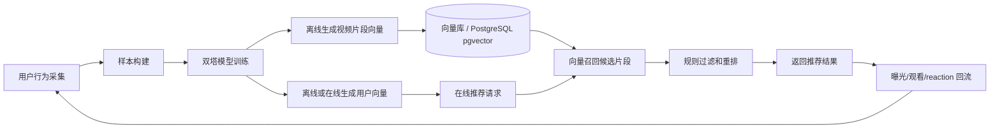

# 双塔推荐链路设计说明

## 1. 背景

当前 `video-service` 的推荐链路主要是“题目向量召回视频片段”：

1. 用户请求 `POST /api/recommendations/by-question`，传入 `question_id` 或 `question_text`。
2. 服务从 `edu_question_bank.embedding` 读取题目向量，或用实时 Embedding 服务生成题目向量。
3. 使用 `edu_video_segment.embedding` 做 pgvector 相似度检索。
4. 按 `(s.embedding <=> question_embedding)` 距离排序，返回相似片段。
5. 将结果写入 `edu_user_video_recommend`，后续可记录观看状态和观看时长。

这套链路解决的是“题目和视频片段内容是否相似”。当前个性化推荐展示入口是 `GET /api/video-segments/random-play`：前端刷新这个接口获取推荐片段，带 `user_id` 时接口会优先使用 active 模型版本下的用户塔向量和视频塔向量做双塔召回；如果缺少用户塔、active 模型或模型候选不可用，再回退到随机可播放片段。用户观看、点赞、超级点赞、点踩和曝光行为会回流到行为表，并影响后续样本导出和用户塔构建。

## 1.1 当前已落地状态

当前项目已经完成从线上行为到离线训练再到线上召回的闭环：

1. `GET /api/video-segments/random-play` 和兼容路径 `GET /api/video-segment/random-play` 都进入同一个 handler。
2. `user_id` 是可选 query 参数；未传时只走随机可播放片段，传入非正整数或非法字符串会返回参数错误。
3. 有 `user_id` 时优先读取 active `two_tower` 模型版本、用户塔向量和 item embedding 做召回。
4. 推荐展示会写入 `edu_recommend_exposure`，观看和 reaction 会回流到行为表。
5. `tools/export_two_tower_samples` 会导出训练样本、全量有效片段 item catalog 和用户学习画像。
6. `two-tower-training` 默认使用 PyTorch backend，训练前聚合同一用户同一片段多行为，按 `event_time` 做时间衰减，并按时间切分训练/评估集。
7. 训练输出 Recall@20/50、HitRate@K、NDCG@K、覆盖率、负样本命中率和点踩命中率。
8. 发布前执行 publish gate，并和上一版 active model metrics 对比；未通过时只保留 artifact，不导入发布。

## 2. 双塔推荐是什么

双塔推荐是一种向量召回模型。它把“用户”和“视频片段”分别输入两个模型：

1. 用户塔：输入用户特征和历史行为，输出一个用户兴趣向量。
2. 视频塔：输入视频或视频片段特征，输出一个视频内容向量。
3. 训练目标：让用户感兴趣的视频片段向量更靠近用户向量，让用户不感兴趣或无反馈的片段向量更远。
4. 在线推荐：先计算当前用户向量，再用向量检索从视频库里召回最相似的一批候选片段，最后结合业务规则做重排。

它的核心价值是把推荐从“题目相似”升级为“用户兴趣和内容匹配”。在视频数量变大后，双塔模型也适合作为第一阶段召回，因为视频侧向量可以离线提前算好，在线只需要计算用户向量并做 ANN/pgvector 检索。

## 3. 当前系统可复用的数据

### 3.1 用户数据

用户必须来自 `sys_user`。双塔链路不应该自己制造用户身份，也不应该绕过用户表。

可用特征：

1. `user_id`
2. 用户基础属性，视 `sys_user` 当前字段决定
3. 用户历史观看记录
4. 用户对视频或片段的 reaction 行为

### 3.2 视频和片段数据

当前可复用的核心表：

1. `edu_video_resource`：视频主体、标题、描述、播放地址、发布时间、播放数、视频级点赞数等。
2. `edu_video_segment`：视频片段、起止时间、摘要、知识标签、片段 embedding、片段级点赞数等。
3. `edu_video_user_reaction`：用户对视频的 `like`、`double_like`、`dislike`。
4. `edu_user_reaction`：用户对视频片段的 `like`、`double_like`、`dislike`。
5. `edu_user_video_recommend`：推荐记录、是否观看、观看时长。
6. `edu_question_bank`：题目内容和题目 embedding。

### 3.3 当前最重要的行为信号

建议先按以下强弱关系处理用户反馈：

| 行为 | 信号类型 | 建议权重 | 说明 |
| --- | --- | ---: | --- |
| `double_like` | 强正反馈 | `+3.0` | 用户明确强喜欢 |
| `like` | 正反馈 | `+2.0` | 用户明确喜欢 |
| 完整或长时观看 | 弱正反馈 | `+1.0` 到 `+2.0` | 需要结合片段时长归一化 |
| 短时观看 | 弱负反馈 | `-0.5` | 可能是不感兴趣，也可能是误触 |
| `dislike` | 强负反馈 | `-2.0` | 用户明确不喜欢 |
| 曝光未点击 | 弱负反馈 | `-0.2` | 当前已有曝光日志，训练导出时可作为弱负样本 |

## 4. 推荐总链路



完整链路分为离线和在线两部分。

离线部分负责沉淀数据和训练模型：

1. 从 `edu_user_reaction`、`edu_video_user_reaction`、`edu_user_video_recommend` 聚合用户行为。
2. 生成训练样本，包括正样本、负样本和样本权重。
3. 训练用户塔和视频塔。
4. 批量生成视频片段推荐向量，写入 `edu_video_item_embedding`。
5. 批量生成用户塔向量，写入 `edu_user_tower_embedding`。
6. 训练指标通过 publish gate 后，发布新的 active `model_version`。

在线部分负责实时推荐：

1. `random-play` 请求带上 `user_id`。
2. 读取 active `model_version` 下的用户塔向量；如果没有用户塔、模型或候选，用随机可播放片段兜底。
3. 在 `edu_video_item_embedding` 中召回 Top N 候选。
4. 过滤不可用数据，例如 `deleted != 0`、未发布视频、异常状态片段。
5. 用题目相关度、用户偏好、热度、多样性、去重等规则重排。
6. 返回 Top K，并写入推荐记录。
7. 用户后续观看和 reaction 回流到行为表。

## 5. 训练样本构建

### 5.1 样本粒度

建议以“用户 - 视频片段”为主样本粒度：

```text
(user_id, video_segment_id, label, weight, event_time)
```

原因：

1. 当前推荐结果已经落到 `video_segment_id`。
2. `edu_video_segment` 有摘要、知识标签和 embedding，更适合表达教学内容。
3. 用户 reaction 已经可以落到片段表 `edu_user_reaction`。
4. 后续播放时可以直接跳到片段起止时间。

视频级行为也要保留，但建议映射到该视频下的片段，或作为视频聚合特征给视频塔使用。

### 5.2 正样本

正样本来源：

1. `edu_user_reaction.reaction_type = 'double_like'`
2. `edu_user_reaction.reaction_type = 'like'`
3. `edu_video_user_reaction.reaction_type = 'double_like'`
4. `edu_video_user_reaction.reaction_type = 'like'`
5. `edu_user_video_recommend.is_watched = true`
6. `edu_user_video_recommend.watch_duration` 达到片段时长的一定比例

片段级 reaction 优先级高于视频级 reaction。视频级 reaction 如果要用于片段样本，建议给该视频下所有有效片段较低权重，避免一个视频点赞把所有片段都放大得过强。

### 5.3 负样本

负样本来源：

1. `edu_user_reaction.reaction_type = 'dislike'`
2. `edu_video_user_reaction.reaction_type = 'dislike'`
3. 曝光后未观看
4. 点击后极短时间退出
5. 同一用户有强正反馈的相邻主题之外，随机采样未互动片段作为弱负样本

当前系统已经有 `edu_recommend_exposure`，因此“曝光未点击”可以作为弱负样本，“曝光后点击/观看”可以作为正反馈或有效行为样本。但仍不能把全库“未互动”都当负样本，因为用户没有互动通常只是没有看到。明确点踩和极短观看仍应作为强负样本，随机负样本只做少量补充。

### 5.4 当前训练样本导出工具

当前已新增训练样本导出工具：

```bash
go run ./tools/export_two_tower_samples \
  --output ../two-tower-training/data/two_tower_samples.csv \
  --item-output ../two-tower-training/data/two_tower_items.csv \
  --user-output ../two-tower-training/data/two_tower_user_features.csv
```

工具默认使用本地配置 `configs/video.yml`。如果要连接生产配置，必须显式指定：

```bash
go run ./tools/export_two_tower_samples \
  --config configs/video_prod.yml \
  --output ../two-tower-training/data/two_tower_samples.csv \
  --item-output ../two-tower-training/data/two_tower_items.csv \
  --user-output ../two-tower-training/data/two_tower_user_features.csv
```

导出的 CSV 字段为：

```text
user_id,video_id,video_segment_id,label,weight,source,reason,event_time
```

`--item-output` 会额外导出全量有效片段目录，供 item tower 生成训练样本中未出现过的新片段 embedding：

```text
video_segment_id,video_id,segment_duration,video_duration,like_count,double_like_count,dislike_count,content_summary,knowledge_tags,video_title
```

`--user-output` 会额外导出有效用户的学习画像，供 user tower 生成更贴近学生学习状态的用户向量：

```text
user_id,grade_id,class_id,user_type,mastery_avg,mastery_min,weak_knowledge_count,strong_knowledge_count,knowledge_correct_count,knowledge_incorrect_count,answer_count,answer_correct_count,answer_incorrect_count,avg_score_rate,avg_cost_seconds,question_feedback_count,generated_feedback_count,generated_correct_count,generated_avg_score_rate,question_search_count,recent_knowledge_point_ids,recent_subjects,question_search_knowledge_text,generated_feedback_knowledge_text
```

导出规则：

1. 用户必须来自 `sys_user`，并按 `deleted`、`del_flag` 过滤无效用户。
2. 片段必须来自 `edu_video_segment` 中 `deleted = 0`、`status = 1` 的数据。
3. 片段所属视频必须来自 `edu_video_resource` 中 `deleted = 0` 的数据。
4. 片段级 reaction 作为强样本：`double_like = 1/3.0`、`like = 1/2.0`、`dislike = 0/2.0`。
5. 视频级 reaction 会映射到该视频下有效片段，但权重低于片段级 reaction：`video_double_like = 1/1.5`、`video_like = 1/1.0`、`video_dislike = 0/1.0`。
6. 观看记录按观看比例生成正样本，长观看权重更高。
7. 曝光未点击作为弱负样本，曝光后点击或观看作为正样本。

如果本地行为数据较少，可以先生成一批合理的模拟行为数据再导出：

```bash
go run ./tools/export_two_tower_samples --dry-run --seed-count 1000
go run ./tools/export_two_tower_samples --seed-count 1000 --output storage/two_tower_samples.csv
```

造数规则同样只使用有效 `sys_user` 和有效 `edu_video_segment`，并会写入 `edu_recommend_exposure`、必要的 `edu_user_video_recommend`、必要的 `edu_user_reaction`，随后回算受影响片段的 `like_count`、`double_like_count`、`dislike_count`。

### 5.5 时间衰减

用户兴趣会变化，样本权重建议加入时间衰减：

```text
final_weight = behavior_weight * exp(-days_since_event / half_life_days)
```

当前 Python 训练会按 `HALF_LIFE_DAYS` / `--half-life-days` 做指数时间衰减，默认半衰期为 30 天。样本导出仍保留原始 `event_time`，衰减发生在训练前的样本处理阶段。

## 6. 特征设计

### 6.1 用户塔输入

用户塔应该表达“这个用户近期喜欢什么内容”。建议输入：

1. 用户 ID embedding。
2. 最近 N 个正反馈片段 ID embedding。
3. 最近 N 个负反馈片段 ID embedding。
4. 最近 N 个知识标签，例如 `knowledge_tags`。
5. 最近 N 个片段摘要 embedding 的加权平均。
6. 用户观看时长统计，例如平均观看比例、最近活跃时间。
7. 用户对 `like`、`double_like`、`dislike` 的数量统计。

当前已落地的训练版本先使用 `user_id` embedding 表达用户塔，用户的近期兴趣通过行为样本、标签权重和时间衰减间接进入训练。最近 N 个正负反馈、观看比例和最近兴趣向量仍是后续增强方向。

早期如果不训练深度模型，可以直接用行为加权平均得到用户画像向量：

```text
user_profile_vector =
  sum(segment_embedding * behavior_weight * time_decay)
  / sum(abs(behavior_weight * time_decay))
```

这个方案不是严格意义上的双塔训练，但它能先把用户行为接入当前推荐链路，风险小、上线快。

### 6.2 视频塔输入

视频塔应该表达“这个片段是什么内容，以及它适合什么用户”。建议输入：

1. `video_segment_id` embedding。
2. `video_id` embedding。
3. `content_summary` 文本 embedding。
4. `knowledge_tags` 标签 embedding。
5. 片段起止时间、片段时长。
6. 视频标题、描述、学科、章节等业务字段。
7. 视频和片段的热度特征：播放数、点赞数、超级点赞数、点踩数。

当前 `edu_video_segment.embedding` 仍作为题目语义召回的内容向量；双塔 item tower 不覆盖它，而是写入 `edu_video_item_embedding`。训练版本已经使用 `segment_id embedding + item feature MLP`，item feature 来自全量 item catalog 中的片段/视频时长、点赞/超级点赞/点踩计数、内容摘要、知识标签和视频标题。

## 7. 模型训练

### 7.1 训练目标

双塔训练的目标是让用户向量和正样本片段向量更接近，和负样本片段向量更远。

常见训练方式：

1. Pointwise：预测用户是否喜欢某片段，适合实现简单的第一版。
2. Pairwise：同一个用户下，正样本分数要高于负样本。
3. In-batch negative：一个 batch 内其他用户的正样本可以作为当前用户的负样本，训练效率高。

当前默认训练后端是 PyTorch，使用 weighted `BCEWithLogitsLoss`，并加入随机负样本和 batch 内 hard negatives。`sgd` 后端仍保留为轻量兼容实现；后续如果要继续提升召回排序质量，再考虑 BPR、sampled softmax 或更完整的 pairwise/listwise 损失。

### 7.2 输出

训练后当前需要产出：

1. `user_embeddings.csv`：用户塔 embedding。
2. `item_embeddings.csv`：视频片段 item embedding，包含训练样本中未出现但 item catalog 中有效的片段。
3. `user_id_map.json` 和 `segment_id_map.json`：ID 到训练索引的映射。
4. `metrics.json`：模型版本、样本数、训练/评估集 loss、AUC、Recall@K、HitRate@K、NDCG@K、覆盖率、负样本命中率和点踩命中率。
5. 模型版本号，例如 `model_version = 'two_tower_20260624_120000'`。

### 7.3 评估指标

离线评估当前按时间切分，老行为训练、新行为验证，重点关注：

1. Recall@K：正样本是否能被召回。
2. HitRate@K：Top K 是否命中用户真实喜欢的片段。
3. NDCG@K：越靠前的命中是否越多。
4. Coverage：推荐覆盖了多少视频或片段，避免只推热门。
5. Negative Hit Rate：负反馈或短退内容是否被减少。
6. Dislike Hit Rate：明确点踩内容是否被召回。

发布判断不再只看训练集 loss 或 AUC。`run_two_tower_pipeline.sh` 会先导出上一版 active 模型的 `metrics_json`，再由 `publish_gate.py` 做绝对阈值和相对上一版下降幅度检查。

上线后再关注：

1. 点击率。
2. 完播率或有效观看时长。
3. 点赞率和超级点赞率。
4. 点踩率。
5. 人均推荐视频数和人均有效观看数。

## 8. 在线推荐链路

### 8.1 请求入口

当前有两个推荐相关入口，职责需要分开：

```text
GET  /api/video-segments/random-play
POST /api/recommendations/by-question
GET  /api/recommendations
POST /api/watch-records
```

`GET /api/video-segments/random-play` 是双塔推荐的展示入口。请求带 `user_id` 时，链路是：

```text
推荐展示 -> 写 edu_user_video_recommend / edu_recommend_exposure
-> 用户观看或 reaction -> 更新用户画像/用户塔
-> 下次 random-play 优先用双塔召回
```

`POST /api/recommendations/by-question` 是题目匹配入口，只根据题目文本向量或题库题目向量匹配视频片段向量，不混入用户塔或画像重排。它适合“按题找视频”的场景，不作为个性化推荐流入口。

如果 `random-play` 没有 `user_id`，只能走匿名随机兜底，不能生成个性化结果。

### 8.2 召回

推荐召回分两条入口处理：

1. `random-play`：有可用用户塔时，用 `edu_user_tower_embedding.tower_vector` 检索 `edu_video_item_embedding.embedding`；没有用户塔或候选为空时，回退到随机可播放片段。
2. `by-question`：用 `question_embedding` 检索视频片段内容向量，直接返回题目相关片段。

第一版先不在 `by-question` 中融合用户画像，避免“题目检索”和“个性化推荐流”互相污染。后续如果需要“题目上下文下的个性化重排”，应新增明确策略或新接口，而不是改变 `by-question` 的语义。

### 8.3 过滤

召回候选必须过滤：

1. `edu_video_segment.deleted = 0`
2. `edu_video_segment.status = 1`
3. `edu_video_resource.deleted = 0`
4. 视频可播放或已发布
5. 用户近期已经看过的相同片段
6. 用户明确点踩过的片段

点踩过滤要谨慎。如果用户点踩的是片段，过滤该片段即可；如果用户点踩的是视频，可以降低该视频下所有片段排序，但不一定全部永久屏蔽。

### 8.4 重排

双塔召回只负责找出候选，不应该直接把向量相似度作为最终排序。推荐重排可以用以下分数：

```text
final_score =
  0.45 * user_item_score
  + 0.25 * question_match_score
  + 0.15 * freshness_score
  + 0.10 * popularity_score
  + 0.05 * diversity_score
  - penalty_score
```

各项含义：

1. `user_item_score`：用户向量与片段向量的相似度。
2. `question_match_score`：题目向量与片段内容向量的相似度。
3. `freshness_score`：新内容加权，避免老内容垄断。
4. `popularity_score`：播放、点赞、超级点赞等热度。
5. `diversity_score`：知识点、视频来源、同视频片段去重。
6. `penalty_score`：已看过、点踩、重复视频、低质量内容的惩罚。

第一版可以不训练复杂重排模型，先用可解释的规则分数。

## 9. 建议的数据表改造

### 9.1 用户画像表

建议新增 `edu_user_video_profile`，用于保存由视频相关行为聚合出的用户画像。

字段建议：

| 字段 | 说明 |
| --- | --- |
| `id` | 主键 |
| `user_id` | 来自 `sys_user` |
| `profile_vector` | 用户画像向量，pgvector |
| `positive_count` | 正反馈样本数 |
| `negative_count` | 负反馈样本数 |
| `last_event_time` | 最近一次行为时间 |
| `model_version` | 画像或模型版本 |
| `create_time` | 创建时间 |
| `update_time` | 更新时间 |
| `deleted` | 软删除标记 |

如果先做“用户画像重排”而不是完整双塔，这张表就足够支撑第一阶段上线。

### 9.2 视频塔向量表

如果不想覆盖 `edu_video_segment.embedding`，建议新增 `edu_video_item_embedding`：

| 字段 | 说明 |
| --- | --- |
| `id` | 主键 |
| `video_segment_id` | 片段 ID |
| `video_id` | 视频 ID |
| `embedding` | 双塔视频塔输出向量 |
| `model_version` | 模型版本 |
| `embedding_dim` | 向量维度 |
| `create_time` | 创建时间 |
| `update_time` | 更新时间 |
| `deleted` | 软删除标记 |

这样可以同时保留当前内容 embedding 和未来双塔 item embedding：

1. `edu_video_segment.embedding`：内容语义向量，适合题目相似召回。
2. `edu_video_item_embedding.embedding`：推荐模型向量，适合用户兴趣召回。

### 9.3 曝光日志表

已新增 `edu_recommend_exposure`，用于记录推荐结果实际展示给了谁、排第几、采用什么策略，以及后续是否点击/观看。

| 字段 | 说明 |
| --- | --- |
| `id` | 主键 |
| `request_id` | 一次推荐请求 ID |
| `user_id` | 用户 ID |
| `question_id` | 题目 ID，可为空 |
| `video_id` | 视频 ID |
| `video_segment_id` | 片段 ID |
| `rank` | 展示位置 |
| `score` | 推荐分数 |
| `strategy` | 推荐策略，例如 `question_vector`、`profile_rerank`、`two_tower` |
| `model_version` | 模型版本 |
| `clicked` | 是否已点击 |
| `watched` | 是否已观看 |
| `clicked_time` | 点击时间 |
| `watched_time` | 观看时间 |
| `create_time` | 曝光时间 |

当前第一版落地规则：

1. `GET /api/video-segments/random-play` 返回片段时，写入 `edu_user_video_recommend` 和 `edu_recommend_exposure`。
2. `POST /api/recommendations/by-question` 返回推荐结果时，按返回顺序批量写入曝光日志。
3. 普通题目向量推荐记录 `strategy = 'question_vector'`。
4. 双塔推荐记录 `strategy = 'two_tower'`，`model_version` 写当前 active 双塔版本。
5. 随机兜底展示记录 `strategy = 'random_play'`。
6. `POST /api/watch-records` 上报观看后，按 `user_id + question_id + video_segment_id` 找最近一次曝光，并标记 `clicked = true`、`watched = true`。
7. 曝光日志不改变现有 API 响应结构。

没有曝光日志时，系统只能知道用户做了什么，不能知道用户看到了什么但没点。现在有了曝光日志，后续可以把“曝光未点击”作为弱负样本，把“曝光后点击/观看”作为正反馈或有效行为样本。

## 10. 分阶段落地路线

### 阶段 0：保持当前题目向量推荐

目标：稳定现有链路。

当前链路继续使用：

1. `edu_question_bank.embedding`
2. `edu_video_segment.embedding`
3. `edu_user_video_recommend`

这一阶段不改变算法，只确保 watch 和 reaction 数据持续积累。

### 阶段 1：基于视频相关行为做用户画像重排

目标：先不用训练双塔模型，也能让用户行为影响推荐。

做法：

1. 从 `edu_user_reaction` 读取片段级反馈。
2. 从 `edu_video_user_reaction` 读取视频级反馈。
3. 从 `edu_user_video_recommend` 读取观看行为。
4. 用行为权重和时间衰减聚合出 `user_profile_vector`。
5. 推荐时仍用题目向量召回较大的候选集，例如 Top 100。
6. 对候选集计算用户画像相似度并重排，最终返回 Top 10 或 Top 20。

这是当前项目最适合先做的阶段，因为它复用现有 `edu_video_segment.embedding`，不需要立即搭建训练平台。

### 阶段 2：离线用户画像任务

目标：把用户画像从在线实时计算改成离线定时计算。

做法：

1. 新增 `edu_user_video_profile`。
2. 新增离线任务或 worker，定时扫描最近行为变化的用户。
3. 重新计算用户画像向量。
4. 在线推荐直接读取画像表，降低接口耗时。
5. 对没有画像的新用户走热门、题目向量、最新内容兜底。

### 阶段 2.5：曝光日志回流

目标：补齐推荐训练样本中的“展示但未点击”和“展示后点击/观看”。

当前已完成：

1. 新增 `edu_recommend_exposure`。
2. 推荐接口返回结果时写曝光，记录 `request_id`、`rank`、`score`、`strategy`、`model_version`。
3. 观看上报时标记最近一次匹配曝光为已点击/已观看。
4. 新增 `tools/export_two_tower_samples`，导出训练样本时读取曝光日志。

下一步：

1. 按 `request_id` 评估同一次推荐请求内的排序质量。
2. 将更多真实行为样本接入离线训练脚本。
3. 在每次模型重训后执行 embedding 导入、指标验证和版本发布。

### 阶段 3：训练真正的双塔模型

目标：从“行为加权平均”升级为可训练的用户塔和视频塔。

当前离线训练工程已单独放在仓库根目录 `two-tower-training/`，训练数据、代码、测试和产物都在该目录内维护。当前版本默认使用 PyTorch 训练 `user_id` embedding 和 `segment_id embedding + item feature MLP`，并通过全量 item catalog 解决有效新片段没有行为时无法生成 item embedding 的问题。

当前已接入的线上闭环：

1. `tools/import_two_tower_embeddings` 可把训练产物导入 `edu_video_item_embedding` 和 `edu_user_tower_embedding`。
2. `edu_recommend_model_version` 保存当前 active 的双塔模型版本。
3. 训练流水线会导出上一版 active 指标并执行 publish gate；只有通过 gate 才会导入并发布新版本。
4. 用户点赞、点踩、观看记录落库后，会按 active model_version 重建 `edu_user_tower_embedding` 中对应用户的用户塔向量。
5. `GET /api/video-segments/random-play` 在 active model_version 的用户塔向量可用时优先走 `two_tower` 召回，并写入 `edu_recommend_exposure.strategy = 'two_tower'`。
6. 如果用户塔向量不可用或双塔候选为空，则回退到随机可播放片段，并写入 `strategy = 'random_play'`。
7. `POST /api/recommendations/by-question` 只走题目向量和视频片段向量匹配。

如果没有 active 版本记录，服务会回退到默认 `two_tower_v1`，避免老环境启动后推荐直接失败。

做法：

1. 建立训练样本导出任务。
2. 训练双塔模型。
3. 离线生成 `edu_video_item_embedding` 和初始 `edu_user_tower_embedding`。
4. 用户行为发生后在线增量重建该用户的 `edu_user_tower_embedding`。
5. 在线召回从 `edu_video_item_embedding` 检索候选。
6. 保留题目向量召回作为一路补充召回。

导入本地测试产物：

```bash
cd video-service
go run ./tools/import_two_tower_embeddings
```

导入并发布为当前 active 版本：

```bash
cd video-service
go run ./tools/import_two_tower_embeddings --artifact-dir ../two-tower-training/artifacts/two_tower_v1 --publish
```

独立切换或回滚 active 版本：

```bash
cd video-service
go run ./tools/publish_recommend_model --version two_tower_v1
```

导入生产库必须显式指定生产配置：

```bash
cd video-service
go run ./tools/import_two_tower_embeddings --config configs/video_prod.yml --publish
```

完整离线训练发布流水线：

```bash
cd two-tower-training
./scripts/run_two_tower_pipeline.sh
```

这个脚本会串起：

```text
go run ./tools/export_two_tower_samples --item-output --user-output
-> python3 -m two_tower_training.train --user-features
-> go run ./tools/export_active_recommend_model_metrics
-> python3 -m two_tower_training.publish_gate
-> go run ./tools/import_two_tower_embeddings --publish
```

如果 publish gate 不通过，脚本会停在导入发布前，保留 `two-tower-training/artifacts/${MODEL_VERSION}` 用于排查，线上继续使用上一版 active 模型。

后续可以把它放入 cron：

```cron
0 3 * * * cd /repo/two-tower-training && CONFIG_FILE=configs/video_prod.yml ./scripts/run_two_tower_pipeline.sh >> /var/log/two_tower_pipeline.log 2>&1
```

当前 worker 已内置定时训练调度，不依赖外部 cron。启动统一 worker 后，会按 Asia/Shanghai 时间从 00:00 开始每 4 小时执行一次：

```text
00:00
04:00
08:00
12:00
16:00
20:00
```

启动命令：

```bash
cd video-service
go run ./cmd/worker
```

内置调度会调用 `two-tower-training/scripts/run_two_tower_pipeline.sh`，使用当前进程的 `CONFIG_FILE` 或 `VIDEO_CONFIG_FILE`。如果都没有设置，则使用本地默认 `configs/video.yml`。

同一时间只允许一个双塔训练任务运行；如果上一次训练未结束，下一次触发会跳过，避免重复导入和重复发布。

流水线成功发布后会自动清理训练样本文件：

```text
video-service/storage/two_tower_samples.csv
two-tower-training/data/*.csv
```

`two-tower-training/artifacts/` 下的模型产物默认保留 7 天，后续定时任务会删除超过保留期的旧模型目录。保留天数可通过 `ARTIFACT_RETENTION_DAYS` 调整。

### 阶段 4：多路召回和精排

目标：推荐结果更稳定、更可控。

候选来源可以包括：

1. 双塔用户兴趣召回。
2. 题目语义召回。
3. 相似视频召回。
4. 热门视频召回。
5. 新视频探索召回。

之后统一进入重排层，按用户兴趣、题目相关性、质量、热度、多样性和业务规则排序。

## 11. 代码改造建议

### 11.1 应用层

当前推荐核心在：

```text
internal/application/videoapp/recommendation/service.go
internal/application/videoapp/recommend.go
```

建议新增能力，而不是直接把逻辑塞进现有方法：

1. `UserProfileRepository`：读取用户画像。
2. `UserBehaviorRepository`：聚合用户行为，用于阶段 1 或离线任务。
3. `CandidateReranker`：对召回候选进行重排。
4. `RecommendationStrategy`：标记当前使用的策略，例如 `question_vector`、`profile_rerank`、`two_tower`。

第一阶段可以保持 `RecommendByQuestion` 的接口不变，只在内部扩大召回数量并加入重排。

### 11.2 持久化层

当前 SQL 召回在：

```text
internal/infrastructure/persistence/sqlqueries/sql.go
```

当前已具备的查询能力：

1. 按用户读取最近片段 reaction。
2. 按用户读取最近视频 reaction。
3. 按用户读取观看记录。
4. 读取或 upsert 用户画像。
5. 读取或 upsert 双塔用户塔向量。
6. 按 `edu_video_item_embedding` 的视频塔向量召回视频片段。
7. 写推荐曝光日志。
8. 读取当前 active 的双塔 `model_version`。

### 11.3 Worker

建议后续新增画像计算 worker，而不是长期只依赖 HTTP 请求内同步重建：

1. 输入：用户 ID 或最近发生行为的用户集合。
2. 读取用户行为。
3. 计算用户画像向量和用户塔向量。
4. 写入 `edu_user_video_profile` 和 `edu_user_tower_embedding`。
5. 记录计算时间和模型版本。

当前实现已经在点赞、点踩、观看后同步重建单个用户的画像和用户塔向量；后续 worker 的价值是削峰、重试和批量回刷。

## 12. 冷启动策略

### 12.1 新用户

新用户没有历史行为时，不能生成可靠画像。建议兜底：

1. 如果有题目上下文，用题目向量推荐。
2. 如果没有题目上下文，用热门片段、最新片段、人工推荐池。
3. 适当增加多样性，让用户尽快产生行为。

### 12.2 新视频

新视频没有行为时，仍然可以通过内容向量参与召回：

1. 视频处理后生成 `edu_video_segment.embedding`。
2. 双塔 item embedding 不存在时，先用内容 embedding 兜底。
3. 给新视频一定探索流量，积累观看和 reaction。

## 13. 风险和注意事项

1. 行为数据稀疏：早期不要过度依赖双塔训练，先做画像重排更稳。
2. 负样本误判：没有曝光日志前，不要把所有未互动都当负样本。
3. 热门内容垄断：重排必须加入多样性和新内容探索。
4. 点踩处理过重：点踩可以强降权，但要区分片段级和视频级。
5. 向量版本混用：不同模型版本的向量不能直接混查。
6. 在线耗时：用户画像计算应尽量离线完成，HTTP 请求只做读取和召回。
7. 数据一致性：reaction 计数和用户行为记录要持续校验，避免画像被脏数据污染。
8. 可解释性：第一版重排建议保留各分数项，便于排查为什么推荐某个视频。

## 14. 当前已实施范围

当前已完成“视频相关数据用户画像重排、双塔召回闭环和受控发布链路”：

1. 新增 `edu_user_video_profile`。
2. 用 `edu_user_reaction`、`edu_video_user_reaction`、`edu_user_video_recommend` 计算用户画像。
3. 保留 `edu_video_segment.embedding` 作为题目语义召回内容向量。
4. `POST /api/recommendations/by-question` 按题目向量召回视频片段，不混入用户塔。
5. `GET /api/video-segments/random-play` 作为个性化推荐展示入口，优先走双塔召回。
6. 写回推荐记录时保留最终分数。
7. 新增 `edu_recommend_exposure`，记录展示、点击和观看。
8. 新增 `edu_video_item_embedding` 和 `edu_user_tower_embedding`。
9. 新增训练样本导出、全量 item catalog 导出、上一版 active 指标导出和 embedding 导入工具。
10. 双塔训练支持样本聚合、时间衰减、时间切分评估、PyTorch backend、随机负样本、batch 内 hard negatives 和 item feature MLP。
11. 训练输出 Recall@20/50、HitRate@K、NDCG@K、覆盖率、负样本命中率和点踩命中率。
12. 发布前执行 publish gate；指标低于阈值或相对上一版 active 模型下降过多时，不导入发布。
13. 用户塔向量存在时，`random-play` 优先走 `two_tower` 召回。

这个范围用于验证“用户行为是否能影响推荐并进入受控发布”。严格意义上的生产级双塔仍需要更多真实样本、更丰富的用户序列特征、线上 A/B 指标和更强的精排策略。

## 15. 推荐接口的目标形态

长期目标是让推荐接口返回结果时能说明策略和分数来源：

```json
{
  "items": [
    {
      "video_id": 1001,
      "video_segment_id": 2001,
      "recommend_score": 0.8732,
      "start_time_sec": 120,
      "end_time_sec": 180,
      "strategy": "profile_rerank",
      "score_detail": {
        "question_match_score": 0.81,
        "user_item_score": 0.77,
        "popularity_score": 0.42,
        "penalty_score": 0.0
      }
    }
  ],
  "total": 1
}
```

对外 API 不一定马上暴露 `score_detail`，但内部日志和曝光表建议保留这些字段，方便后续调参与复盘。

## 16. 后续任务拆分建议

1. 持续检查真实行为数据质量，确认曝光、观看、reaction 的覆盖率和时间分布。
2. 将用户塔从单纯 `user_id` embedding 升级为最近 N 个正负反馈、观看比例和最近兴趣向量。
3. 将 item tower 继续扩展为更强的内容特征、学科/章节特征和热度/新鲜度特征。
4. 增加线上 A/B 指标和人工抽检，避免只依赖离线 gate。
5. 补充多路召回和精排，统一处理题目语义、双塔兴趣、热门、新内容探索和去重多样性。
6. 把用户画像和用户塔重建逐步迁到异步 worker，降低 HTTP 请求内同步计算压力。
7. 根据真实数据重新校准 publish gate 阈值，让发布率和线上质量保持平衡。
