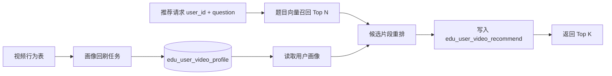

# 视频相关数据用户画像重排设计与实施文档

## 1. 目标

本阶段目标是先不引入完整双塔训练，只使用视频相关数据构建用户画像，并把画像用于推荐结果重排。

具体目标：

1. 使用 `edu_user_reaction`、`edu_video_user_reaction`、`edu_user_video_recommend` 生成用户视频兴趣画像。
2. 复用 `edu_video_segment.embedding` 作为片段内容向量。
3. 保持现有按题目推荐接口不变，仍通过题目向量先召回候选片段。
4. 在候选片段内加入用户画像相关性重排，让不同用户看到更贴合自身行为的顺序。
5. 没有画像或画像不足时，自动回退到当前题目向量推荐逻辑。

本方案是完整双塔推荐前的第一版落地方案。它能先验证“视频行为画像是否能改善推荐”，同时不要求引入 Python 训练服务、模型发布服务或新的向量数据库。

## 2. 非目标

本阶段不做以下事情：

1. 不训练真正的双塔模型。
2. 不新增独立机器学习服务。
3. 不改变前端调用的推荐接口协议。
4. 不使用题目以外的业务域数据做画像，例如班级、学校、考试成绩。
5. 不把所有未互动视频都当作负反馈。
6. 不依赖曝光未点击负样本，因为当前系统还没有独立曝光日志。

## 3. 当前基础

当前推荐入口和链路：

1. `POST /api/recommendations/by-question`
2. `internal/http/handler/recommendations/handler.go`
3. `internal/application/videoapp/recommend.go`
4. `internal/application/videoapp/recommendation/service.go`
5. `internal/infrastructure/persistence/gorm_video_repository.go`
6. `internal/infrastructure/persistence/sqlqueries/sql.go`

当前推荐逻辑：

1. 从题库读取 `edu_question_bank.embedding`，或用题目文本实时生成 embedding。
2. 在 `edu_video_segment.embedding` 上用 pgvector 做相似度召回。
3. 使用 `s.embedding <=> question_embedding` 排序。
4. 将推荐结果写入 `edu_user_video_recommend`。

当前可用的视频行为数据：

1. `edu_user_reaction`：用户对视频片段的 `like`、`double_like`、`dislike`。
2. `edu_video_user_reaction`：用户对整条视频的 `like`、`double_like`、`dislike`。
3. `edu_user_video_recommend`：推荐记录、观看状态、观看时长。
4. `edu_video_segment`：片段内容、知识标签、向量、片段级计数。
5. `edu_video_resource`：视频标题、描述、播放状态、视频级计数。

## 4. 总体方案

第一版分为两个链路：离线画像生成和在线推荐重排。



链路说明：

1. 画像生成任务读取用户历史视频行为。
2. 根据行为权重和时间衰减聚合片段向量，生成 `profile_vector`。
3. 推荐请求仍先按题目向量召回候选集，例如 Top 100。
4. 如果用户有有效画像，则计算候选片段与画像的相似度。
5. 用题目相关度、画像相关度、热度和惩罚项计算最终分数。
6. 最终结果按重排分写入 `edu_user_video_recommend` 并返回。

## 5. 画像数据模型

### 5.1 新增表：`edu_user_video_profile`

建议新增一张画像表：

| 字段 | 类型建议 | 说明 |
| --- | --- | --- |
| `id` | `BIGSERIAL` | 主键 |
| `user_id` | `BIGINT NOT NULL` | 用户 ID，必须来自 `sys_user` |
| `profile_vector` | `vector(1536)` | 用户视频兴趣画像向量，维度与 `edu_video_segment.embedding` 一致 |
| `positive_count` | `INT DEFAULT 0` | 参与画像的正反馈数量 |
| `negative_count` | `INT DEFAULT 0` | 参与画像的负反馈数量 |
| `watch_count` | `INT DEFAULT 0` | 参与画像的观看行为数量 |
| `source_event_count` | `INT DEFAULT 0` | 参与画像的总行为数量 |
| `last_event_time` | `TIMESTAMPTZ` | 最近一次参与画像的行为时间 |
| `model_version` | `TEXT NOT NULL` | 画像算法版本，例如 `video_profile_v1` |
| `status` | `SMALLINT DEFAULT 1` | `1` 表示有效，`0` 表示数据不足 |
| `create_time` | `TIMESTAMPTZ` | 创建时间 |
| `update_time` | `TIMESTAMPTZ` | 更新时间 |
| `deleted` | `SMALLINT DEFAULT 0` | 软删除标记 |

约束和索引：

1. `UNIQUE (user_id, model_version)`。
2. `INDEX (user_id)`。
3. `INDEX (model_version, status, deleted)`。

本阶段推荐服务只会按 `user_id` 读取画像，不需要对 `profile_vector` 建向量索引。

### 5.2 Go 模型

建议在 `internal/model/video.go` 增加：

```go
type EduUserVideoProfile struct {
    ID               uint64          `gorm:"primaryKey;column:id" json:"id"`
    UserID           uint64          `gorm:"column:user_id;not null;index" json:"user_id"`
    ProfileVector    pgvector.Vector `gorm:"column:profile_vector;type:vector(1536)" json:"-"`
    PositiveCount    int             `gorm:"column:positive_count;default:0" json:"positive_count"`
    NegativeCount    int             `gorm:"column:negative_count;default:0" json:"negative_count"`
    WatchCount       int             `gorm:"column:watch_count;default:0" json:"watch_count"`
    SourceEventCount int             `gorm:"column:source_event_count;default:0" json:"source_event_count"`
    LastEventTime    time.Time       `gorm:"column:last_event_time" json:"last_event_time"`
    ModelVersion     string          `gorm:"column:model_version;type:text;not null;index" json:"model_version"`
    Status           int16           `gorm:"column:status;default:1;index" json:"status"`
    CreateTime       time.Time       `gorm:"column:create_time;autoCreateTime" json:"create_time"`
    UpdateTime       time.Time       `gorm:"column:update_time;autoUpdateTime" json:"update_time"`
    Deleted          int16           `gorm:"column:deleted;default:0;index" json:"deleted"`
}

func (EduUserVideoProfile) TableName() string { return "edu_user_video_profile" }
```

`AutoMigrate` 需要加入 `&model.EduUserVideoProfile{}`，位置包括 HTTP app 和 worker app 中当前迁移视频相关表的位置。

## 6. 行为权重设计

### 6.1 片段级 reaction

片段级 reaction 是最强信号，因为它直接对应 `video_segment_id`。

| 行为 | 权重 | 说明 |
| --- | ---: | --- |
| `double_like` | `+3.0` | 强正反馈 |
| `like` | `+2.0` | 正反馈 |
| `dislike` | `-2.0` | 强负反馈 |

只读取 `deleted = 0` 的 active reaction。

### 6.2 视频级 reaction

视频级 reaction 比片段级弱，因为它不知道用户喜欢的是视频内哪一个片段。

处理方式：

1. 对该视频下 `deleted = 0 AND status = 1 AND embedding IS NOT NULL` 的片段求平均向量。
2. 每条视频级 reaction 只作为一个行为事件加入画像。
3. 不把一条视频级 reaction 展开成该视频下所有片段的强反馈，避免长视频天然权重过高。

| 行为 | 权重 | 说明 |
| --- | ---: | --- |
| `double_like` | `+1.5` | 视频级强正反馈 |
| `like` | `+1.0` | 视频级正反馈 |
| `dislike` | `-1.0` | 视频级负反馈 |

### 6.3 观看行为

观看记录来自 `edu_user_video_recommend`。

推荐计算片段时长：

```text
segment_duration = max(end_time - start_time, 1)
watch_ratio = min(watch_duration / segment_duration, 1.0)
```

观看权重：

| 条件 | 权重 | 说明 |
| --- | ---: | --- |
| `is_watched = true` 且 `watch_ratio >= 0.8` | `+1.2` | 基本完整观看 |
| `is_watched = true` 且 `watch_ratio >= 0.4` | `+0.7` | 有效观看 |
| `is_watched = true` 且 `watch_ratio > 0` | `+0.3` | 弱正反馈 |
| `is_watched = false` 且 `watch_duration <= 5` | `0` | 第一版不作为负样本 |

第一版不把短观看直接当负样本，避免误伤误触、网络卡顿、前端自动播放等情况。

### 6.4 时间衰减

使用简单分段衰减，便于实现和调试：

| 行为距今时间 | 衰减系数 |
| --- | ---: |
| 7 天内 | `1.0` |
| 30 天内 | `0.7` |
| 90 天内 | `0.4` |
| 90 天以上 | `0.2` |

最终权重：

```text
final_weight = behavior_weight * time_decay
```

## 7. 用户画像向量计算

### 7.1 输入

画像计算输入是一组带权向量：

```text
weighted_event = {
  user_id,
  source_type,
  source_id,
  vector,
  weight,
  event_time
}
```

`source_type` 建议取值：

1. `segment_reaction`
2. `video_reaction`
3. `watch`

### 7.2 计算规则

计算步骤：

1. 读取用户所有有效视频行为，第一版最多取最近 500 条。
2. 过滤没有 embedding 的片段或视频。
3. 对每个事件的向量做 L2 normalize。
4. 用 `final_weight` 加权求和。
5. 用 `sum(abs(final_weight))` 做归一。
6. 对最终画像向量再次做 L2 normalize。
7. 如果正反馈数量为 0，则画像状态为 `status = 0`，推荐时不启用画像重排。

公式：

```text
profile_vector = l2_normalize(
  sum(l2_normalize(event_vector) * final_weight)
  / sum(abs(final_weight))
)
```

### 7.3 只用负反馈的处理

如果一个用户只有 `dislike`，不生成可用于召回的正向兴趣画像。

处理规则：

1. 写入 `edu_user_video_profile`，但 `status = 0`。
2. 保留 `negative_count`，便于后续做过滤和分析。
3. 在线推荐阶段不使用该画像向量参与重排。

原因：只有负反馈只能说明“不喜欢什么”，不能可靠推出“喜欢什么”。

## 8. 画像生成任务

### 8.1 第一版形态

第一版同时提供两种画像生成方式：

1. 命令行回刷工具：用于初始化历史数据、排查单个用户画像、批量修复画像。
2. 自动更新触发：用户 reaction 或观看记录成功落库后，立即重建该用户画像。

命令行回刷工具：

```text
go run ./tools/rebuild_user_video_profiles
```

支持参数：

```text
--config configs/video_prod.yml
--user-id 123
--limit-users 1000
--model-version video_profile_v1
--dry-run
```

推荐默认行为：

1. 不传 `--user-id` 时，扫描有视频行为的用户。
2. 只处理 `sys_user` 中存在的用户。
3. 每个用户最多读取最近 500 条行为。
4. `--dry-run` 只打印用户画像统计，不写数据库。

自动更新触发点：

1. `SubmitVideoReaction` 直接写库成功后，重建该 `user_id` 的画像。
2. `SubmitSegmentReaction` 直接写库成功后，重建该 `user_id` 的画像。
3. Redis reaction worker 将视频 reaction 落库成功后，重建该 `user_id` 的画像。
4. Redis segment reaction worker 将片段 reaction 落库成功后，重建该 `user_id` 的画像。
5. `ReportWatch` 写入观看记录成功后，重建该 `user_id` 的画像。

自动更新复用与回刷工具一致的权重、时间衰减和向量归一化规则，最终 upsert 到 `(user_id, model_version)` 对应的 `edu_user_video_profile` 行。

### 8.2 用户来源

用户必须来自 `sys_user`。

候选用户 SQL 应先从行为表聚合出用户 ID，再和 `sys_user` 做 inner join：

```sql
SELECT DISTINCT u.id AS user_id
FROM sys_user u
JOIN (
  SELECT user_id FROM edu_user_reaction WHERE deleted = 0
  UNION
  SELECT user_id FROM edu_video_user_reaction WHERE deleted = 0
  UNION
  SELECT user_id FROM edu_user_video_recommend WHERE deleted = 0
) b ON b.user_id = u.id
ORDER BY u.id
LIMIT ?;
```

如果 `sys_user` 的主键字段不是 `id`，实施时需要先按实际表结构调整这段 SQL。

### 8.3 Upsert 规则

使用 `(user_id, model_version)` 做幂等 upsert：

```sql
INSERT INTO edu_user_video_profile
  (user_id, profile_vector, positive_count, negative_count, watch_count,
   source_event_count, last_event_time, model_version, status, deleted,
   create_time, update_time)
VALUES
  (?, ?, ?, ?, ?, ?, ?, ?, ?, 0, ?, ?)
ON CONFLICT (user_id, model_version)
DO UPDATE SET
  profile_vector = EXCLUDED.profile_vector,
  positive_count = EXCLUDED.positive_count,
  negative_count = EXCLUDED.negative_count,
  watch_count = EXCLUDED.watch_count,
  source_event_count = EXCLUDED.source_event_count,
  last_event_time = EXCLUDED.last_event_time,
  status = EXCLUDED.status,
  deleted = 0,
  update_time = EXCLUDED.update_time;
```

## 9. 在线推荐重排

### 9.1 保持接口不变

当前请求保持不变：

```json
{
  "question_id": 8,
  "question_text": "可选",
  "user_id": 123,
  "limit": 10
}
```

如果 `user_id = 0`，当前代码会默认使用 `user_id = 1`。实施画像重排时建议逐步改为：

1. 推荐接口内部仍兼容默认值，避免破坏现有调用。
2. 只有请求显式传入 `user_id > 0` 且画像有效时，才启用画像重排。
3. 默认用户或匿名用户不启用个性化画像重排。

### 9.2 召回数量

当前 `limit` 最大为 50。加入重排后，需要先召回更大的候选集：

```text
candidate_limit = max(limit * 10, 100)
candidate_limit = min(candidate_limit, 300)
```

最终仍返回用户请求的 `limit` 条。

### 9.3 候选召回

第一版仍按题目向量召回：

```sql
ORDER BY s.embedding <=> question_embedding
LIMIT candidate_limit
```

如果用户画像存在，查询时额外计算画像距离：

```sql
(s.embedding <=> profile_vector) AS profile_distance
```

这样推荐服务不需要把候选片段 embedding 全部拉回 Go 内存计算相似度。

### 9.4 最终分数

将 pgvector cosine distance 转成相似分：

```text
question_score = 1 / (1 + question_distance)
profile_score = 1 / (1 + profile_distance)
```

第一版重排分：

```text
final_score =
  0.65 * question_score
  + 0.25 * profile_score
  + 0.10 * popularity_score
  - penalty_score
```

`popularity_score` 第一版建议：

```text
popularity_score = min(log(1 + like_count + 2 * double_like_count + view_count) / 10, 1)
```

`penalty_score` 第一版建议：

1. 用户已点踩该片段：`1.0`。
2. 用户已点踩该视频：`0.5`。
3. 用户近期已看过该片段：`0.2`。
4. 同一视频多个片段同时进入结果时，第 2 个及以后片段每个加 `0.1` 惩罚。

如果没有有效画像：

```text
final_score = question_score
```

### 9.5 保存推荐分

`edu_user_video_recommend.recommend_score` 保存最终重排分，而不是原始题目相似分。

原因：

1. 列表接口 `GET /api/recommendations` 当前按 `recommend_score` 排序。
2. 保存最终分可以让历史推荐列表与实际返回顺序一致。
3. 后续排查推荐结果时更容易复盘。

## 10. 应用层改造建议

### 10.1 类型扩展

在 `internal/application/videoapp/types.go` 和 `internal/application/videoapp/recommendation/service.go` 中扩展候选结构。

建议新增字段：

```go
type Candidate struct {
    VideoSegmentID  uint64
    VideoID         uint64
    StartTimeSec    int
    EndTimeSec      int
    Distance        float64
    ProfileDistance *float64
    LikeCount       int
    DoubleLikeCount int
    DislikeCount    int
    UserDisliked    bool
    UserWatched     bool
}
```

如果不想在第一版修改过多字段，也可以新增专用结构：

```go
type ProfileRerankCandidate struct {
    Candidate
    ProfileDistance float64
    UserDisliked    bool
    UserWatched     bool
}
```

推荐使用专用结构，避免影响当前 `FindRecommendedSegments` 的调用方。

### 10.2 Repository 接口

在 `internal/application/videoapp/recommendation/service.go` 中新增可选接口：

```go
type ProfileRepository interface {
    GetUserVideoProfile(ctx context.Context, userID uint64, modelVersion string) (UserVideoProfile, bool, error)
    FindRecommendedSegmentsForProfileRerank(ctx context.Context, input ProfileRerankQuery) ([]ProfileRerankCandidate, error)
}
```

推荐做成可选接口的原因：

1. 不强行扩大当前 `Repository` 的所有测试 stub。
2. 没有实现该接口时自动回退旧逻辑。
3. 便于分阶段上线和回滚。

### 10.3 Reranker

建议在 `internal/application/videoapp/recommendation/` 下新增纯逻辑文件：

```text
rerank.go
rerank_test.go
```

职责：

1. 将距离转成相似度。
2. 计算 popularity 分。
3. 计算 penalty。
4. 输出最终排序。

这些逻辑应做成纯函数，便于单元测试，不依赖数据库。

### 10.4 推荐服务流程

`RecommendByQuestion` 的目标流程：

1. 校验题目输入和 `limit`。
2. 构建题目向量。
3. 如果 `user_id > 0`，尝试读取 `edu_user_video_profile`。
4. 如果画像存在且 `status = 1`，走画像重排查询。
5. 如果画像不存在、状态无效或查询失败，回退当前 `FindRecommendedSegments`。
6. 保存最终分数到 `edu_user_video_recommend`。
7. 按实际返回顺序写入 `edu_recommend_exposure`。
8. 返回结果。

查询失败是否回退需要谨慎：

1. 画像不存在：回退旧逻辑。
2. 画像状态无效：回退旧逻辑。
3. 画像查询 SQL 报错：返回错误，不静默回退，避免线上问题被隐藏。

## 11. 持久化层改造建议

### 11.1 SQL 查询

新增画像重排召回 SQL：

```sql
SELECT
  s.id AS video_segment_id,
  s.video_id AS video_id,
  s.start_time AS start_time_sec,
  s.end_time AS end_time_sec,
  (s.embedding <=> ?) AS distance,
  (s.embedding <=> ?) AS profile_distance,
  s.content_summary AS segment_title,
  s.like_count AS like_count,
  s.double_like_count AS double_like_count,
  s.dislike_count AS dislike_count,
  r.video_url AS video_url,
  r.cover_url AS cover_url,
  r.status AS status,
  r.is_published AS is_published,
  r.is_recommend AS is_recommend,
  r.view_count AS view_count,
  r.create_time AS create_time,
  r.update_time AS update_time,
  COALESCE(ur.reaction_type = 'dislike' AND ur.deleted = 0, false) AS user_disliked,
  COALESCE(vur.reaction_type = 'dislike' AND vur.deleted = 0, false) AS user_video_disliked,
  COALESCE(w.is_watched, false) AS user_watched
FROM edu_video_segment s
JOIN edu_video_resource r ON r.id = s.video_id
LEFT JOIN edu_user_reaction ur
  ON ur.user_id = ?
 AND ur.video_segment_id = s.id
LEFT JOIN edu_video_user_reaction vur
  ON vur.user_id = ?
 AND vur.video_id = s.video_id
LEFT JOIN edu_user_video_recommend w
  ON w.user_id = ?
 AND w.video_segment_id = s.id
 AND w.deleted = 0
WHERE s.deleted = 0
  AND s.status = 1
  AND s.embedding IS NOT NULL
  AND r.deleted = 0
ORDER BY s.embedding <=> ?
LIMIT ?;
```

参数顺序：

1. `question_vector`
2. `profile_vector`
3. `user_id`
4. `user_id`
5. `user_id`
6. `question_vector`
7. `candidate_limit`

### 11.2 画像读取 SQL

```sql
SELECT
  user_id,
  profile_vector::text AS profile_vector,
  positive_count,
  negative_count,
  watch_count,
  source_event_count,
  last_event_time,
  model_version,
  status
FROM edu_user_video_profile
WHERE user_id = ?
  AND model_version = ?
  AND status = 1
  AND deleted = 0
LIMIT 1;
```

读取后可以复用现有 `ParseVectorText` 和 `NormalizeVectorDim`。

### 11.3 配置常量

第一版不需要引入复杂配置文件，建议在推荐包中使用常量：

```go
const defaultProfileModelVersion = "video_profile_v1"
const minProfilePositiveCount = 1
const minProfileSourceEventCount = 1
const maxProfileRerankCandidates = 300
```

如果后续需要灰度或调权重，再迁移到配置文件。

## 12. 实施任务拆分

### 任务 1：新增用户画像模型和迁移

修改文件：

1. `internal/model/video.go`
2. `internal/http/app/app.go`
3. `internal/worker/transcodeworker/app.go`
4. `internal/worker/vectorworker/app.go`
5. `internal/infrastructure/persistence/sqlqueries/sql.go`

测试：

```text
go test ./internal/model
```

验收：

1. `EduUserVideoProfile.TableName()` 返回 `edu_user_video_profile`。
2. AutoMigrate 包含新模型。
3. `(user_id, model_version)` 唯一约束创建逻辑存在。

### 任务 2：实现画像向量计算纯逻辑

新增文件：

1. `internal/application/videoapp/profile/vector.go`
2. `internal/application/videoapp/profile/vector_test.go`

职责：

1. 行为权重计算。
2. 时间衰减。
3. L2 normalize。
4. 加权聚合画像向量。
5. 数据不足时输出 `status = 0`。

重点测试：

1. `double_like` 权重大于 `like`。
2. `dislike` 作为负权重参与计算。
3. 只有负反馈时画像无效。
4. 不同时间段衰减符合规则。
5. 输出向量经过 L2 normalize。

测试命令：

```text
go test ./internal/application/videoapp/profile
```

### 任务 3：实现画像持久化查询

修改文件：

1. `internal/infrastructure/persistence/gorm_video_repository.go`
2. `internal/infrastructure/persistence/sqlqueries/sql.go`
3. `internal/application/videoapp/contracts.go`

新增能力：

1. 扫描有视频行为且存在于 `sys_user` 的用户。
2. 读取用户片段 reaction 行为和片段向量。
3. 读取用户视频 reaction 行为和视频平均向量。
4. 读取用户观看行为和片段向量。
5. Upsert `edu_user_video_profile`。
6. 读取有效用户画像。

测试：

```text
go test ./internal/infrastructure/persistence
```

如果现有持久化测试没有真实 PostgreSQL + pgvector，可先把向量聚合留在应用层单测覆盖，持久化层重点测试 SQL 常量和参数映射。

### 任务 4：新增画像回刷工具

新增目录：

```text
tools/rebuild_user_video_profiles/
```

新增文件：

1. `tools/rebuild_user_video_profiles/main.go`
2. `tools/rebuild_user_video_profiles/main_test.go`

命令示例：

```text
go run ./tools/rebuild_user_video_profiles --config configs/video_prod.yml --limit-users 1000
go run ./tools/rebuild_user_video_profiles --config configs/video_prod.yml --user-id 123
go run ./tools/rebuild_user_video_profiles --config configs/video_prod.yml --dry-run
```

验收：

1. 能按 `sys_user` 和行为表扫描用户。
2. 能为指定用户生成画像。
3. `--dry-run` 不写数据库。
4. 输出处理用户数、有效画像数、无效画像数、跳过用户数。

### 任务 5：实现推荐画像重排纯逻辑

新增文件：

1. `internal/application/videoapp/recommendation/rerank.go`
2. `internal/application/videoapp/recommendation/rerank_test.go`

职责：

1. `distanceToScore(distance float64) float64`
2. `popularityScore(likeCount, doubleLikeCount, viewCount int) float64`
3. `penaltyScore(candidate ProfileRerankCandidate) float64`
4. `rerankCandidates(candidates []ProfileRerankCandidate, limit int) []ResultItem`

重点测试：

1. 画像相似度更高的候选在题目分接近时排更前。
2. 题目分明显更高时不被画像完全覆盖。
3. 用户点踩片段会显著降权。
4. 用户已观看片段会轻微降权。
5. 同一视频多个片段会被去重惩罚。
6. 无画像时结果等同当前题目向量排序。

测试命令：

```text
go test ./internal/application/videoapp/recommendation
```

### 任务 6：接入 `RecommendByQuestion`

修改文件：

1. `internal/application/videoapp/recommendation/service.go`
2. `internal/application/videoapp/recommend.go`
3. `internal/application/videoapp/contracts.go`
4. `internal/infrastructure/persistence/gorm_video_repository.go`
5. `internal/infrastructure/persistence/sqlqueries/sql.go`

实施要点：

1. 保留当前 `RecommendByQuestion` 参数和返回结构。
2. 构建题目向量后，尝试读取用户画像。
3. 有效画像存在时，使用 `candidate_limit` 召回候选并重排。
4. 无画像时走旧的 `FindRecommendedSegments`。
5. 推荐写库使用最终分数。
6. 推荐曝光日志使用同一最终分数和返回顺序。

重点测试：

1. 有画像时使用画像重排路径。
2. 无画像时回退旧路径。
3. 画像状态无效时回退旧路径。
4. 推荐保存的分数是最终重排分。
5. `limit` 仍按现有规则默认、封顶和返回。
6. 推荐返回结果会写曝光日志，包含 `rank`、`strategy`、`model_version`。

测试命令：

```text
go test ./internal/application/videoapp/recommendation
go test ./internal/application/videoapp
```

### 任务 7：新增推荐曝光日志

修改文件：

1. `internal/model/video.go`
2. `internal/http/app/app.go`
3. `internal/worker/transcodeworker/app.go`
4. `internal/worker/vectorworker/app.go`
5. `internal/application/videoapp/recommendation/service.go`
6. `internal/application/videoapp/recommend.go`
7. `internal/infrastructure/persistence/gorm_video_repository.go`
8. `internal/infrastructure/persistence/sqlqueries/sql.go`

新增表：

```text
edu_recommend_exposure
```

第一版记录字段：

1. `request_id`：一次推荐请求 ID。
2. `user_id`、`question_id`、`video_id`、`video_segment_id`。
3. `rank`：实际返回位置，从 1 开始。
4. `score`：实际用于排序和返回的推荐分。
5. `strategy`：`question_vector` 或 `profile_rerank`。
6. `model_version`：画像重排时为 `video_profile_v1`。
7. `clicked`、`watched`、`clicked_time`、`watched_time`。

写入规则：

1. 推荐接口返回结果时批量写入曝光日志。
2. `ReportWatch` 写入观看记录成功后，标记最近一次匹配曝光为已点击/已观看。
3. 匹配条件为 `user_id + question_id + video_segment_id`，按 `create_time DESC, id DESC` 取最近一条。
4. 曝光日志不改变当前 HTTP API 协议。

测试命令：

```text
go test ./internal/application/videoapp/recommendation
go test ./internal/application/videoapp -run 'TestRecommendByQuestion_PersistsExposureLog|TestReportWatch_IncrementsParentVideoViewCount'
go test ./internal/model ./internal/infrastructure/persistence -run 'TestVideoModelTableNames|TestSaveRecommendationExposuresPersistsRankAndStrategy|TestMarkRecommendationExposureWatchedUpdatesLatestMatchingExposure'
```

### 任务 8：补充文档和运行验证

修改文件：

1. `README.md`
2. `video-service/docs/two-tower-recommendation-pipeline.md`

文档补充：

1. 用户画像回刷命令。
2. 当前推荐策略说明。
3. 与完整双塔推荐的关系。

验证命令：

```text
go test ./internal/application/videoapp/recommendation
go test ./internal/application/videoapp/profile
go test ./internal/model
```

如果本地有 PostgreSQL、Redis、对象存储和 pgvector，再运行：

```text
go test ./...
```

## 13. 灰度和回滚

第一版建议默认启用条件：

1. 请求显式传入 `user_id > 0`。
2. `edu_user_video_profile` 中存在 `model_version = 'video_profile_v1'`。
3. `status = 1`。
4. `positive_count >= 1`。

回滚方式：

1. 将画像查询逻辑关闭，推荐服务自动走旧题目向量路径。
2. 不删除 `edu_user_video_profile` 表，保留数据用于分析。
3. 回滚不影响 reaction、watch 和原推荐记录。

可以先通过常量控制：

```go
const enableVideoProfileRerank = true
```

如果需要运行期控制，再把它迁移到配置文件。

## 14. 质量验收标准

功能验收：

1. 指定用户能生成 `edu_user_video_profile`。
2. 没有画像的用户推荐结果与旧逻辑一致。
3. 有画像的用户在同一题目下，推荐排序会受历史 reaction 和观看行为影响。
4. 点踩过的片段不会排到前面。
5. 推荐结果仍只包含 `deleted = 0`、`status = 1` 的片段。

工程验收：

1. 画像计算核心逻辑有单元测试。
2. 推荐重排核心逻辑有单元测试。
3. 原有推荐接口测试继续通过。
4. 画像回刷工具支持 `--dry-run`。
5. 所有新增 SQL 都明确过滤 `deleted = 0`。

数据验收：

1. 抽样检查用户画像的 `positive_count`、`negative_count`、`watch_count` 与源行为表基本一致。
2. 抽样检查用户点踩过的片段是否被降权。
3. 抽样检查用户点赞过的知识点或相似片段是否排序上升。

## 15. 后续演进

本阶段完成后，可以继续演进：

1. 在训练样本导出中使用 `edu_recommend_exposure`，把曝光未点击作为弱负样本。
2. 如果自动实时重建压力过大，将自动更新改为“写入待重建用户队列 + 后台批量重建”。
3. 给推荐结果记录 `score_detail`，方便调参。
4. 引入 `edu_video_item_embedding`，开始训练真正的视频塔。
5. 从“题目召回后重排”升级为“题目召回 + 用户画像召回 + 热门召回”的多路召回。
